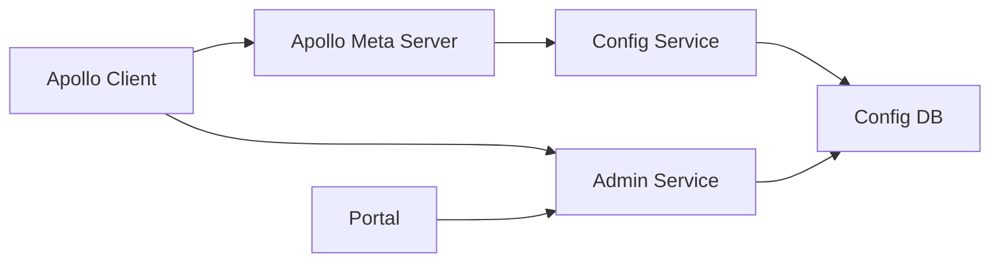
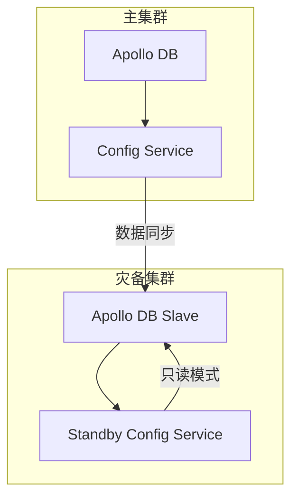

# Apollo Client 配置中心详解与最佳实践

> 分布式环境下的配置管理利器

- [ApolloConfig 官网](https://www.apolloconfig.com/)

## 一、Apollo 概述

### 1.1 什么是 Apollo？

Apollo（阿波罗）是携程开源的**分布式配置中心**，提供：

- **配置集中管理**：统一管理不同环境、集群的配置
- **实时推送更新**：配置修改秒级推送到客户端
- **版本管理**：配置变更历史追溯与回滚
- **权限控制**：细粒度的配置访问权限管理
- **灰度发布**：配置按比例/特定规则分批发布

### 1.2 核心优势对比

| 特性 | Apollo | Spring Cloud Config | Nacos |
|------|--------|---------------------|-------|
| **实时推送** | ⭐⭐⭐⭐⭐ | ⭐⭐ (需配合Bus) | ⭐⭐⭐⭐ |
| **配置版本管理** | ⭐⭐⭐⭐⭐ | ⭐⭐⭐ | ⭐⭐⭐ |
| **权限控制** | ⭐⭐⭐⭐⭐ | ⭐⭐ | ⭐⭐⭐ |
| **多语言支持** | ⭐⭐⭐⭐ | ⭐⭐ (主要Java) | ⭐⭐⭐⭐ |
| **配置灰度发布** | ⭐⭐⭐⭐ | ⭐ | ⭐⭐⭐ |

## 二、架构解析

### 2.1 整体架构



- **Config Service**：提供配置获取、推送接口
- **Admin Service**：提供配置管理接口
- **Portal**：配置管理界面
- **Meta Server**：服务发现入口
- **Client**：应用集成SDK

### 2.2 配置发布流程

1. 在Portal创建/修改配置
2. Admin Service写入数据库
3. Config Service读取新配置
4. 客户端通过长轮询获取更新
5. 客户端回调监听器处理新配置

## 三、环境搭建

### 3.1 服务端部署（Docker快速部署）

```bash
# 创建网络
docker network create apollo-network

# 启动数据库
docker run -d --name apollo-db --network apollo-network \
  -e MYSQL_ROOT_PASSWORD=root -p 3306:3306 mysql:5.7

# 启动Config/Admin/Meta服务
docker run -d --name apollo-configservice \
  --network apollo-network -p 8080:8080 \
  -e SPRING_DATASOURCE_URL="jdbc:mysql://apollo-db:3306/ApolloConfigDB?useSSL=false" \
  apolloconfig/apollo-configservice:2.1.0

# 启动Portal
docker run -d --name apollo-portal \
  --network apollo-network -p 8070:8070 \
  -e SPRING_DATASOURCE_URL="jdbc:mysql://apollo-db:3306/ApolloPortalDB?useSSL=false" \
  apolloconfig/apollo-portal:2.1.0
```

### 3.2 客户端依赖

**Maven**:

```xml
<dependency>
    <groupId>com.ctrip.framework.apollo</groupId>
    <artifactId>apollo-client</artifactId>
    <version>2.1.0</version>
</dependency>
```

**Gradle**:

```groovy
implementation 'com.ctrip.framework.apollo:apollo-client:2.1.0'
```

## 四、核心概念

### 4.1 配置维度

| 维度 | 说明 | 优先级 |
|------|------|--------|
| **应用** | 基础配置 | 最低 |
| **环境** | DEV/TEST/PROD | ↑ |
| **集群** | 机房/区域划分 | ↑ |
| **命名空间** | 配置分组 | 最高 |

### 4.2 命名空间类型

| 类型 | 特点 | 适用场景 |
|------|------|----------|
| **私有** | 应用独享 | 应用特定配置 |
| **公共** | 多应用共享 | 数据库连接等通用配置 |
| **关联** | 继承公共配置 | 覆盖公共配置中的特定项 |

## 五、客户端集成

### 5.1 Spring Boot 集成

```java
@EnableApolloConfig // 启用Apollo
@SpringBootApplication
public class Application {
    public static void main(String[] args) {
        SpringApplication.run(Application.class, args);
    }
}

// application.properties
app.id=order-service
apollo.meta=http://apollo.meta:8080
apollo.cacheDir=/opt/app/config-cache
apollo.bootstrap.enabled=true
apollo.bootstrap.namespaces=application,redis-config
```

### 5.2 配置获取方式

```java
// 1. 注解方式
@Value("${order.timeout:3000}")
private int orderTimeout;

// 2. ConfigService API
Config config = ConfigService.getConfig("redis-config");
String host = config.getProperty("redis.host", "localhost");

// 3. Environment API
String env = Environment.getEnv();
```

### 5.3 监听配置变更

```java
config.addChangeListener(event -> {
    System.out.println("配置变更: " + event.getNamespace());
    event.changedKeys().forEach(key -> {
        ConfigChange change = event.getChange(key);
        System.out.printf(
            "Key: %s, Old: %s, New: %s, ChangeType: %s%n",
            key, change.getOldValue(), 
            change.getNewValue(), change.getChangeType()
        );
    });
});
```

## 六、最佳实践

### 6.1 配置设计规范

1. **命名规范**：
   - Key：`小写+连字符`（`max-pool-size`）
   - 命名空间：`业务域.功能`（`payment.alipay`）

2. **配置分类**：

   ```mermaid
   graph TD
   A[应用配置] --> B[业务配置]
   A --> C[技术组件配置]
   A --> D[第三方服务配置]
   C --> E[数据库]
   C --> F[缓存]
   C --> G[消息队列]
   ```

3. **敏感配置加密**：

   ```java
   // 使用Jasypt加密
   @Value("${db.password}")
   private String encryptedPassword;
   
   public String getPassword() {
       return EncryptUtil.decrypt(encryptedPassword);
   }
   ```

### 6.2 灰度发布策略

**场景**：逐步验证新配置的稳定性


**实现方式**：

1. 创建灰度版本
2. 按IP分配：`192.168.1.100-120`
3. 按标签分配：`env=canary`
4. 全量发布前可回滚

### 6.3 灾备方案



**客户端容灾配置**：

```properties
# 本地缓存路径
apollo.cacheDir=/opt/app/config-cache
# 本地缓存保留份数
apollo.configService.retryTimes=5
# 连接失败时使用本地缓存
apollo.configService.allowCacheFallback=true
```

## 七、高级特性

### 7.1 配置覆盖策略

```java
// 优先级：启动参数 > 系统变量 > 服务器配置 > 本地缓存
public class CustomConfigSource implements Config {
    @Override
    public String getProperty(String key, String defaultValue) {
        // 1. 检查环境变量
        String envValue = System.getenv(key.replace('.', '_'));
        if (envValue != null) return envValue;
        
        // 2. 检查本地文件
        return FileConfigLoader.load(key, defaultValue);
    }
}

// 注册自定义配置源
ConfigService.registerCustomConfigSource("custom", new CustomConfigSource());
```

### 7.2 多集群配置

**场景**：不同数据中心配置差异

```properties
# 指定集群名称
apollo.cluster=shanghai-01

# 集群覆盖配置
shanghai-01.redis.host=redis-sh01.prod
```

### 7.3 Spring Cloud 集成

```java
// Apollo Config Server 配置
@Configuration
public class ApolloCloudConfig {
    @Bean
    public ApolloConfigServerPropertySourceLocator propertySourceLocator() {
        return new ApolloConfigServerPropertySourceLocator();
    }
}

// bootstrap.properties
spring.application.name=order-service
spring.cloud.apollo.config.enabled=true
spring.cloud.apollo.meta=http://apollo.meta:8080
```

## 八、安全实践

### 8.1 权限控制矩阵

| 角色 | 权限 | 操作范围 |
|------|------|----------|
| **Developer** | 读/写 | 仅DEV环境 |
| **Operator** | 读/发布 | 指定命名空间 |
| **Admin** | 全权限 | 所有环境 |

### 8.2 访问审计

```sql
-- 查询配置变更记录
SELECT * FROM Audit
WHERE `DataChange_CreatedBy` = 'user@company.com'
  AND `EntityName` = 'Item'
  AND `OpName` = 'UPDATE'
ORDER BY `DataChange_LastTime` DESC
LIMIT 100;
```

### 8.3 网络隔离策略

1. **客户端→服务端**：仅开放8080端口
2. **Portal→Admin**：内网访问
3. **DB访问控制**：IP白名单
4. **HTTPS加密**：

   ```properties
   apollo.meta=https://apollo.meta:8443
   apollo.ssl.enabled=true
   apollo.ssl.trustStore=classpath:truststore.jks
   ```

## 九、常见问题解决方案

| 问题 | 排查步骤 | 解决方案 |
|------|----------|----------|
| **配置未更新** | 1. 检查监听器注册<br>2. 查看客户端日志<br>3. 验证Portal配置 | 1. 检查长轮询状态<br>2. 重启客户端<br>3. 清理本地缓存 |
| **启动加载失败** | 1. 检查Meta地址<br>2. 验证网络连通<br>3. 查看应用ID | 1. 添加fallback配置<br>2. 设置-Dapollo.configService=localhost |
| **多环境冲突** | 1. 检查环境变量<br>2. 验证集群设置<br>3. 查看命名空间 | 1. 明确指定env<br>2. 使用`@ApolloConfig`限定空间 |
| **权限不足** | 1. 检查角色授权<br>2. 验证命名空间权限 | 1. 申请权限<br>2. 使用关联命名空间 |

## 十、性能优化

### 10.1 客户端优化

```properties
# 调整长轮询超时（默认60s）
apollo.refreshInterval=30

# 关闭未使用的命名空间
apollo.autoUpdateInjectedSpringProperties=false

# 限制监听器执行时间
apollo.longPollingInitialDelayInMills=1000
```

### 10.2 服务端优化

1. **缓存配置**：

   ```java
   // 启用本地缓存
   Config config = ConfigService.getConfig("namespace", true);
   ```

2. **DB连接池优化**：

   ```properties
   # Apollo Admin Service
   spring.datasource.hikari.maximum-pool-size=20
   spring.datasource.hikari.connection-timeout=3000
   ```

3. **集群水平扩展**：

   ```mermaid
   graph LR
   A[客户端] --> B[负载均衡器]
   B --> C[Config Service 1]
   B --> D[Config Service 2]
   B --> E[Config Service 3]
   ```

## 附录：客户端配置参考

### 核心配置项

| 配置项 | 默认值 | 说明 |
|--------|--------|------|
| `app.id` | - | 应用ID（必填） |
| `apollo.meta` | - | Meta Server地址 |
| `apollo.cluster` | default | 集群名称 |
| `apollo.cacheDir` | /opt/data | 本地缓存目录 |
| `apollo.autoUpdateInjectedSpringProperties` | true | 自动更新Spring值 |
| `apollo.longPollingInitialDelayInMills` | 2000 | 长轮询初始延迟 |
| `apollo.remoteRefreshTimeout` | 1000 | 远程刷新超时(ms) |

### 监控端点（Spring Boot Actuator）

```json
// GET /actuator/apollo-config
{
  "appId": "order-service",
  "cluster": "default",
  "namespaceNames": ["application", "redis"],
  "releaseKeys": {
    "application": "202306241023-release",
    "redis": "202306240915-release"
  }
}
```

> **最佳实践总结**：
>
> 1. **配置分类管理**：按业务/技术维度划分命名空间
> 2. **变更可追溯**：每次修改添加注释说明
> 3. **安全加固**：权限最小化+操作审计
> 4. **灾备设计**：本地缓存+多集群部署
> 5. **灰度发布**：先小范围验证再全量
> 6. **性能监控**：关注配置拉取延迟和错误率

通过合理应用 Apollo，可实现配置与代码分离，提升系统可维护性和部署灵活性，是微服务架构的关键基础设施。
