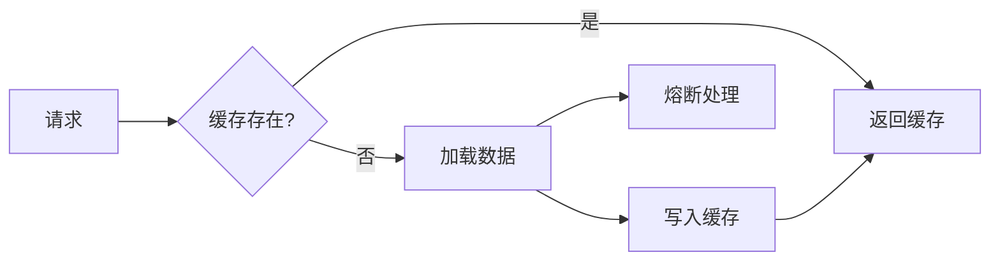
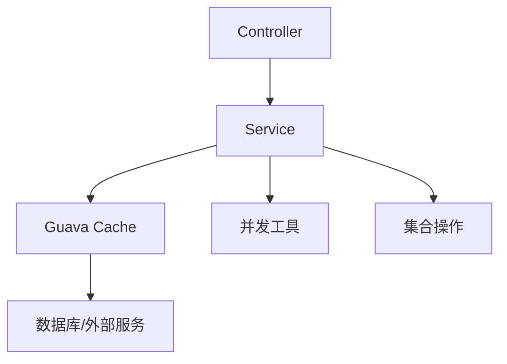

# Guava 详解与最佳实践

> Google 核心 Java 库的权威指南

- [Guava 官网](https://guava.dev/)

## 一、Guava 概述

### 1.1 什么是 Guava？

Guava 是 Google 开源的 Java 核心库，提供：

- 🧩 **高效工具集**：集合、缓存、函数式编程等扩展
- ⚡ **性能优化**：比标准库更高效的数据结构和算法
- 🛡️ **防御性编程**：增强空值处理和参数校验
- 📐 **工程化设计**：遵循 Google Java 开发规范的最佳实践

### 1.2 核心模块

| 模块 | 主要功能 | 使用率 |
|------|----------|--------|
| **集合** | 不可变集合、多值映射、表结构 | 85% |
| **缓存** | 本地缓存实现 | 65% |
| **函数式** | 函数接口、函数操作 | 50% |
| **并发** | ListenableFuture、RateLimiter | 60% |
| **原生类型** | 基本类型工具类 | 45% |
| **字符串** | 分割、连接、匹配 | 75% |
| **I/O** | 简化文件操作 | 40% |

## 二、环境配置

### 2.1 添加依赖

**Maven**:

```xml
<dependency>
    <groupId>com.google.guava</groupId>
    <artifactId>guava</artifactId>
    <version>33.2.0-jre</version> <!-- 企业版用 33.2.0-android -->
</dependency>
```

**Gradle**:

```groovy
implementation 'com.google.guava:guava:33.2.0-jre'
```

### 2.2 Spring Boot 兼容性

| Spring Boot 版本 | 推荐 Guava 版本 | 注意事项 |
|------------------|-----------------|----------|
| 3.x | 33.2.0-jre | 需 Java 17+ |
| 2.7.x | 31.1-jre | 兼容 Java 8+ |
| 2.5.x | 30.1.1-jre | 避免使用废弃 API |

## 三、核心功能详解

### 3.1 集合工具（Collections）

**不可变集合**：

```java
// 创建不可变集合
ImmutableList<String> names = ImmutableList.of("Alice", "Bob", "Charlie");
ImmutableMap<String, Integer> scores = ImmutableMap.of("Alice", 90, "Bob", 85);

// 构建器模式
ImmutableSet<String> colors = ImmutableSet.<String>builder()
    .add("red")
    .addAll(existingList)
    .build();
```

**多值映射**：

```java
Multimap<String, String> departmentEmployees = ArrayListMultimap.create();
departmentEmployees.put("IT", "Alice");
departmentEmployees.put("IT", "Bob"); 
// IT → [Alice, Bob]

// 转换视图
Map<String, Collection<String>> mapView = departmentEmployees.asMap();
```

**表结构**：

```java
Table<String, String, Double> distanceTable = HashBasedTable.create();
distanceTable.put("London", "Paris", 344.0);
distanceTable.put("New York", "London", 5566.0);

// 行列操作
Map<String, Double> londonTo = distanceTable.row("London");
Map<String, Double> toParis = distanceTable.column("Paris");
```

### 3.2 缓存实现（Caching）

```java
LoadingCache<String, User> userCache = CacheBuilder.newBuilder()
    .maximumSize(1000) // 最大条目数
    .expireAfterAccess(30, TimeUnit.MINUTES) // 访问过期
    .expireAfterWrite(1, TimeUnit.HOURS) // 写入过期
    .concurrencyLevel(4) // 并发级别
    .recordStats() // 开启统计
    .build(new CacheLoader<String, User>() {
        @Override
        public User load(String key) {
            return userService.getUser(key); // 加载逻辑
        }
    });

// 使用缓存
User user = userCache.get("user123");
```

### 3.3 函数式编程

**函数接口**：

```java
Function<String, Integer> lengthFunction = String::length;
Predicate<String> longWordPredicate = s -> s.length() > 5;

// 组合函数
Function<String, String> upperCaseThenTrim = 
    Functions.compose(String::trim, String::toUpperCase);
```

**集合操作**：

```java
List<String> words = Lists.newArrayList("apple", "banana", "cherry");

// 过滤
Collection<String> longWords = Collections2.filter(words, longWordPredicate);

// 转换
List<Integer> lengths = Lists.transform(words, lengthFunction);
```

### 3.4 并发工具

**ListenableFuture**：

```java
ListeningExecutorService service = 
    MoreExecutors.listeningDecorator(Executors.newFixedThreadPool(10));

ListenableFuture<User> future = service.submit(() -> userService.getUserAsync(id));

// 异步回调
Futures.addCallback(future, new FutureCallback<User>() {
    public void onSuccess(User user) {
        System.out.println("User: " + user);
    }
    public void onFailure(Throwable t) {
        log.error("Failed to get user", t);
    }
}, service);
```

**RateLimiter**：

```java
RateLimiter limiter = RateLimiter.create(10.0); // 每秒10个许可

void processRequest(Request request) {
    if (limiter.tryAcquire(1, 500, TimeUnit.MILLISECONDS)) {
        // 处理请求
    } else {
        // 限流处理
        throw new RateLimitException();
    }
}
```

## 四、Spring Boot 整合实践

### 4.1 配置 Guava 缓存为 Spring Cache

```java
@Configuration
@EnableCaching
public class CacheConfig {

    @Bean
    public CacheManager cacheManager() {
        GuavaCacheManager cacheManager = new GuavaCacheManager();
        cacheManager.setCacheBuilder(CacheBuilder.newBuilder()
            .expireAfterWrite(30, TimeUnit.MINUTES)
            .maximumSize(100));
        return cacheManager;
    }
}

@Service
public class ProductService {
    
    @Cacheable(value = "products", key = "#id")
    public Product getProductById(String id) {
        // 数据库查询
    }
}
```

### 4.2 参数校验增强

```java
@RestController
@RequestMapping("/users")
public class UserController {
    
    @PostMapping
    public ResponseEntity<?> createUser(@RequestBody UserRequest request) {
        // Guava 参数校验
        Preconditions.checkArgument(
            request.getName().length() >= 3, 
            "姓名长度至少3个字符"
        );
        Preconditions.checkNotNull(
            request.getEmail(), 
            "邮箱不能为空"
        );
        
        // 业务逻辑
    }
}
```

### 4.3 事件总线集成

```java
@Bean
public EventBus eventBus() {
    return new EventBus(); // 同步事件总线
}

@Bean
public AsyncEventBus asyncEventBus() {
    return new AsyncEventBus(Executors.newCachedThreadPool());
}

// 事件监听器
@Component
public class UserEventListener {
    
    @EventListener
    public void handleUserCreated(UserCreatedEvent event) {
        // 处理事件
    }
}

// 发布事件
@Service
public class UserService {
    
    @Autowired
    private EventBus eventBus;
    
    public User createUser(User user) {
        // 保存用户
        eventBus.post(new UserCreatedEvent(user));
        return user;
    }
}
```

## 五、最佳实践

### 5.1 集合使用规范

1. **优先使用不可变集合**：

   ```java
   // 防御性编程
   public ImmutableList<String> getConfigItems() {
       return ImmutableList.copyOf(configList);
   }
   ```

2. **避免多层嵌套**：

   ```java
   // 使用 Table 替代 Map<K, Map<V, T>>
   Table<String, String, Double> distanceTable = HashBasedTable.create();
   ```

### 5.2 缓存设计原则



**配置建议**：

```java
CacheBuilder.newBuilder()
    .maximumWeight(10000) // 权重控制
    .weigher((String key, User user) -> user.getName().length())
    .refreshAfterWrite(10, TimeUnit.MINUTES) // 刷新策略
    .removalListener(notification -> { // 移除监听
        log.info("Removed: {}", notification.getKey());
    });
```

### 5.3 并发控制策略

**RateLimiter 使用场景**：

| 场景 | 策略 | 配置示例 |
|------|------|----------|
| API 限流 | 平滑突发限制 | `create(100)` |
| 资源保护 | 预热模式 | `create(50, 5, TimeUnit.SECONDS)` |
| 优先级控制 | 多级限流 | 创建多个限流器 |

## 六、性能优化

### 6.1 集合性能对比

| 操作 | Guava 实现 | JDK 实现 | 性能提升 |
|------|------------|----------|----------|
| 不可变列表 | `ImmutableList` | `Collections.unmodifiableList` | 3-5x |
| 多值映射 | `Multimap` | `Map<K, List<V>>` | 2-4x |
| 缓存获取 | `LoadingCache` | `ConcurrentHashMap` | 1.5-2x (带加载) |

### 6.2 内存优化技巧

```java
// 1. 使用不可变集合减少内存开销
ImmutableList<String> fixedList = ImmutableList.copyOf(variableList);

// 2. 优化集合初始化
List<String> list = Lists.newArrayListWithCapacity(100); // 避免扩容

// 3. 使用基本类型集合
Ints.asList(1, 2, 3); // 避免装箱
```

## 七、常见问题解决方案

| 问题 | 原因 | 解决方案 |
|------|------|----------|
| `Preconditions` 异常信息不清晰 | 字符串拼接耗时 | 使用惰性求值：`checkArgument(expr, "%s错误", arg)` |
| 缓存雪崩 | 同时大量加载 | 配置 `refreshAfterWrite` + 异步刷新 |
| 不可变集合修改异常 | 尝试修改不可变集合 | 使用 `Builder` 或可变副本 |
| `ListenableFuture` 回调不执行 | 线程池关闭 | 使用 `MoreExecutors.listeningDecorator` 包装 |
| 版本冲突 | 与其他库冲突 | 使用 `mvn dependency:tree` 排查 |

## 八、Guava 与替代方案比较

| 功能 | Guava | Apache Commons | Java 标准库 | Vavr |
|------|-------|----------------|-------------|------|
| **不可变集合** | ⭐⭐⭐⭐⭐ | ⭐⭐ | ⭐⭐⭐ | ⭐⭐⭐⭐ |
| **缓存实现** | ⭐⭐⭐⭐⭐ | ⭐⭐ | ❌ | ❌ |
| **函数式编程** | ⭐⭐⭐ | ⭐⭐ | ⭐⭐⭐ | ⭐⭐⭐⭐⭐ |
| **并发工具** | ⭐⭐⭐⭐ | ⭐ | ⭐⭐⭐ | ⭐⭐ |
| **I/O 工具** | ⭐⭐⭐ | ⭐⭐⭐⭐ | ⭐⭐⭐ | ⭐ |

## 九、升级与迁移

### 9.1 废弃 API 迁移

| 废弃类 | 替代方案 | 备注 |
|--------|----------|------|
| `com.google.common.collect.Collections2` | `java.util.stream.Stream` | Java 8+ |
| `Function`/`Predicate` | `java.util.function` | Java 8+ |
| `Objects.toStringHelper` | `MoreObjects.toStringHelper` | 重命名 |

### 9.2 版本升级策略

1. **逐步迁移**：

   ```java
   // 旧版
   Joiner.on(";").skipNulls().join(list);
   
   // 新版
   String.join(";", list.stream().filter(Objects::nonNull).toList());
   ```

2. **兼容性测试**：
   - 重点关注缓存和集合模块
   - 运行完整的单元测试套件
   - 性能基准对比

## 十、最佳实践总结

### 10.1 核心原则

1. **防御性编程**：

   ```java
   public User createUser(@NonNull String name, @NonNull Email email) {
       Preconditions.checkNotNull(name, "姓名不能为空");
       Preconditions.checkArgument(name.length() >= 3, "姓名过短");
       // ...
   }
   ```

2. **不可变性优先**：

   ```java
   // 返回值设计
   public ImmutableList<Order> getUserOrders(String userId) {
       return ImmutableList.copyOf(orders);
   }
   ```

### 10.2 架构建议



### 10.3 性能与安全

1. **缓存监控**：

   ```java
   CacheStats stats = cache.stats();
   monitor.recordHitRate(stats.hitRate());
   monitor.recordLoadTime(stats.averageLoadPenalty());
   ```

2. **安全边界**：
   - 对外接口避免暴露 Guava 特有类型
   - 使用 DTO 转换内部对象
   - 限制缓存大小防止 OOM

> **最佳实践总结**：
>
> 1. **适度使用**：避免过度依赖，仅在标准库不足时选用
> 2. **版本管理**：保持版本一致，定期升级
> 3. **性能监控**：缓存和并发工具需添加监控
> 4. **防御性设计**：参数校验前置，不可变对象优先
> 5. **团队规范**：统一 Guava 使用模式和版本

Guava 作为 Java 生态的瑞士军刀，能显著提升开发效率和系统性能。合理运用其核心模块，结合 Spring Boot 的现代特性，可构建出高性能、易维护的企业级应用。
