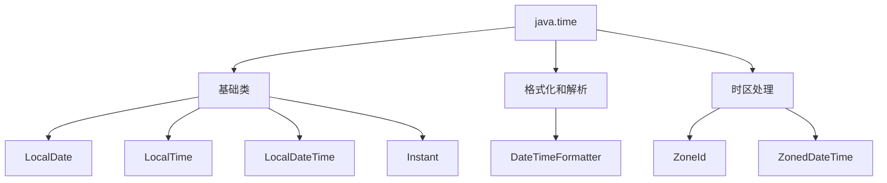

# Java Time API 详解与最佳实践

> 现代 Java 日期时间处理的权威指南

## 一、Java Time API 概述

### 1.1 为什么需要新的时间 API？

Java 8 引入的 `java.time` 包解决了传统 `Date` 和 `Calendar` 类的根本缺陷：

| 问题 | 旧 API (`java.util.Date`) | 新 API (`java.time`) |
|------|---------------------------|----------------------|
| **线程安全** | 非线程安全 | 不可变对象，线程安全 |
| **设计缺陷** | 月份从0开始，年份1900基准 | 人性化设计（1-12月，正常年份） |
| **时区处理** | 混乱，依赖 `Calendar` | 明确的 `ZoneId` 和 `ZonedDateTime` |
| **扩展性** | 难以扩展 | 清晰的接口体系，易于扩展 |
| **功能完整性** | 缺少日期计算、格式化等工具 | 提供丰富的时间操作和格式化功能 |

### 1.2 核心包结构



## 二、核心类详解

### 2.1 基础日期时间类

| 类名 | 描述 | 示例 |
|------|------|------|
| **LocalDate** | 不含时间的日期 | `2023-10-15` |
| **LocalTime** | 不含日期的时间 | `14:30:45.123` |
| **LocalDateTime** | 日期+时间 | `2023-10-15T14:30:45` |
| **Instant** | 时间戳（UTC时区） | `2023-10-15T06:30:45Z` |
| **Duration** | 时间间隔（秒/纳秒） | PT2H30M |
| **Period** | 日期间隔（年/月/日） | P1Y2M10D |

### 2.2 时区相关类

| 类名 | 描述 | 示例 |
|------|------|------|
| **ZoneId** | 时区标识符 | `Asia/Shanghai` |
| **ZonedDateTime** | 带时区的日期时间 | `2023-10-15T14:30:45+08:00[Asia/Shanghai]` |
| **OffsetDateTime** | 带UTC偏移的日期时间 | `2023-10-15T14:30:45+08:00` |

## 三、基础操作与转换

### 3.1 创建对象

```java
// 当前日期时间
LocalDate today = LocalDate.now();
LocalTime currentTime = LocalTime.now();
LocalDateTime now = LocalDateTime.now();

// 指定值创建
LocalDate birthday = LocalDate.of(1990, Month.JANUARY, 15);
LocalTime meetingTime = LocalTime.of(14, 30); // 14:30
LocalDateTime projectDeadline = LocalDateTime.of(2023, 12, 31, 23, 59);

// 解析字符串
LocalDate parsedDate = LocalDate.parse("2023-10-15");
LocalTime parsedTime = LocalTime.parse("14:30:45");
LocalDateTime parsedDateTime = LocalDateTime.parse("2023-10-15T14:30:45");
```

### 3.2 时间计算与调整

```java
// 加减时间
LocalDate nextWeek = today.plusWeeks(1);
LocalTime earlierTime = currentTime.minusMinutes(15);

// 使用TemporalAdjusters
LocalDate firstDayOfMonth = today.with(TemporalAdjusters.firstDayOfMonth());
LocalDate nextFriday = today.with(TemporalAdjusters.next(DayOfWeek.FRIDAY));

// 自定义调整器
LocalDateTime nextWorkingDay = now.with(temporal -> {
    DayOfWeek day = DayOfWeek.from(temporal);
    int daysToAdd = 1;
    if (day == DayOfWeek.FRIDAY) daysToAdd = 3;
    if (day == DayOfWeek.SATURDAY) daysToAdd = 2;
    return temporal.plus(daysToAdd, ChronoUnit.DAYS);
});
```

### 3.3 时间间隔计算

```java
// Duration (时间间隔)
Duration timeBetween = Duration.between(startTime, endTime);
long minutes = timeBetween.toMinutes();

// Period (日期间隔)
Period age = Period.between(birthDate, LocalDate.now());
System.out.printf("年龄: %d年 %d月 %d天%n", 
    age.getYears(), age.getMonths(), age.getDays());

// 组合使用
LocalDateTime start = LocalDateTime.of(2023, 1, 1, 9, 0);
LocalDateTime end = LocalDateTime.of(2023, 1, 1, 17, 30);
Duration workDuration = Duration.between(start, end);
```

## 四、时区处理最佳实践

### 4.1 时区转换

```java
// 创建带时区的时间
ZonedDateTime shanghaiTime = ZonedDateTime.now(ZoneId.of("Asia/Shanghai"));
ZonedDateTime newYorkTime = ZonedDateTime.now(ZoneId.of("America/New_York"));

// 时区转换
ZonedDateTime londonTime = shanghaiTime.withZoneSameInstant(ZoneId.of("Europe/London"));

// 获取UTC时间
OffsetDateTime utcTime = OffsetDateTime.now(ZoneOffset.UTC);
```

### 4.2 处理夏令时

```java
ZoneId londonZone = ZoneId.of("Europe/London");

// 夏令时开始前的日期
ZonedDateTime beforeDST = ZonedDateTime.of(2023, 3, 26, 1, 30, 0, 0, londonZone);

// 夏令时开始后的日期
ZonedDateTime afterDST = beforeDST.plusHours(1);

System.out.println(beforeDST); // 2023-03-26T01:30+00:00[Europe/London]
System.out.println(afterDST);  // 2023-03-26T03:30+01:00[Europe/London]
```

### 4.3 最佳实践原则

1. **存储和传输使用 UTC**

   ```java
   Instant timestamp = Instant.now(); // 存储到数据库
   ```

2. **前端显示时转换为本地时区**

   ```java
   ZonedDateTime localTime = timestamp.atZone(ZoneId.systemDefault());
   ```

3. **避免使用固定偏移量**

   ```java
   // 不推荐
   ZoneOffset offset = ZoneOffset.ofHours(8);
   
   // 推荐
   ZoneId zone = ZoneId.of("Asia/Shanghai");
   ```

## 五、格式化与解析

### 5.1 使用 DateTimeFormatter

```java
// 预定义格式
String isoDate = now.format(DateTimeFormatter.ISO_LOCAL_DATE_TIME);

// 自定义格式
DateTimeFormatter formatter = DateTimeFormatter.ofPattern("yyyy-MM-dd HH:mm:ss");
String formatted = now.format(formatter);
LocalDateTime parsed = LocalDateTime.parse("2023-10-15 14:30:00", formatter);

// 本地化格式
DateTimeFormatter germanFormatter = DateTimeFormatter
    .ofLocalizedDateTime(FormatStyle.MEDIUM)
    .withLocale(Locale.GERMAN);
String germanDate = now.format(germanFormatter); // 15. Okt. 2023 14:30:45
```

### 5.2 最佳实践：集中管理格式

```java
public class DateTimeFormatters {
    public static final DateTimeFormatter DB_FORMATTER = 
        DateTimeFormatter.ofPattern("yyyyMMddHHmmss");
        
    public static final DateTimeFormatter UI_DATE_FORMATTER = 
        DateTimeFormatter.ofPattern("dd/MM/yyyy");
        
    public static final DateTimeFormatter UI_TIME_FORMATTER = 
        DateTimeFormatter.ofPattern("HH:mm");
}

// 使用
String dbTimestamp = now.format(DateTimeFormatters.DB_FORMATTER);
LocalDateTime parsedDb = LocalDateTime.parse("20231015143000", 
    DateTimeFormatters.DB_FORMATTER);
```

## 六、与旧 API 的互操作

### 6.1 转换为旧 API

```java
// Instant -> Date
Date legacyDate = Date.from(Instant.now());

// LocalDateTime -> Date (需要时区)
Date date = Date.from(localDateTime.atZone(ZoneId.systemDefault()).toInstant());

// LocalDate -> java.sql.Date
java.sql.Date sqlDate = java.sql.Date.valueOf(localDate);
```

### 6.2 从旧 API 转换

```java
// Date -> Instant
Instant instant = legacyDate.toInstant();

// Date -> LocalDateTime
LocalDateTime ldt = LocalDateTime.ofInstant(
    legacyDate.toInstant(), ZoneId.systemDefault());

// java.sql.Date -> LocalDate
LocalDate localDate = sqlDate.toLocalDate();
```

### 6.3 迁移策略

1. **逐步替换**：

   ```java
   // 旧代码
   Date now = new Date();
   calendar.add(Calendar.DAY_OF_MONTH, 1);
   
   // 新代码
   LocalDateTime now = LocalDateTime.now();
   LocalDateTime tomorrow = now.plusDays(1);
   ```

2. **边界隔离**：

   ```java
   // 在服务边界进行转换
   @Service
   public class LegacyAdapterService {
       public LocalDate convertToLocalDate(java.sql.Date sqlDate) {
           return sqlDate != null ? sqlDate.toLocalDate() : null;
       }
       
       public java.sql.Date convertToSqlDate(LocalDate localDate) {
           return localDate != null ? java.sql.Date.valueOf(localDate) : null;
       }
   }
   ```

## 七、Spring Boot 集成实践

### 7.1 全局日期时间格式化

```java
@Configuration
public class DateTimeConfig {
    
    @Bean
    public ObjectMapper objectMapper() {
        ObjectMapper mapper = new ObjectMapper();
        JavaTimeModule module = new JavaTimeModule();
        
        // 全局日期格式
        module.addSerializer(LocalDate.class, 
            new LocalDateSerializer(DateTimeFormatter.ISO_DATE));
            
        module.addDeserializer(LocalDate.class,
            new LocalDateDeserializer(DateTimeFormatter.ISO_DATE));
            
        mapper.registerModule(module);
        mapper.disable(SerializationFeature.WRITE_DATES_AS_TIMESTAMPS);
        return mapper;
    }
}
```

### 7.2 RESTful API 中的日期处理

```java
@RestController
@RequestMapping("/events")
public class EventController {
    
    @PostMapping
    public ResponseEntity<Event> createEvent(
            @RequestBody @Valid EventRequest request) {
        // 自动转换日期字符串为LocalDateTime
    }
    
    @GetMapping("/between")
    public List<Event> getEventsBetween(
            @RequestParam("start") @DateTimeFormat(iso = ISO.DATE_TIME) LocalDateTime start,
            @RequestParam("end") @DateTimeFormat(pattern = "yyyy-MM-dd HH:mm") LocalDateTime end) {
        return eventService.findEventsBetween(start, end);
    }
}

// DTO定义
public class EventRequest {
    @Future
    private LocalDateTime eventTime;
    
    @JsonFormat(pattern = "yyyy-MM-dd")
    private LocalDate registrationDeadline;
}
```

### 7.3 JPA 实体映射

```java
@Entity
public class Meeting {
    @Id
    private Long id;
    
    @Column
    private LocalDateTime startTime;
    
    @Column
    private LocalDateTime endTime;
    
    @Column
    private Duration duration; // 需要Hibernate 5.2+
}

// 配置转换器（Spring Data JPA）
@Converter(autoApply = true)
public class LocalDateConverter implements AttributeConverter<LocalDate, Date> {
    @Override
    public Date convertToDatabaseColumn(LocalDate localDate) {
        return localDate != null ? Date.valueOf(localDate) : null;
    }
    
    @Override
    public LocalDate convertToEntityAttribute(Date date) {
        return date != null ? date.toLocalDate() : null;
    }
}
```

## 八、最佳实践总结

### 8.1 时间处理原则

| 场景 | 推荐类 | 说明 |
|------|--------|------|
| **生日、纪念日** | `LocalDate` | 不需要时间 |
| **会议时间** | `LocalDateTime` | 本地时间，无时区 |
| **全球事件** | `ZonedDateTime` | 需要明确时区 |
| **时间戳记录** | `Instant` | 日志、数据库存储 |
| **持续时间** | `Duration` | 秒/纳秒精度 |
| **日期间隔** | `Period` | 年/月/日精度 |

### 8.2 性能优化

```java
// 1. 重用DateTimeFormatter（线程安全）
private static final DateTimeFormatter FORMATTER = 
    DateTimeFormatter.ofPattern("yyyy-MM-dd");

// 2. 避免频繁调用now()
LocalDateTime start = LocalDateTime.now();
// ... 执行操作 ...
Duration duration = Duration.between(start, LocalDateTime.now());

// 3. 使用Instant进行高性能时间戳比较
Instant start = Instant.now();
// 执行代码
long elapsedMillis = Duration.between(start, Instant.now()).toMillis();
```

### 8.3 错误处理模式

```java
try {
    LocalDate date = LocalDate.parse(inputDate, formatter);
} catch (DateTimeParseException e) {
    throw new InvalidDateException("无效的日期格式: " + inputDate);
}

// 自定义异常
public class InvalidDateException extends RuntimeException {
    public InvalidDateException(String message) {
        super(message);
    }
}
```

## 九、高级应用场景

### 9.1 工作日计算

```java
public class BusinessDayCalculator {
    
    private static final Set<DayOfWeek> WEEKEND = 
        Set.of(DayOfWeek.SATURDAY, DayOfWeek.SUNDAY);
    
    public static LocalDate addBusinessDays(LocalDate start, int days) {
        LocalDate result = start;
        int added = 0;
        while (added < days) {
            result = result.plusDays(1);
            if (!WEEKEND.contains(result.getDayOfWeek())) {
                added++;
            }
        }
        return result;
    }
}
```

### 9.2 节假日日历

```java
public class HolidayCalendar {
    private static final Set<LocalDate> HOLIDAYS = Set.of(
        LocalDate.of(2023, 1, 1),   // 元旦
        LocalDate.of(2023, 5, 1),   // 劳动节
        LocalDate.of(2023, 10, 1)   // 国庆节
    );
    
    public static boolean isHoliday(LocalDate date) {
        return HOLIDAYS.contains(date) || 
               date.getDayOfWeek() == DayOfWeek.SATURDAY ||
               date.getDayOfWeek() == DayOfWeek.SUNDAY;
    }
}
```

### 9.3 时间范围处理

```java
public class TimeRange {
    private final LocalTime start;
    private final LocalTime end;
    
    public TimeRange(LocalTime start, LocalTime end) {
        this.start = start;
        this.end = end;
    }
    
    public boolean contains(LocalTime time) {
        return !time.isBefore(start) && !time.isAfter(end);
    }
    
    public boolean overlaps(TimeRange other) {
        return this.contains(other.start) || other.contains(this.start);
    }
}
```

## 十、常见问题解决方案

| 问题 | 原因 | 解决方案 |
|------|------|----------|
| **`UnsupportedTemporalTypeException`** | 尝试获取不支持的时间单位 | 使用正确的类：`LocalDate.getDayOfWeek()` 而非 `get(ChronoField.HOUR_OF_DAY)` |
| **时区转换错误** | 未正确处理夏令时 | 使用 `ZoneId` 而非 `ZoneOffset` |
| **日期解析失败** | 格式不匹配 | 明确指定 `DateTimeFormatter` |
| **数据库存储问题** | JPA 未正确配置 | 添加 `@Converter` 或使用 Hibernate 5.2+ |
| **序列化格式不一致** | Jackson 未配置 | 添加 `JavaTimeModule` 并禁用 `WRITE_DATES_AS_TIMESTAMPS` |

## 附录：常用操作速查表

### 日期操作

```java
LocalDate date = LocalDate.now();
date = date.plusDays(1);          // 加1天
date = date.minusMonths(1);       // 减1月
date = date.withYear(2024);       // 修改年份
DayOfWeek day = date.getDayOfWeek(); // 获取星期几
boolean isLeap = date.isLeapYear(); // 是否闰年
```

### 时间操作

```java
LocalTime time = LocalTime.now();
time = time.plusHours(2);         // 加2小时
time = time.minusMinutes(30);     // 减30分钟
time = time.withSecond(0);        // 秒设为0
int hour = time.getHour();         // 获取小时
boolean isAfter = time.isAfter(LocalTime.NOON); // 是否在中午后
```

### 日期时间比较

```java
LocalDateTime dt1 = ...;
LocalDateTime dt2 = ...;

boolean isBefore = dt1.isBefore(dt2);
boolean isAfter = dt1.isAfter(dt2);
boolean isEqual = dt1.isEqual(dt2);

long daysBetween = ChronoUnit.DAYS.between(dt1, dt2);
Duration duration = Duration.between(dt1, dt2);
```

> **最佳实践总结**：
>
> 1. **优先使用新API**：完全替代 `Date` 和 `Calendar`
> 2. **明确时间语义**：根据场景选择 `LocalDate`、`LocalDateTime` 或 `ZonedDateTime`
> 3. **存储使用UTC**：数据库存储推荐使用 `Instant` 或 UTC 时间
> 4. **配置集中管理**：统一项目中日期时间格式
> 5. **考虑时区影响**：跨国系统必须正确处理时区和夏令时
> 6. **使用不可变对象**：所有 `java.time` 类都是线程安全的不可变对象

通过遵循这些最佳实践，您可以构建出健壮、可维护且国际化的时间处理系统，彻底解决传统 Java 日期时间处理的痛点。
