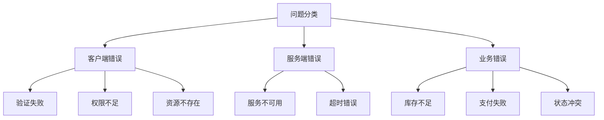

# Zalando Problem 详解与 Spring Boot 整合最佳实践

> 构建符合 RFC 7807 标准的 RESTful 错误响应

- [Zalando Problem 官网](https://github.com/zalando/problem)

## 一、问题响应标准化概述

### 1.1 为什么需要标准化错误响应？

在 RESTful API 开发中，**错误处理的标准化**是提升开发者体验的关键。传统错误响应的问题：

| 问题类型 | 传统做法 | 弊端 |
|----------|----------|------|
| **不一致性** | 每个端点自定义错误格式 | 客户端难以统一处理 |
| **信息不足** | 简单状态码+消息 | 缺乏问题细节和解决指导 |
| **无机器可读** | 纯文本错误消息 | 自动化处理困难 |
| **无扩展性** | 固定错误结构 | 无法添加额外上下文信息 |

### 1.2 RFC 7807 与 Zalando Problem

**RFC 7807** 定义了 Problem Details for HTTP APIs 标准，Zalando Problem 是其 Java 实现：

```json
{
  "type": "https://example.com/probs/out-of-stock",
  "title": "库存不足",
  "status": 404,
  "detail": "商品ID 12345 库存仅剩2件，请求数量5件",
  "instance": "/orders/12345",
  "custom_field": "额外上下文信息"
}
```

**核心优势**：

- ✅ 标准化的错误响应结构
- 🔍 包含问题解决指引的文档链接
- 📦 可扩展的自定义字段
- ⚙️ 与 Spring Boot 无缝集成

## 二、环境配置与依赖

### 2.1 添加依赖

**Maven**:

```xml
<dependency>
    <groupId>org.zalando</groupId>
    <artifactId>problem-spring-web-starter</artifactId>
    <version>0.29.0</version>
</dependency>
```

**Gradle**:

```groovy
implementation 'org.zalando:problem-spring-web-starter:0.29.0'
```

### 2.2 Spring Boot 版本兼容性

| Spring Boot 版本 | 推荐 Zalando Problem 版本 | 注意事项 |
|------------------|---------------------------|----------|
| 3.x | 0.29.0+ | 需 Jakarta EE 9+ |
| 2.7.x | 0.27.0 | 兼容 Java 8+ |
| 2.5.x | 0.26.0 | 建议升级 |

## 三、核心概念解析

### 3.1 Problem 响应结构

| 字段 | 类型 | 必需 | 描述 |
|------|------|------|------|
| **type** | URI | 是 | 问题类型的标识符（文档链接） |
| **title** | String | 是 | 人类可读的问题摘要 |
| **status** | Integer | 否 | HTTP 状态码 |
| **detail** | String | 否 | 问题详细描述 |
| **instance** | URI | 否 | 具体问题实例的标识符 |
| **扩展字段** | Any | 否 | 自定义业务上下文信息 |

### 3.2 内置异常类型

| 异常类 | HTTP 状态码 | 使用场景 |
|--------|-------------|----------|
| `BadRequestProblem` | 400 | 客户端请求错误 |
| `UnauthorizedProblem` | 401 | 未认证访问 |
| `ForbiddenProblem` | 403 | 权限不足 |
| `NotFoundProblem` | 404 | 资源不存在 |
| `ConflictProblem` | 409 | 资源冲突 |
| `UnprocessableEntityProblem` | 422 | 语义错误 |
| `InternalServerErrorProblem` | 500 | 服务器内部错误 |

## 四、Spring Boot 基础整合

### 4.1 全局异常处理

```java
@ControllerAdvice
public class ProblemExceptionHandler implements ProblemHandling {

    // 自动处理所有Spring MVC异常
    // 无需额外代码
    
    // 自定义异常映射
    @ExceptionHandler(BusinessException.class)
    public ResponseEntity<Problem> handleBusinessException(
            BusinessException ex, 
            NativeWebRequest request) {
        
        Problem problem = Problem.builder()
            .withType(URI.create("https://api.example.com/errors/business-error"))
            .withTitle("业务规则冲突")
            .withStatus(Status.UNPROCESSABLE_ENTITY)
            .withDetail(ex.getMessage())
            .with("error_code", ex.getErrorCode())
            .with("invalid_params", ex.getValidationErrors())
            .build();
            
        return create(ex, problem, request);
    }
}
```

### 4.2 控制器层使用

```java
@RestController
@RequestMapping("/api/products")
public class ProductController {

    @GetMapping("/{id}")
    public Product getProduct(@PathVariable String id) {
        return productRepository.findById(id)
            .orElseThrow(() -> new NotFoundProblem("产品不存在: " + id));
    }

    @PostMapping
    @ResponseStatus(CREATED)
    public Product createProduct(@Valid @RequestBody ProductRequest request) {
        if (productRepository.existsByName(request.getName())) {
            throw new ConflictProblem("产品名称已存在: " + request.getName());
        }
        return productRepository.save(request.toEntity());
    }
}
```

## 五、高级配置与定制

### 5.1 配置 Problem 全局设置

```yaml
# application.yml
problem:
  with-stack-trace: never # 生产环境禁用堆栈跟踪
  censor-parameters: password, token # 敏感参数过滤
  object-mapper-ref: problemObjectMapper # 自定义ObjectMapper
  base-package: com.example.api # 异常扫描包
  enable-rfc-7807: true # 严格遵循RFC标准
```

### 5.2 自定义 Problem 类型

```java
public class CustomProblemModule extends AbstractProblemModule {
    
    @Override
    public void configure() {
        // 注册自定义序列化器
        addSerializer(ValidationError.class, new ValidationErrorSerializer());
        
        // 配置全局混入
        setMixInAnnotation(ConstraintViolationProblem.class, ConstraintViolationProblemMixin.class);
    }
    
    // 自定义错误字段格式
    @JsonSerialize(using = ValidationErrorSerializer.class)
    public record ValidationError(String field, String message) {}
    
    static class ValidationErrorSerializer extends JsonSerializer<ValidationError> {
        @Override
        public void serialize(ValidationError value, JsonGenerator gen, SerializerProvider provider) {
            gen.writeStartObject();
            gen.writeStringField("field", value.field());
            gen.writeStringField("message", value.message());
            gen.writeEndObject();
        }
    }
}

// 注册模块
@Bean
public Module problemModule() {
    return new CustomProblemModule();
}
```

### 5.3 国际化支持

```java
@Bean
public ProblemFactory problemFactory(
        final MessageSource messageSource,
        final Optional<LocaleResolver> localeResolver) {
    
    return new DefaultProblemFactory() {
        @Override
        public Problem create(Throwable throwable, StatusType status, URI type) {
            Locale locale = localeResolver.map(r -> r.resolveLocale(request))
                .orElse(Locale.ENGLISH);
            
            String titleKey = "problem." + type.getPath() + ".title";
            String detailKey = "problem." + type.getPath() + ".detail";
            
            return Problem.builder()
                .withType(type)
                .withTitle(messageSource.getMessage(titleKey, null, locale))
                .withStatus(status)
                .withDetail(messageSource.getMessage(detailKey, null, locale))
                .build();
        }
    };
}
```

## 六、最佳实践指南

### 6.1 错误类型设计原则



**错误类型 URI 命名规范**：

```
https://api.example.com/errors/
  ├── client/
  │   ├── invalid-param
  │   ├── unauthorized
  │   └── not-found
  ├── server/
  │   ├── service-unavailable
  │   └── timeout
  └── business/
      ├── out-of-stock
      └── payment-declined
```

### 6.2 验证错误处理

```java
@ExceptionHandler(ConstraintViolationException.class)
public ResponseEntity<Problem> handleConstraintViolation(
        ConstraintViolationException ex, 
        NativeWebRequest request) {
    
    List<Violation> violations = ex.getConstraintViolations().stream()
        .map(v -> new Violation(
            v.getPropertyPath().toString(),
            v.getMessage(),
            v.getInvalidValue()))
        .collect(Collectors.toList());
    
    Problem problem = Problem.builder()
        .withType(URI.create("https://api.example.com/errors/invalid-param"))
        .withTitle("参数验证失败")
        .withStatus(Status.BAD_REQUEST)
        .with("violations", violations)
        .build();
    
    return create(ex, problem, request);
}

// 错误结构示例
{
  "type": "https://api.example.com/errors/invalid-param",
  "title": "参数验证失败",
  "status": 400,
  "violations": [
    {
      "field": "email",
      "message": "必须是有效的邮箱格式",
      "invalidValue": "invalid-email"
    },
    {
      "field": "age",
      "message": "必须大于18",
      "invalidValue": 15
    }
  ]
}
```

### 6.3 安全与日志

**敏感信息过滤**：

```java
@Bean
public ProblemModule problemModule() {
    return new ProblemModule()
        .withStackTraces(false) // 禁用堆栈信息
        .withCensorParameters("password", "creditCard"); // 过滤敏感参数
}
```

**错误日志记录**：

```java
@ExceptionHandler(Exception.class)
public ResponseEntity<Problem> handleAllExceptions(
        Exception ex, 
        NativeWebRequest request,
        HttpServletRequest httpRequest) {
    
    log.error("未处理异常: {} {}", 
        httpRequest.getMethod(), 
        httpRequest.getRequestURI(), 
        ex);
    
    Problem problem = Problem.builder()
        .withType(URI.create("https://api.example.com/errors/internal-error"))
        .withTitle("服务器内部错误")
        .withStatus(Status.INTERNAL_SERVER_ERROR)
        .build();
    
    return create(ex, problem, request);
}
```

## 七、与 Spring Security 集成

### 7.1 认证授权错误处理

```java
@Bean
public SecurityFilterChain securityFilterChain(HttpSecurity http) throws Exception {
    http
        .authorizeHttpRequests(auth -> auth
            .anyRequest().authenticated()
        )
        .exceptionHandling(handling -> handling
            .authenticationEntryPoint(problemAuthenticationEntryPoint())
            .accessDeniedHandler(problemAccessDeniedHandler())
        )
        .oauth2ResourceServer(oauth2 -> oauth2
            .authenticationEntryPoint(problemAuthenticationEntryPoint())
            .accessDeniedHandler(problemAccessDeniedHandler())
            .jwt(Customizer.withDefaults())
        );
    return http.build();
}

@Bean
public AuthenticationEntryPoint problemAuthenticationEntryPoint() {
    return new ProblemAuthenticationEntryPoint();
}

@Bean
public AccessDeniedHandler problemAccessDeniedHandler() {
    return new ProblemAccessDeniedHandler();
}
```

### 7.2 OAuth2 错误响应

```json
{
  "type": "https://api.example.com/errors/invalid-token",
  "title": "无效的访问令牌",
  "status": 401,
  "detail": "访问令牌已过期或无效",
  "instance": "/api/protected-resource",
  "reauthenticate_url": "https://auth.example.com/login?redirect_uri=/api"
}
```

## 八、性能优化策略

### 8.1 错误响应缓存

```java
@Bean
public ProblemHttpMessageConverter problemConverter() {
    return new ProblemHttpMessageConverter() {
        @Override
        protected Problem getProblem(Throwable throwable, StatusType status, URI type) {
            Problem problem = super.getProblem(throwable, status, type);
            
            // 缓存常见错误
            if (problem instanceof NotFoundProblem) {
                return CachedProblem.of(problem, Duration.ofMinutes(10));
            }
            
            return problem;
        }
    };
}
```

### 8.2 监控与指标

```java
@Bean
public MeterRegistryCustomizer<MeterRegistry> problemMetrics() {
    return registry -> {
        Counter.builder("api.errors")
            .description("API错误计数")
            .tag("type", "client")
            .register(registry);
        
        Timer.builder("api.error_handling.time")
            .description("错误处理耗时")
            .register(registry);
    };
}

@Aspect
@Component
public class ProblemMetricsAspect {
    
    @Autowired
    private MeterRegistry meterRegistry;
    
    @Around("@within(org.zalando.problem.spring.web.advice.ProblemHandling)")
    public Object measureProblemHandling(ProceedingJoinPoint joinPoint) throws Throwable {
        Timer.Sample sample = Timer.start(meterRegistry);
        try {
            return joinPoint.proceed();
        } catch (Throwable throwable) {
            // 记录错误类型
            meterRegistry.counter("api.errors", 
                "type", getErrorType(throwable))
                .increment();
            throw throwable;
        } finally {
            sample.stop(Timer.builder("api.error_handling.time")
                .register(meterRegistry));
        }
    }
    
    private String getErrorType(Throwable throwable) {
        if (throwable instanceof ClientError) return "client";
        if (throwable instanceof ServerError) return "server";
        return "unknown";
    }
}
```

## 九、常见问题解决方案

| 问题 | 原因 | 解决方案 |
|------|------|----------|
| 错误响应未格式化 | 缺少依赖或配置 | 检查 `problem-spring-web-starter` 是否引入 |
| 自定义字段未显示 | 未正确配置序列化 | 实现自定义 `ProblemModule` |
| 堆栈信息泄露 | 生产环境未禁用 | 设置 `problem.with-stack-trace: never` |
| 国际化不生效 | 未配置 `MessageSource` | 确保 `ProblemFactory` 注入 `MessageSource` |
| 验证错误格式不一致 | 未统一异常处理器 | 使用 `ConstraintViolationProblem` 内置处理 |
| 与 OpenAPI 冲突 | 响应类型不匹配 | 在 Springdoc 中配置错误响应模型 |

## 十、迁移策略与升级指南

### 10.1 从传统错误处理迁移


### 10.2 升级兼容性处理

**从 0.27.x 升级到 0.29.x**：

```java
// 旧版
throw new NotFoundException("User not found");

// 新版
throw new NotFoundProblem("User not found");

// 配置适配器
@Bean
public ProblemModule problemModule() {
    return new ProblemModule()
        .withExceptionMapper(NotFoundException.class, 
            (exception, context) -> new NotFoundProblem(exception.getMessage()));
}
```

## 附录：RFC 7807 标准字段详解

| 字段 | 类型 | 示例值 | 描述 |
|------|------|--------|------|
| **type** | URI | `https://example.com/err/invalid-param` | 问题类型的标识符 |
| **title** | String | `Invalid Parameter` | 简短、人类可读的问题摘要 |
| **status** | Number | 400 | 匹配HTTP状态码 |
| **detail** | String | `'age' must be positive` | 问题具体描述 |
| **instance** | URI | `/users/123` | 问题发生的具体资源实例 |
| **extensions** | Object | `{"param": "age", "min": 18}` | 自定义扩展字段 |

> **最佳实践总结**：
>
> 1. **统一错误格式**：全系统遵循 RFC 7807 标准
> 2. **分类明确**：设计清晰的错误类型层次结构
> 3. **信息充分**：提供足够的问题诊断信息
> 4. **安全优先**：过滤敏感信息和堆栈跟踪
> 5. **文档配套**：为每个错误类型提供解决文档
> 6. **监控覆盖**：记录所有错误的关键指标
> 7. **渐进迁移**：逐步替换旧错误处理机制

通过 Zalando Problem 实现标准化错误响应，可显著提升 API 的可用性和可维护性，同时为客户端提供一致、可操作的错误处理体验。
