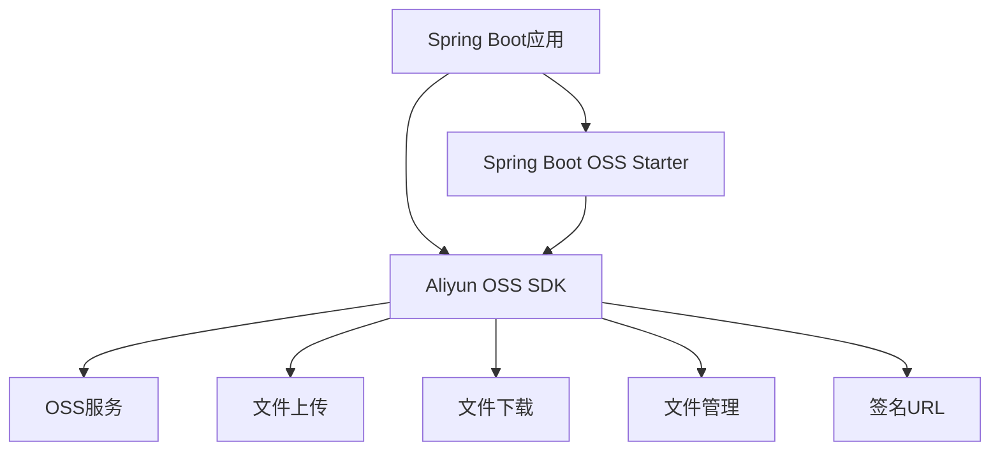

# Aliyun OSS SDK 详解与 Spring Boot 整合最佳实践



## 一、阿里云 OSS 核心概念

### 1.1 什么是对象存储服务（OSS）？

阿里云对象存储服务（Object Storage Service，简称 OSS）是一种**海量、安全、低成本、高可靠**的云存储服务，提供 99.9999999999%（12个9）的数据持久性。

### 1.2 OSS 核心术语

| 术语         | 说明                                                                 |
|--------------|----------------------------------------------------------------------|
| **Bucket**   | 存储空间，全局唯一命名空间，相当于文件系统的顶级目录                 |
| **Object**   | 存储的基本单元，包含数据（文件内容）和元数据（描述信息）             |
| **Endpoint** | OSS 服务的访问域名，格式：`https://bucket-name.region.aliyuncs.com` |
| **Region**   | OSS 数据中心所在区域（如：oss-cn-hangzhou）                         |
| **ACL**      | 访问控制列表，控制 Bucket 和 Object 的访问权限                      |

### 1.3 OSS SDK 核心功能

- **文件管理**：上传、下载、删除、列举文件
- **分片操作**：大文件分片上传、断点续传
- **权限控制**：Bucket/Object ACL 设置
- **数据处理**：图片处理、视频截帧、文档转换
- **签名URL**：生成临时访问链接

## 二、Spring Boot 整合 OSS SDK

### 2.1 添加 Maven 依赖

```xml
<dependencies>
    <!-- 阿里云 OSS 官方 SDK -->
    <dependency>
        <groupId>com.aliyun.oss</groupId>
        <artifactId>aliyun-sdk-oss</artifactId>
        <version>3.16.1</version>
    </dependency>
    
    <!-- Spring Boot OSS Starter（推荐） -->
    <dependency>
        <groupId>com.alibaba.cloud</groupId>
        <artifactId>spring-cloud-starter-alicloud-oss</artifactId>
        <version>2022.0.0.0</version>
    </dependency>
</dependencies>
```

### 2.2 配置 OSS 连接参数

`application.yml` 配置：

```yaml
alibaba:
  cloud:
    access-key: your-access-key-id
    secret-key: your-access-key-secret
    oss:
      endpoint: oss-cn-hangzhou.aliyuncs.com # 根据实际区域修改
      bucket: your-bucket-name # 默认存储桶
      # 高级配置
      max-connections: 512   # 最大连接数
      connection-timeout: 5000 # 连接超时(ms)
      max-error-retry: 3     # 最大重试次数
```

### 2.3 初始化 OSS Client Bean

```java
@Configuration
public class OssConfig {

    @Bean
    public OSS ossClient(OSSProperties properties) {
        return new OSSClientBuilder().build(
            properties.getEndpoint(),
            properties.getAccessKey(),
            properties.getSecretKey()
        );
    }
    
    @Bean
    public OSSProperties ossProperties() {
        return new OSSProperties();
    }
}
```

## 三、OSS 操作最佳实践

### 3.1 文件上传（完整示例）

```java
@Service
public class OssService {

    @Autowired
    private OSS ossClient;
    
    @Autowired
    private OSSProperties ossProperties;

    /**
     * 上传文件到OSS
     * @param file 上传文件
     * @param filePath 存储路径 (e.g. "images/2023/avatar.jpg")
     * @return 文件访问URL
     */
    public String uploadFile(MultipartFile file, String filePath) {
        try (InputStream inputStream = file.getInputStream()) {
            // 创建上传请求
            PutObjectRequest request = new PutObjectRequest(
                ossProperties.getBucket(), 
                filePath, 
                inputStream
            );
            
            // 设置元数据
            ObjectMetadata metadata = new ObjectMetadata();
            metadata.setContentType(file.getContentType());
            metadata.setContentLength(file.getSize());
            request.setMetadata(metadata);
            
            // 执行上传
            ossClient.putObject(request);
            
            // 返回访问URL
            return generateFileUrl(filePath);
        } catch (IOException e) {
            throw new OssOperationException("文件上传失败", e);
        }
    }
    
    /**
     * 生成文件访问URL（带签名）
     */
    private String generateFileUrl(String filePath) {
        // 设置URL过期时间为1小时
        Date expiration = new Date(System.currentTimeMillis() + 3600 * 1000);
        GeneratePresignedUrlRequest request = new GeneratePresignedUrlRequest(
            ossProperties.getBucket(), 
            filePath, 
            HttpMethod.GET
        );
        request.setExpiration(expiration);
        return ossClient.generatePresignedUrl(request).toString();
    }
}
```

### 3.2 大文件分片上传（>100MB）

```java
public String uploadLargeFile(File file, String objectName) {
    // 初始化分片上传
    InitiateMultipartUploadRequest initRequest = new InitiateMultipartUploadRequest(
        ossProperties.getBucket(), objectName);
    InitiateMultipartUploadResult initResult = ossClient.initiateMultipartUpload(initRequest);
    
    // 设置分片大小(5MB)
    final long partSize = 5 * 1024 * 1024; 
    List<PartETag> partETags = new ArrayList<>();
    long fileLength = file.length();
    int partCount = (int) (fileLength / partSize);
    if (fileLength % partSize != 0) partCount++;
    
    // 分片上传
    try (FileInputStream fis = new FileInputStream(file)) {
        for (int i = 0; i < partCount; i++) {
            long startPos = i * partSize;
            long curPartSize = Math.min(partSize, fileLength - startPos);
            
            // 跳过已上传部分
            fis.skip(startPos);
            
            UploadPartRequest uploadRequest = new UploadPartRequest();
            uploadRequest.setBucketName(ossProperties.getBucket());
            uploadRequest.setKey(objectName);
            uploadRequest.setUploadId(initResult.getUploadId());
            uploadRequest.setInputStream(fis);
            uploadRequest.setPartSize(curPartSize);
            uploadRequest.setPartNumber(i + 1);
            
            UploadPartResult uploadResult = ossClient.uploadPart(uploadRequest);
            partETags.add(uploadResult.getPartETag());
        }
        
        // 完成分片上传
        CompleteMultipartUploadRequest completeRequest = 
            new CompleteMultipartUploadRequest(
                ossProperties.getBucket(), 
                objectName, 
                initResult.getUploadId(), 
                partETags
            );
        ossClient.completeMultipartUpload(completeRequest);
        return generateFileUrl(objectName);
    } catch (Exception e) {
        // 中断上传
        ossClient.abortMultipartUpload(new AbortMultipartUploadRequest(
            ossProperties.getBucket(), objectName, initResult.getUploadId()));
        throw new OssOperationException("大文件上传失败", e);
    }
}
```

### 3.3 文件下载

```java
public void downloadFile(String objectName, HttpServletResponse response) {
    // 获取文件元数据
    ObjectMetadata metadata = ossClient.getObjectMetadata(
        ossProperties.getBucket(), objectName);
    
    // 设置响应头
    response.setContentType(metadata.getContentType());
    response.setContentLengthLong(metadata.getContentLength());
    response.setHeader("Content-Disposition", 
        "attachment; filename=\"" + URLEncoder.encode(objectName, "UTF-8") + "\"");
    
    // 流式下载
    try (OSSObject ossObject = ossClient.getObject(
            ossProperties.getBucket(), objectName);
         OutputStream out = response.getOutputStream()) {
        byte[] buffer = new byte[4096];
        int bytesRead;
        while ((bytesRead = ossObject.getObjectContent().read(buffer)) != -1) {
            out.write(buffer, 0, bytesRead);
        }
        out.flush();
    } catch (Exception e) {
        throw new OssOperationException("文件下载失败", e);
    }
}
```

## 四、高级功能与最佳实践

### 4.1 安全最佳实践

1. **使用STS临时凭证**

   ```java
   // 获取STS Token
   public OSS stsOssClient() {
       STSAssumeRoleSessionCredentialsProvider credentials = 
           new STSAssumeRoleSessionCredentialsProvider(
               "your-access-key-id",
               "your-access-key-secret",
               "your-role-arn",
               "session-name");
               
       return new OSSClientBuilder().build(endpoint, credentials);
   }
   ```

2. **Bucket权限策略**

   ```json
   {
     "Version": "1",
     "Statement": [
       {
         "Effect": "Allow",
         "Action": "oss:GetObject",
         "Resource": "acs:oss:*:*:your-bucket/*"
       }
     ]
   }
   ```

### 4.2 性能优化策略

| 优化方向       | 实现方案                                                                 |
|----------------|--------------------------------------------------------------------------|
| **连接池优化** | 使用`OSSClientBuilder`配置连接池参数：<br>`ClientConfiguration config = new ClientConfiguration().setMaxConnections(200);` |
| **超时设置**   | `config.setConnectionTimeout(5000);`<br>`config.setSocketTimeout(20000);` |
| **分片上传**   | 文件>100MB时使用分片上传，并行上传提高速度                                |
| **CDN加速**    | 将OSS Bucket绑定到阿里云CDN，通过CDN域名访问资源                         |

### 4.3 异常处理规范

```java
try {
    ossClient.putObject(bucketName, objectName, inputStream);
} catch (OSSException oe) {
    // 服务端错误
    log.error("OSS服务异常: [{}] {}", oe.getErrorCode(), oe.getMessage());
    throw new ServiceException("存储服务异常");
} catch (ClientException ce) {
    // 客户端错误
    if (ce instanceof ConnectionTimeoutException) {
        log.warn("OSS连接超时");
    }
    throw new ClientException("客户端请求失败");
} catch (IOException e) {
    // IO异常
    throw new FileOperationException("文件流异常");
} finally {
    // 确保关闭资源
    IOUtils.closeQuietly(inputStream);
}
```

## 五、Spring Boot 整合完整示例

### 5.1 Controller 层实现

```java
@RestController
@RequestMapping("/oss")
public class OssController {

    @Autowired
    private OssService ossService;

    @PostMapping("/upload")
    public ResponseEntity<String> uploadFile(
            @RequestParam("file") MultipartFile file,
            @RequestParam("path") String path) {
        String url = ossService.uploadFile(file, path);
        return ResponseEntity.ok(url);
    }

    @GetMapping("/download")
    public void downloadFile(
            @RequestParam("objectName") String objectName,
            HttpServletResponse response) {
        ossService.downloadFile(objectName, response);
    }
    
    @DeleteMapping("/delete")
    public ResponseEntity<Void> deleteFile(
            @RequestParam("objectName") String objectName) {
        ossService.deleteFile(objectName);
        return ResponseEntity.noContent().build();
    }
}
```

### 5.2 配置自动化（使用 Spring Cloud AliCloud）

```java
@SpringBootApplication
@EnableConfigurationProperties(OSSProperties.class)
public class Application {
    public static void main(String[] args) {
        SpringApplication.run(Application.class, args);
    }
    
    @Bean
    public OSS ossClient(OSSProperties properties) {
        return new OSSClientBuilder()
            .build(properties.getEndpoint(), 
                   properties.getAccessKey(), 
                   properties.getSecretKey());
    }
}
```

## 六、常见问题排查

### 6.1 高频问题解决方案

| 问题现象                     | 原因分析                  | 解决方案                                                                 |
|------------------------------|---------------------------|--------------------------------------------------------------------------|
| `NoSuchBucket` 错误          | Bucket 不存在或名称错误   | 1. 检查Bucket名称拼写<br>2. 确认Bucket所在Region                         |
| `SignatureDoesNotMatch` 错误 | AccessKey 或签名计算错误  | 1. 检查AccessKey/SecretKey<br>2. 确认SDK版本与文档一致                   |
| `ConnectionTimeout`          | 网络连接超时              | 1. 检查Endpoint是否正确<br>2. 增加超时时间<br>3. 使用内网Endpoint加速    |
| 上传文件损坏                 | 流未正确关闭或重置        | 1. 使用try-with-resources<br>2. 上传前重置输入流到起始位置               |
| 403 Forbidden                | 权限不足                  | 1. 检查RAM策略<br>2. 验证Bucket ACL设置<br>3. 使用STS临时凭证           |

### 6.2 调试技巧

1. **开启SDK日志**

   ```java
   // 在application.yml中配置
   logging:
     level:
       com.aliyun.oss: DEBUG
   ```

2. **使用OSS管理控制台**
   - 实时查看Bucket文件列表
   - 监控流量、请求次数
   - 设置访问日志记录

3. **使用OSS Util命令行工具**

   ```bash
   # 安装
   npm install -g ossutil
   
   # 配置
   ossutil config
   
   # 查看Bucket内容
   ossutil ls oss://your-bucket
   ```

## 七、扩展功能：OSS 图片处理

```java
public String processImage(String originalImage, int width, int height) {
    String style = "image/resize,m_fill,w_" + width + ",h_" + height;
    GeneratePresignedUrlRequest request = new GeneratePresignedUrlRequest(
        ossProperties.getBucket(), originalImage, HttpMethod.GET);
    request.setProcess(style);
    
    // 设置过期时间
    Date expiration = new Date(System.currentTimeMillis() + 3600 * 1000);
    request.setExpiration(expiration);
    
    return ossClient.generatePresignedUrl(request).toString();
}
```

**处理效果**：

```console
原始URL: https://bucket.oss-cn-hangzhou.aliyuncs.com/photo.jpg
处理后: https://bucket.oss-cn-hangzhou.aliyuncs.com/photo.jpg?x-oss-process=image/resize,m_fill,w_300,h_200
```

## 总结

通过本文，您已掌握：

1. 阿里云 OSS 核心概念与 SDK 功能
2. Spring Boot 整合 OSS 的完整方案
3. 文件上传/下载的最佳实践
4. 大文件处理、安全配置和性能优化技巧
5. 常见问题排查与调试方法

**推荐实践**：

- 生产环境使用 STS 临时凭证
- 超过 100MB 文件使用分片上传
- 结合 CDN 加速静态资源访问
- 为不同业务场景配置独立 Bucket
- 定期审计 OSS 访问日志

> 官方资源：
>
> - [OSS SDK 文档](https://help.aliyun.com/document_detail/32008.html)
> - [Spring Cloud AliCloud OSS](https://github.com/alibaba/spring-cloud-alibaba/wiki/OSS)
> - [OSS 最佳实践](https://help.aliyun.com/document_detail/31827.html)
