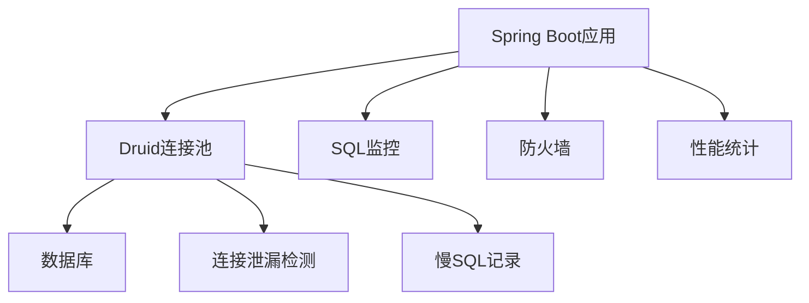
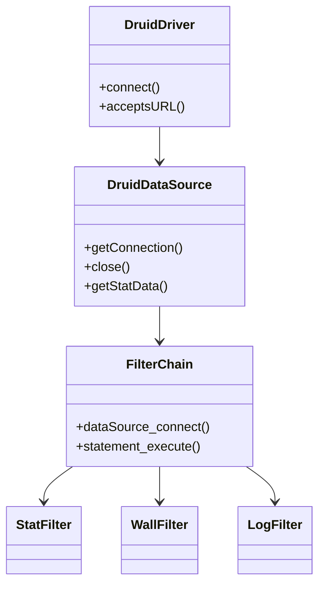
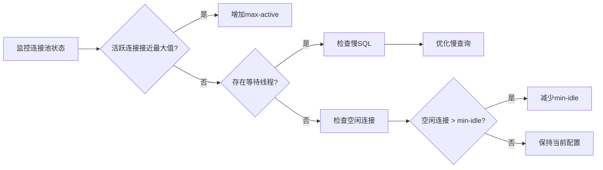

# Alibaba Druid 详解与 Spring Boot 整合最佳实践



## 一、Druid 核心特性与架构

### 1.1 Druid 是什么？

Alibaba Druid 是**Java领域性能最佳、功能最全的数据库连接池**，提供：

- 高性能的连接池管理
- 实时监控和统计功能
- SQL防火墙防御
- 内置加密支持
- Web界面管理

### 1.2 Druid 核心优势对比

| 特性                | Druid       | HikariCP     | Tomcat JDBC | C3P0        |
|---------------------|-------------|--------------|-------------|-------------|
| **性能**            | ⭐⭐⭐⭐       | ⭐⭐⭐⭐⭐       | ⭐⭐⭐         | ⭐⭐          |
| **监控功能**        | ⭐⭐⭐⭐⭐      | ⭐            | ⭐⭐          | ⭐           |
| **SQL防火墙**       | ✅           | ❌            | ❌           | ❌           |
| **连接泄漏检测**    | ✅           | ✅            | ❌           | ❌           |
| **配置复杂性**      | 中等         | 简单          | 中等         | 复杂         |

### 1.3 Druid 架构组成



## 二、Spring Boot 整合 Druid

### 2.1 添加 Maven 依赖

```xml
<dependencies>
    <!-- Spring Boot Starter JDBC -->
    <dependency>
        <groupId>org.springframework.boot</groupId>
        <artifactId>spring-boot-starter-data-jdbc</artifactId>
    </dependency>
    
    <!-- Druid 官方 Starter -->
    <dependency>
        <groupId>com.alibaba</groupId>
        <artifactId>druid-spring-boot-starter</artifactId>
        <version>1.2.18</version>
    </dependency>
    
    <!-- 数据库驱动（以MySQL为例） -->
    <dependency>
        <groupId>mysql</groupId>
        <artifactId>mysql-connector-java</artifactId>
        <scope>runtime</scope>
    </dependency>
</dependencies>
```

### 2.2 基础配置（application.yml）

```yaml
spring:
  datasource:
    url: jdbc:mysql://localhost:3306/mydb?useSSL=false&serverTimezone=UTC
    username: root
    password: yourpassword
    driver-class-name: com.mysql.cj.jdbc.Driver
    
    # Druid 专用配置
    type: com.alibaba.druid.pool.DruidDataSource
    druid:
      # 连接池配置
      initial-size: 5
      min-idle: 5
      max-active: 20
      max-wait: 60000
      
      # 监控配置
      stat-view-servlet:
        enabled: true
        url-pattern: /druid/*
        login-username: admin
        login-password: druid123
        reset-enable: false
      
      # 过滤器配置
      filters: stat,wall,slf4j
      
      # SQL防火墙配置
      wall:
        config:
          delete-allow: false
          drop-table-allow: false
```

## 三、Druid 高级配置详解

### 3.1 连接池核心参数配置

```yaml
spring:
  datasource:
    druid:
      # 连接池大小
      initial-size: 5      # 初始化连接数
      min-idle: 5          # 最小空闲连接
      max-active: 50       # 最大活跃连接
      max-wait: 3000       # 获取连接最大等待时间(ms)
      
      # 连接有效性检查
      validation-query: SELECT 1
      test-on-borrow: false
      test-on-return: false
      test-while-idle: true
      time-between-eviction-runs-millis: 60000 # 检查间隔
      min-evictable-idle-time-millis: 300000   # 最小空闲时间
      
      # 连接泄漏检测
      remove-abandoned: true
      remove-abandoned-timeout: 1800 # 超过30分钟未关闭的连接视为泄漏
      log-abandoned: true
```

### 3.2 监控与统计配置

```yaml
spring:
  datasource:
    druid:
      # 启用监控统计
      filter:
        stat:
          enabled: true
          slow-sql-millis: 2000  # 慢SQL阈值(2秒)
          log-slow-sql: true
          
        wall:
          enabled: true
          config:
            select-allow: true
            delete-allow: false  # 禁止DELETE操作
            create-table-allow: false
            
      # Web监控页面
      stat-view-servlet:
        enabled: true
        url-pattern: /druid/*
        allow: 192.168.1.0/24,127.0.0.1 # IP白名单
        deny: 192.168.1.123             # IP黑名单
        login-username: admin
        login-password: securepass
        reset-enable: false
```

### 3.3 自定义配置类（高级场景）

```java
@Configuration
public class DruidConfig {

    @Bean
    @ConfigurationProperties("spring.datasource.druid")
    public DataSource dataSource() {
        return DruidDataSourceBuilder.create().build();
    }

    @Bean
    public ServletRegistrationBean<StatViewServlet> statViewServlet() {
        ServletRegistrationBean<StatViewServlet> bean = 
            new ServletRegistrationBean<>(new StatViewServlet(), "/druid/*");
        
        // 监控页面配置
        Map<String, String> initParams = new HashMap<>();
        initParams.put("loginUsername", "admin");
        initParams.put("loginPassword", "druid123");
        initParams.put("allow", "127.0.0.1"); // 只允许本地访问
        initParams.put("deny", "192.168.1.100");
        bean.setInitParameters(initParams);
        return bean;
    }

    @Bean
    public FilterRegistrationBean<WebStatFilter> webStatFilter() {
        FilterRegistrationBean<WebStatFilter> bean = 
            new FilterRegistrationBean<>(new WebStatFilter());
        
        // 配置拦截规则
        bean.addUrlPatterns("/*");
        bean.addInitParameter("exclusions", "*.js,*.gif,*.jpg,*.css,/druid/*");
        return bean;
    }
}
```

## 四、Druid 监控中心使用指南

### 4.1 访问监控中心

1. 启动应用后访问：`http://localhost:8080/druid`
2. 输入配置的用户名密码（如：admin/druid123）

### 4.2 核心监控功能

| 模块            | 功能说明                                                                 |
|-----------------|--------------------------------------------------------------------------|
| **数据源**      | 显示连接池状态：活跃连接、空闲连接、等待线程数                           |
| **SQL监控**     | 实时查看SQL执行次数、耗时、执行时间分布                                  |
| **SQL防火墙**   | 监控拦截的SQL操作，防止危险操作                                          |
| **Web应用**     | 监控URI请求量、并发数、响应时间                                          |
| **会话**        | 查看当前数据库会话状态                                                   |
| **JSON API**    | 提供监控数据的JSON接口，便于集成其他系统                                 |

### 4.3 关键监控指标解读

1. **连接池状态**
   - **ActiveCount**：当前活跃连接数（应小于max-active）
   - **PoolingCount**：空闲连接数（应在min-idle和max-active之间）
   - **WaitThreadCount**：等待连接的线程数（持续大于0需扩容）

2. **SQL性能分析**
   - **慢SQL**：执行时间超过`slow-sql-millis`的SQL（需优化）
   - **执行次数TOP10**：高频SQL（考虑缓存优化）
   - **影响行数统计**：识别批量操作风险

## 五、安全加固最佳实践

### 5.1 生产环境安全配置

```yaml
spring:
  datasource:
    druid:
      # 禁用内置登录页面（生产环境推荐）
      stat-view-servlet:
        enabled: false
      
      # 启用加密
      filter:
        config:
          enabled: true
          # 使用公钥加密配置文件中的密码
          config.decrypt: true
          config.decrypt.key: MFwwDQYJKoZIhvcNAQEBBQAD...
```

### 5.2 SQL 防火墙规则配置

```java
@Bean
public WallFilter wallFilter() {
    WallFilter wallFilter = new WallFilter();
    WallConfig config = new WallConfig();
    
    // 禁止高危操作
    config.setDropTableAllow(false);
    config.setTruncateAllow(false);
    config.setNoneBaseStatementAllow(false);
    
    // 限制DELETE操作
    config.setDeleteAllow(false);
    config.setDeleteWhereAlwayTrueCheck(true);
    
    // 限制查询返回行数
    config.setSelectLimit(1000);
    
    wallFilter.setConfig(config);
    return wallFilter;
}
```

### 5.3 连接池密码加密

1. **生成加密密码**

   ```bash
   java -cp druid-1.2.18.jar com.alibaba.druid.filter.config.ConfigTools your_password
   
   # 输出：
   privateKey:MIIBVAIBADANBgkqhkiG9w0BAQEFAASCAT4wggE6AgE...
   publicKey:MFwwDQYJKoZIhvcNAQEBBQADSwAwSAJBAKoR8mU0f+n...
   password:PNak1M+qbS4Y3Hq4T0BsK8hGsUQ4Jxx...
   ```

2. **配置加密密码**

   ```yaml
   spring:
     datasource:
       password: ENC(PNak1M+qbS4Y3Hq4T0BsK8hGsUQ4Jxx...)
       druid:
         filter:
           config:
             enabled: true
             decrypt: true
             decrypt.key: MFwwDQYJKoZIhvcNAQEBBQAD...
   ```

## 六、性能调优指南

### 6.1 连接池参数优化公式

| 参数                | 推荐值                              | 计算公式/说明                     |
|---------------------|------------------------------------|----------------------------------|
| **initial-size**    | 10                                 | 应用启动时预加载连接数           |
| **min-idle**        | 10                                 | 保持的最小空闲连接               |
| **max-active**      | 50-100                             | (最大并发请求数 × 平均响应时间)/1000 |
| **max-wait**        | 2000-5000ms                        | 避免线程长时间阻塞               |
| **time-between-eviction-runs-millis** | 60000ms (1分钟)       | 连接空闲检查间隔                 |

### 6.2 监控驱动的优化流程



### 6.3 慢SQL优化策略

1. **识别慢SQL**

   ```sql
   -- 在Druid监控页查看执行时间>2s的SQL
   SELECT * FROM SQL_STAT WHERE EXECUTE_MILLIS > 2000
   ```

2. **优化方法**
   - 添加缺失索引：`EXPLAIN`分析执行计划
   - 重写复杂查询：拆分多表JOIN
   - 启用查询缓存：`spring.cache.type=redis`
   - 批量操作优化：使用`rewriteBatchedStatements=true`

## 七、常见问题解决方案

### 7.1 高频问题排查表

| 问题现象                          | 原因分析                  | 解决方案                                                                 |
|-----------------------------------|---------------------------|--------------------------------------------------------------------------|
| **连接泄漏**                      | 未正确关闭Connection      | 1. 启用`remove-abandoned`<br>2. 使用try-with-resources                   |
| **WAIT线程堆积**                  | `max-active`设置过小      | 1. 根据公式调大`max-active`<br>2. 优化慢SQL减少连接占用时间             |
| **监控页面无法访问**              | 安全限制                  | 1. 检查`stat-view-servlet.enabled`<br>2. 确认IP白名单配置               |
| **"discard long time none received connection"** | 空闲连接被数据库断开 | 1. 启用`test-while-idle`<br>2. 设置合理的`validation-query`             |
| **性能低于HikariCP**              | 过滤器过多                | 1. 减少不必要的过滤器<br>2. 升级到最新版本                              |

### 7.2 日志配置技巧

```properties
# application.properties
# 启用Druid日志
logging.level.druid.sql=DEBUG
logging.level.com.alibaba.druid=INFO

# 慢SQL单独记录
spring.datasource.druid.filter.stat.log-slow-sql=true
spring.datasource.druid.filter.stat.slow-sql-millis=2000
```

### 7.3 多数据源配置

```java
@Configuration
public class MultiDataSourceConfig {

    @Bean
    @ConfigurationProperties("spring.datasource.druid.primary")
    public DataSource primaryDataSource() {
        return DruidDataSourceBuilder.create().build();
    }

    @Bean
    @ConfigurationProperties("spring.datasource.druid.secondary")
    public DataSource secondaryDataSource() {
        return DruidDataSourceBuilder.create().build();
    }
    
    @Bean
    public ServletRegistrationBean<StatViewServlet> druidServlet() {
        // 统一监控入口配置
    }
}
```

## 八、Spring Boot 3整合注意事项

### 8.1 兼容性调整

1. **JDK要求**：Druid 1.2.18+支持JDK 17
2. **Jakarta EE**：使用`druid-spring-boot-3-starter`

   ```xml
   <dependency>
       <groupId>com.alibaba</groupId>
       <artifactId>druid-spring-boot-3-starter</artifactId>
       <version>1.2.18</version>
   </dependency>
   ```

### 8.2 配置变更

```yaml
# Spring Boot 3中的新配置项
spring:
  datasource:
    druid:
      # 使用新参数名
      keep-alive: true
      keep-alive-between-time-millis: 30000
      # 移除过时参数
      # useGlobalDataSourceStat: false  # 已弃用
```

## 总结：Druid 最佳实践清单

1. **安全加固**
   - 启用SQL防火墙（WallFilter）
   - 加密数据库密码
   - 限制监控页面访问IP

2. **性能优化**
   - 根据业务负载动态调整连接池大小
   - 定期分析并优化慢SQL
   - 开启连接泄漏检测

3. **监控配置**
   - 生产环境关闭内置页面（或严格限制访问）
   - 集成Prometheus监控指标

   ```java
   // Prometheus集成
   @Bean
   public DruidStatView druidStatView() {
       return new DruidStatView();
   }
   ```

4. **版本管理**
   - 使用最新稳定版（当前推荐1.2.18+）
   - Spring Boot 3使用专用starter

> 官方资源：
>
> - [Druid GitHub](https://github.com/alibaba/druid)
> - [Druid Wiki](https://github.com/alibaba/druid/wiki)
> - [Spring Boot Starter文档](https://github.com/alibaba/druid/tree/master/druid-spring-boot-starter)

通过本文，您将获得：

1. Druid核心原理深度解析
2. Spring Boot整合完整方案
3. 生产级安全加固策略
4. 性能调优实战指南
5. 复杂问题解决方案
