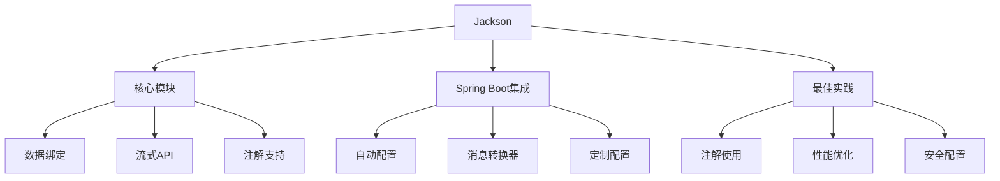

# Jackson 详解与 Spring Boot 整合最佳实践



## 一、Jackson 核心概念

### 1.1 Jackson 是什么？

Jackson 是 Java 生态中最流行的 **JSON 处理库**，提供：

- 高性能的 JSON 序列化/反序列化
- 强大的数据绑定功能
- 灵活的流式 API
- 丰富的注解系统
- 支持 XML、YAML 等格式

### 1.2 Jackson 三模块架构

| 模块               | 功能描述                                                                 |
|--------------------|--------------------------------------------------------------------------|
| **jackson-core**   | 提供底层流式 API（JsonParser, JsonGenerator）                           |
| **jackson-annotations** | 包含所有注解定义（@JsonProperty, @JsonIgnore 等）                      |
| **jackson-databind** | 实现数据绑定功能，依赖前两个模块                                       |

### 1.3 Spring Boot 中的 Jackson 自动配置

Spring Boot 自动配置 `ObjectMapper`：

- 默认启用 `WRITE_DATES_AS_TIMESTAMPS = false`
- 自动注册 JDK8 时间模块
- 支持通过配置文件定制

```java
@Bean
@Primary
public ObjectMapper objectMapper() {
    return Jackson2ObjectMapperBuilder.json()
        .indentOutput(true)
        .modules(new JavaTimeModule())
        .build();
}
```

## 二、核心注解详解

### 2.1 序列化控制注解

| 注解                  | 作用描述                                                                 | 示例                                                                 |
|-----------------------|--------------------------------------------------------------------------|----------------------------------------------------------------------|
| `@JsonProperty`       | 指定属性在 JSON 中的名称                                                 | `@JsonProperty("user_name") private String userName;`               |
| `@JsonFormat`         | 控制日期/数字的格式化                                                    | `@JsonFormat(pattern="yyyy-MM-dd") private LocalDate birthDate;`     |
| `@JsonInclude`        | 控制何时包含属性                                                         | `@JsonInclude(Include.NON_NULL)`                                    |
| `@JsonGetter`         | 自定义 getter 方法在序列化中的名称                                        | `@JsonGetter("displayName") public String getFullName()`            |
| `@JsonAnyGetter`      | 将 Map 属性平铺展开到 JSON                                               | `@JsonAnyGetter public Map<String, Object> getProperties()`         |

### 2.2 反序列化控制注解

| 注解                  | 作用描述                                                                 | 示例                                                                 |
|-----------------------|--------------------------------------------------------------------------|----------------------------------------------------------------------|
| `@JsonAlias`          | 为属性定义多个别名                                                       | `@JsonAlias({"email", "e_mail"}) private String email;`              |
| `@JsonCreator`        | 自定义反序列化构造方法                                                   | `@JsonCreator public User(@JsonProperty("id") int id)`              |
| `@JsonSetter`         | 自定义 setter 方法在反序列化中的名称                                      | `@JsonSetter("u_name") public void setUsername(String name)`        |
| `@JsonAnySetter`      | 处理 JSON 中的未知属性                                                    | `@JsonAnySetter public void set(String key, Object value)`          |
| `@JsonPropertyOrder`  | 控制属性序列化顺序                                                       | `@JsonPropertyOrder({"id", "name"})`                                |

### 2.3 类型处理注解

| 注解                  | 作用描述                                                                 | 示例                                                                 |
|-----------------------|--------------------------------------------------------------------------|----------------------------------------------------------------------|
| `@JsonTypeInfo`       | 添加类型信息用于多态反序列化                                             | `@JsonTypeInfo(use=Id.CLASS)`                                       |
| `@JsonSubTypes`       | 定义子类型映射关系                                                       | `@JsonSubTypes({ @Type(value=Dog.class), @Type(value=Cat.class) })` |
| `@JsonTypeName`       | 定义类型的名称                                                           | `@JsonTypeName("dog")`                                              |
| `@JsonIgnoreType`     | 忽略整个类                                                               | `@JsonIgnoreType public class InternalMetadata {}`                  |

## 三、Spring Boot 整合实践

### 3.1 添加依赖

```xml
<dependencies>
    <!-- Spring Boot Web 已包含 Jackson -->
    <dependency>
        <groupId>org.springframework.boot</groupId>
        <artifactId>spring-boot-starter-web</artifactId>
    </dependency>
    
    <!-- JDK8 时间支持 -->
    <dependency>
        <groupId>com.fasterxml.jackson.datatype</groupId>
        <artifactId>jackson-datatype-jsr310</artifactId>
    </dependency>
</dependencies>
```

### 3.2 全局配置（application.yml）

```yaml
spring:
  jackson:
    # 日期格式
    date-format: yyyy-MM-dd HH:mm:ss
    time-zone: Asia/Shanghai
    
    # 序列化配置
    serialization:
      write-dates-as-timestamps: false
      write-duration-as-timestamps: false
      indent-output: true  # 美化输出
    
    # 属性包含规则
    default-property-inclusion: non_null
    
    # 反序列化配置
    deserialization:
      fail-on-unknown-properties: false  # 忽略未知属性
```

### 3.3 自定义 ObjectMapper

```java
@Configuration
public class JacksonConfig {

    @Bean
    public ObjectMapper objectMapper() {
        return new ObjectMapper()
            .registerModule(new JavaTimeModule())  // 支持Java8时间
            .registerModule(new Jdk8Module())      // 支持Optional等
            .disable(SerializationFeature.WRITE_DATES_AS_TIMESTAMPS)
            .disable(DeserializationFeature.FAIL_ON_UNKNOWN_PROPERTIES)
            .setSerializationInclusion(JsonInclude.Include.NON_NULL)
            .enable(MapperFeature.ACCEPT_CASE_INSENSITIVE_ENUMS) // 枚举不区分大小写
            .setPropertyNamingStrategy(PropertyNamingStrategies.SNAKE_CASE); // 全局命名策略
    }
}
```

## 四、高级序列化场景

### 4.1 多态类型处理

```java
// 基类
@JsonTypeInfo(
    use = JsonTypeInfo.Id.NAME,
    include = JsonTypeInfo.As.PROPERTY,
    property = "type")
@JsonSubTypes({
    @JsonSubTypes.Type(value = Dog.class, name = "dog"),
    @JsonSubTypes.Type(value = Cat.class, name = "cat")
})
public abstract class Animal {
    private String name;
}

// 子类
@JsonTypeName("dog")
public class Dog extends Animal {
    private int barkVolume;
}

// 子类
@JsonTypeName("cat")
public class Cat extends Animal {
    private boolean likesCream;
}
```

**序列化结果**：

```json
{
  "type": "dog",
  "name": "Buddy",
  "barkVolume": 10
}
```

### 4.2 自定义序列化器

```java
public class MoneySerializer extends StdSerializer<BigDecimal> {
    public MoneySerializer() {
        super(BigDecimal.class);
    }

    @Override
    public void serialize(BigDecimal value, JsonGenerator gen, SerializerProvider provider) 
      throws IOException {
        gen.writeString(value.setScale(2, RoundingMode.HALF_UP) + " USD");
    }
}

// 使用
public class Product {
    @JsonSerialize(using = MoneySerializer.class)
    private BigDecimal price;
}
```

### 4.3 视图控制（View）

```java
public class Views {
    public static class Public {}
    public static class Internal extends Public {}
}

public class User {
    @JsonView(Views.Public.class)
    private Long id;
    
    @JsonView(Views.Public.class)
    private String name;
    
    @JsonView(Views.Internal.class)
    private String email;
}

// Controller中使用
@GetMapping("/user")
@JsonView(Views.Public.class)
public User getUser() {
    return userService.getCurrentUser();
}
```

## 五、最佳实践指南

### 5.1 性能优化策略

| 优化点                | 实现方式                                                                 |
|-----------------------|--------------------------------------------------------------------------|
| **重用 ObjectMapper** | 避免重复创建，使用单例或 Spring 管理的 Bean                              |
| **启用预编译**        | 对于 POJO 使用 `@JsonSerialize(as = MyClass.class)` 避免反射开销         |
| **关闭无用特性**      | `mapper.disable(MapperFeature.DEFAULT_VIEW_INCLUSION)`                   |
| **使用流式 API**      | 处理大 JSON 时使用 JsonParser/JsonGenerator                              |
| **缓存 TypeFactory**  | `mapper.getTypeFactory().constructType(MyClass.class)`                   |

### 5.2 安全配置建议

1. **防栈溢出**

   ```java
   mapper.enable(JsonParser.Feature.STRICT_DUPLICATE_DETECTION);
   mapper.configure(StreamReadConstraints.builder()
       .maxNestingDepth(1000).build());
   ```

2. **防 DDoS 攻击**

   ```java
   // 限制字符串长度和数字值
   mapper.configure(StreamReadConstraints.builder()
       .maxStringLength(100000)
       .maxNumberLength(1000)
       .build());
   ```

3. **关闭危险特性**

   ```java
   // 禁用自动关闭源
   mapper.disable(JsonParser.Feature.AUTO_CLOSE_SOURCE);
   // 禁止解析注释
   mapper.disable(JsonParser.Feature.ALLOW_COMMENTS);
   ```

### 5.3 日期时间处理最佳实践

```java
@Bean
public ObjectMapper objectMapper() {
    ObjectMapper mapper = new ObjectMapper();
    
    // 注册Java8时间模块
    JavaTimeModule timeModule = new JavaTimeModule();
    
    // 自定义日期序列化格式
    timeModule.addSerializer(LocalDateTime.class, new LocalDateTimeSerializer(
        DateTimeFormatter.ofPattern("yyyy-MM-dd HH:mm:ss")));
    
    // 自定义日期反序列化
    timeModule.addDeserializer(LocalDate.class, new LocalDateDeserializer(
        DateTimeFormatter.ofPattern("yyyy/MM/dd")));
    
    mapper.registerModule(timeModule);
    return mapper;
}
```

## 六、常见问题解决方案

### 6.1 高频问题排查表

| 问题现象                          | 原因分析                  | 解决方案                                                                 |
|-----------------------------------|---------------------------|--------------------------------------------------------------------------|
| **日期序列化为时间戳**            | 未注册 JavaTimeModule     | 1. 添加 jackson-datatype-jsr310 依赖<br>2. 注册 JavaTimeModule           |
| **未知属性导致解析失败**          | FAIL_ON_UNKNOWN_PROPERTIES=true | `mapper.disable(DeserializationFeature.FAIL_ON_UNKNOWN_PROPERTIES)` |
| **循环引用导致栈溢出**            | 对象间相互引用            | 1. 使用 `@JsonManagedReference` 和 `@JsonBackReference`<br>2. 使用 `@JsonIgnore` |
| **枚举值大小写敏感**              | 默认区分大小写            | `mapper.enable(MapperFeature.ACCEPT_CASE_INSENSITIVE_ENUMS)`             |
| **Optional 字段序列化问题**       | 未注册 Jdk8Module         | 1. 添加 jackson-datatype-jdk8 依赖<br>2. 注册 Jdk8Module                 |

### 6.2 循环引用解决方案

```java
public class User {
    @JsonManagedReference
    private List<Order> orders;
}

public class Order {
    @JsonBackReference
    private User user;
}

// 或使用
@JsonIdentityInfo(
    generator = ObjectIdGenerators.PropertyGenerator.class,
    property = "id")
public class User {
    private Long id;
    private List<Order> orders;
}

@JsonIdentityInfo(
    generator = ObjectIdGenerators.PropertyGenerator.class,
    property = "id")
public class Order {
    private Long id;
    private User user;
}
```

### 6.3 自定义反序列化器

```java
public class CustomDateDeserializer extends StdDeserializer<LocalDate> {
    public CustomDateDeserializer() {
        super(LocalDate.class);
    }

    @Override
    public LocalDate deserialize(JsonParser p, DeserializationContext ctxt) 
      throws IOException {
        String dateStr = p.getText();
        try {
            return LocalDate.parse(dateStr, DateTimeFormatter.ofPattern("dd/MM/yyyy"));
        } catch (DateTimeParseException e) {
            throw new JsonParseException(p, "日期格式错误，应为 dd/MM/yyyy");
        }
    }
}

// 使用
public class Event {
    @JsonDeserialize(using = CustomDateDeserializer.class)
    private LocalDate eventDate;
}
```

## 七、Spring Boot 3 新特性支持

### 7.1 Record 类型支持

```java
public record UserRecord(
    @JsonProperty("id") Long id,
    @JsonProperty("name") String name,
    @JsonProperty("email") String email
) {}

// 自动支持序列化/反序列化
```

### 7.2 密封类（Sealed Classes）支持

```java
@JsonTypeInfo(use = Id.NAME, property = "type")
@JsonSubTypes({
    @Type(value = Admin.class, name = "admin"),
    @Type(value = Member.class, name = "member")
})
public sealed interface User permits Admin, Member {
    String name();
}

public final class Admin implements User {
    private String name;
    private String[] permissions;
}

public final class Member implements User {
    private String name;
    private LocalDate joinDate;
}
```

### 7.3 虚拟线程（Virtual Threads）优化

```java
@Bean
public ObjectMapper objectMapper() {
    return JsonMapper.builder()
        .enable(JsonReadFeature.ALLOW_TRAILING_COMMA)
        .enable(StreamReadFeature.IGNORE_TRAILING_TOKENS)
        .build();
}
```

## 八、实战：构建 RESTful API

### 8.1 统一响应结构

```java
@JsonInclude(JsonInclude.Include.NON_NULL)
public class ApiResponse<T> {
    private int code;
    private String message;
    
    @JsonView(Views.Public.class)
    private T data;
    
    @JsonFormat(pattern = "yyyy-MM-dd HH:mm:ss")
    private LocalDateTime timestamp = LocalDateTime.now();
    
    // 构造方法使用@JsonCreator
    @JsonCreator
    public ApiResponse(@JsonProperty("code") int code, 
                       @JsonProperty("message") String message) {
        this.code = code;
        this.message = message;
    }
    
    // 静态工厂方法
    public static <T> ApiResponse<T> success(T data) {
        ApiResponse<T> response = new ApiResponse<>(200, "Success");
        response.setData(data);
        return response;
    }
}
```

### 8.2 全局异常处理

```java
@RestControllerAdvice
public class GlobalExceptionHandler {
    
    @ExceptionHandler(MethodArgumentNotValidException.class)
    @ResponseStatus(HttpStatus.BAD_REQUEST)
    public ApiResponse<Map<String, String>> handleValidationExceptions(
        MethodArgumentNotValidException ex) {
        
        Map<String, String> errors = new HashMap<>();
        ex.getBindingResult().getFieldErrors().forEach(error -> 
            errors.put(error.getField(), error.getDefaultMessage()));
        
        return new ApiResponse<>(400, "Validation failed", errors);
    }
    
    @ExceptionHandler(JsonParseException.class)
    @ResponseStatus(HttpStatus.BAD_REQUEST)
    public ApiResponse<String> handleJsonParseException(JsonParseException ex) {
        return new ApiResponse<>(400, "JSON parse error: " + ex.getMessage());
    }
}
```

## 总结：Jackson 最佳实践清单

1. **注解策略**
   - 优先使用注解而非全局配置
   - 合理使用 `@JsonView` 控制敏感字段
   - 使用 `@JsonInclude` 减少不必要数据

2. **性能优化**
   - 重用 ObjectMapper 实例
   - 关闭无用特性（`FAIL_ON_EMPTY_BEANS` 等）
   - 大文件处理使用流式 API

3. **安全加固**
   - 限制 JSON 输入大小和深度
   - 禁用危险特性（`ALLOW_COMMENTS` 等）
   - 验证输入数据格式

4. **类型处理**
   - 使用 `@JsonTypeInfo` 处理多态
   - 注册 JavaTimeModule 处理日期
   - 使用 Record 类型简化 DTO

> 官方资源：
>
> - [Jackson GitHub](https://github.com/FasterXML/jackson)
> - [Jackson 注解指南](https://github.com/FasterXML/jackson-annotations/wiki/Jackson-Annotations)
> - [Spring Boot JSON 文档](https://docs.spring.io/spring-boot/docs/current/reference/html/features.html#features.json)

通过本文，您将掌握：

1. Jackson 核心概念与架构
2. 30+ 常用注解的深度解析
3. Spring Boot 整合最佳实践
4. 高级序列化场景解决方案
5. 性能优化与安全加固策略
6. Spring Boot 3 新特性支持
