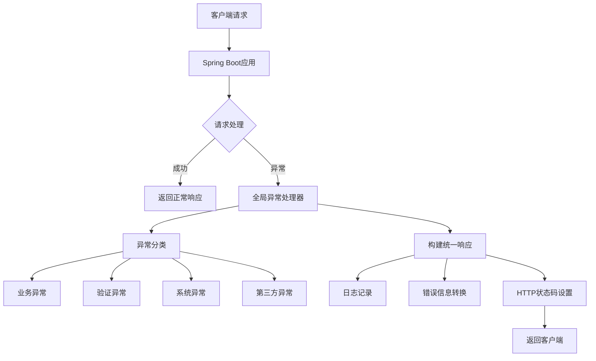

# Spring Boot 全局异常处理详解与最佳实践



## 一、为什么需要全局异常处理？

在Spring Boot应用中，异常处理至关重要：

1. **统一错误响应**：避免不同控制器返回不同格式的错误信息
2. **分离关注点**：业务代码专注于核心逻辑，异常处理集中管理
3. **增强安全性**：避免敏感信息泄露（如堆栈跟踪）
4. **提升用户体验**：提供清晰、友好的错误提示
5. **便于监控**：集中记录异常日志，便于问题追踪

## 二、Spring Boot 异常处理机制

### 2.1 异常处理核心组件

| 组件 | 说明 | 适用场景 |
|------|------|----------|
| `@ExceptionHandler` | 控制器内异常处理 | 单个控制器的特定异常 |
| `@ControllerAdvice` | 全局异常处理 | 应用级别的统一异常处理 |
| `ResponseEntityExceptionHandler` | Spring MVC提供的异常处理基类 | 扩展实现自定义全局处理 |
| `ErrorController` | 处理未捕获异常 | 最终兜底处理 |

### 2.2 异常传播优先级

```mermaid
graph LR
    A[Controller内@ExceptionHandler] --> B[全局@ControllerAdvice]
    B --> C[ResponseEntityExceptionHandler]
    C --> D[ErrorController]
```

## 三、全局异常处理实现

### 3.1 基础实现：使用@ControllerAdvice

```java
@RestControllerAdvice
public class GlobalExceptionHandler {

    // 处理所有未定义异常
    @ExceptionHandler(Exception.class)
    @ResponseStatus(HttpStatus.INTERNAL_SERVER_ERROR)
    public ErrorResponse handleException(Exception ex) {
        return new ErrorResponse("SERVER_ERROR", "系统内部错误");
    }
    
    // 处理自定义业务异常
    @ExceptionHandler(BusinessException.class)
    @ResponseStatus(HttpStatus.BAD_REQUEST)
    public ErrorResponse handleBusinessException(BusinessException ex) {
        return new ErrorResponse(ex.getCode(), ex.getMessage());
    }
    
    // 处理数据验证异常
    @ExceptionHandler(MethodArgumentNotValidException.class)
    @ResponseStatus(HttpStatus.BAD_REQUEST)
    public ErrorResponse handleValidationException(MethodArgumentNotValidException ex) {
        List<String> errors = ex.getBindingResult()
            .getFieldErrors()
            .stream()
            .map(FieldError::getDefaultMessage)
            .collect(Collectors.toList());
        return new ErrorResponse("VALIDATION_ERROR", "参数验证失败", errors);
    }
}
```

### 3.2 统一响应体设计

```java
public class ErrorResponse {
    private String code;       // 错误代码
    private String message;    // 用户友好消息
    private Object details;    // 错误详情
    private long timestamp;    // 时间戳
    
    // 构造方法
    public ErrorResponse(String code, String message) {
        this.code = code;
        this.message = message;
        this.timestamp = System.currentTimeMillis();
    }
    
    // 带详情的构造方法
    public ErrorResponse(String code, String message, Object details) {
        this(code, message);
        this.details = details;
    }
    
    // Getters
    // ...
}
```

### 3.3 自定义业务异常

```java
public class BusinessException extends RuntimeException {
    private final String code;
    
    public BusinessException(String code, String message) {
        super(message);
        this.code = code;
    }
    
    public BusinessException(String code, String message, Throwable cause) {
        super(message, cause);
        this.code = code;
    }
    
    public String getCode() {
        return code;
    }
}

// 使用示例
public void processOrder(Order order) {
    if (order == null) {
        throw new BusinessException("ORDER_INVALID", "订单不能为空");
    }
    // 业务逻辑...
}
```

## 四、处理特定异常的最佳实践

### 4.1 数据验证异常处理

```java
@ExceptionHandler(MethodArgumentNotValidException.class)
@ResponseStatus(HttpStatus.BAD_REQUEST)
public ErrorResponse handleValidationExceptions(
    MethodArgumentNotValidException ex) {
    
    Map<String, String> errors = new HashMap<>();
    ex.getBindingResult().getAllErrors().forEach(error -> {
        String fieldName = ((FieldError) error).getField();
        String errorMessage = error.getDefaultMessage();
        errors.put(fieldName, errorMessage);
    });
    
    return new ErrorResponse(
        "VALIDATION_FAILED", 
        "请求参数验证失败", 
        errors
    );
}
```

### 4.2 认证授权异常处理

```java
@ExceptionHandler({
    AccessDeniedException.class,
    AuthenticationException.class
})
@ResponseStatus(HttpStatus.FORBIDDEN)
public ErrorResponse handleAccessDeniedException(Exception ex) {
    return new ErrorResponse(
        "ACCESS_DENIED", 
        "您没有权限执行此操作"
    );
}
```

### 4.3 数据库操作异常处理

```java
@ExceptionHandler(DataAccessException.class)
@ResponseStatus(HttpStatus.INTERNAL_SERVER_ERROR)
public ErrorResponse handleDataAccessException(DataAccessException ex) {
    // 记录详细日志但返回通用错误
    log.error("数据库操作异常: {}", ex.getMessage(), ex);
    return new ErrorResponse(
        "DATABASE_ERROR", 
        "数据库操作失败，请稍后重试"
    );
}
```

### 4.4 处理404资源不存在

```java
@ExceptionHandler(NoHandlerFoundException.class)
@ResponseStatus(HttpStatus.NOT_FOUND)
public ErrorResponse handleNoHandlerFoundException(
    NoHandlerFoundException ex) {
    
    return new ErrorResponse(
        "RESOURCE_NOT_FOUND", 
        "请求的资源不存在: " + ex.getRequestURL()
    );
}
```

## 五、高级功能与最佳实践

### 5.1 异常国际化支持

```java
@RestControllerAdvice
public class GlobalExceptionHandler {
    
    @Autowired
    private MessageSource messageSource;
    
    @ExceptionHandler(BusinessException.class)
    @ResponseStatus(HttpStatus.BAD_REQUEST)
    public ErrorResponse handleBusinessException(
        BusinessException ex, 
        HttpServletRequest request) {
        
        // 从请求头获取语言
        Locale locale = request.getLocale();
        
        // 使用国际化消息
        String localizedMsg = messageSource.getMessage(
            ex.getCode(), 
            ex.getArgs(), 
            ex.getMessage(), 
            locale
        );
        
        return new ErrorResponse(ex.getCode(), localizedMsg);
    }
}
```

### 5.2 异常日志记录策略

```java
@ExceptionHandler(Exception.class)
@ResponseStatus(HttpStatus.INTERNAL_SERVER_ERROR)
public ErrorResponse handleGlobalException(
    Exception ex, 
    WebRequest request) {
    
    // 记录异常堆栈
    log.error("全局异常: {} - {}", request.getDescription(false), ex.getMessage());
    
    // 生产环境不返回堆栈信息
    Object details = null;
    if (Arrays.asList(env.getActiveProfiles()).contains("dev")) {
        details = ex.getStackTrace();
    }
    
    return new ErrorResponse(
        "GLOBAL_ERROR", 
        "系统发生错误，请联系管理员", 
        details
    );
}
```

### 5.3 自定义HTTP状态码

```java
@ExceptionHandler(ResourceNotFoundException.class)
public ResponseEntity<ErrorResponse> handleResourceNotFound(
    ResourceNotFoundException ex) {
    
    ErrorResponse error = new ErrorResponse(
        "RESOURCE_NOT_FOUND", 
        ex.getMessage()
    );
    
    // 根据业务需要返回不同状态码
    HttpStatus status = ex.isPermanent() ? 
        HttpStatus.GONE : HttpStatus.NOT_FOUND;
    
    return new ResponseEntity<>(error, status);
}
```

### 5.4 异常分类处理框架

```java
public interface ExceptionHandlerStrategy {
    boolean supports(Exception ex);
    ResponseEntity<ErrorResponse> handle(Exception ex);
}

@Component
public class ValidationHandlerStrategy implements ExceptionHandlerStrategy {
    @Override
    public boolean supports(Exception ex) {
        return ex instanceof MethodArgumentNotValidException;
    }
    
    @Override
    public ResponseEntity<ErrorResponse> handle(Exception ex) {
        // 处理逻辑...
    }
}

@RestControllerAdvice
public class GlobalExceptionHandler {
    
    @Autowired
    private List<ExceptionHandlerStrategy> strategies;
    
    @ExceptionHandler(Exception.class)
    public ResponseEntity<ErrorResponse> handleException(Exception ex) {
        return strategies.stream()
            .filter(strategy -> strategy.supports(ex))
            .findFirst()
            .map(strategy -> strategy.handle(ex))
            .orElseGet(() -> fallbackHandler(ex));
    }
    
    private ResponseEntity<ErrorResponse> fallbackHandler(Exception ex) {
        // 默认处理逻辑...
    }
}
```

## 六、Spring Boot 3 新特性

### 6.1 Problem Details for HTTP APIs (RFC 7807)

Spring Boot 3 支持标准化错误响应格式：

```java
@RestControllerAdvice
public class GlobalExceptionHandler 
    extends ResponseEntityExceptionHandler {
    
    @ExceptionHandler(BusinessException.class)
    public ProblemDetail handleBusinessException(BusinessException ex) {
        ProblemDetail problemDetail = ProblemDetail.forStatus(HttpStatus.BAD_REQUEST);
        problemDetail.setTitle("业务错误");
        problemDetail.setDetail(ex.getMessage());
        problemDetail.setProperty("errorCode", ex.getCode());
        problemDetail.setProperty("timestamp", Instant.now());
        return problemDetail;
    }
}
```

**响应示例**：

```json
{
  "type": "about:blank",
  "title": "业务错误",
  "status": 400,
  "detail": "订单金额不足",
  "errorCode": "ORDER_BALANCE_INSUFFICIENT",
  "timestamp": "2023-10-05T12:30:45.123Z"
}
```

### 6.2 错误处理自动配置

Spring Boot 3 自动配置了以下错误处理：

- 自动处理 `MethodArgumentNotValidException`
- 自动处理 `HttpMessageNotReadableException`
- 默认启用 RFC 7807 支持

可通过配置自定义：

```yaml
server:
  error:
    include-message: always
    include-binding-errors: always
    include-stacktrace: on_param
    path: /error
```

## 七、测试全局异常处理器

### 7.1 使用MockMvc测试

```java
@SpringBootTest
@AutoConfigureMockMvc
class GlobalExceptionHandlerTest {

    @Autowired
    private MockMvc mockMvc;

    @Test
    void whenInvalidInput_thenReturnsValidationError() throws Exception {
        mockMvc.perform(post("/api/orders")
                .contentType(MediaType.APPLICATION_JSON)
                .content("{\"amount\": -1}"))
            .andExpect(status().isBadRequest())
            .andExpect(jsonPath("$.code").value("VALIDATION_FAILED"))
            .andExpect(jsonPath("$.details.amount").exists());
    }

    @Test
    void whenResourceNotFound_thenReturns404() throws Exception {
        mockMvc.perform(get("/api/products/999"))
            .andExpect(status().isNotFound())
            .andExpect(jsonPath("$.code").value("RESOURCE_NOT_FOUND"));
    }
}
```

### 7.2 使用TestRestTemplate测试

```java
@SpringBootTest(webEnvironment = WebEnvironment.RANDOM_PORT)
class GlobalExceptionHandlerIntegrationTest {

    @LocalServerPort
    private int port;

    @Autowired
    private TestRestTemplate restTemplate;

    @Test
    void whenBusinessException_thenReturnsBusinessError() {
        ResponseEntity<ErrorResponse> response = restTemplate.getForEntity(
            "http://localhost:" + port + "/api/business-error", 
            ErrorResponse.class
        );
        
        assertThat(response.getStatusCode()).isEqualTo(HttpStatus.BAD_REQUEST);
        assertThat(response.getBody().getCode()).isEqualTo("BUSINESS_ERROR");
    }
}
```

## 八、常见问题与解决方案

### 8.1 异常处理不生效排查

| 问题现象 | 可能原因 | 解决方案 |
|----------|----------|----------|
| 全局异常处理器未生效 | 包扫描问题 | 添加 `@ComponentScan` 包含处理器包 |
| 特定异常未被捕获 | 异常类型不匹配 | 检查异常继承关系，使用更通用的异常类型 |
| 响应状态码不正确 | 缺少 `@ResponseStatus` | 在处理方法上添加正确的状态码注解 |
| 自定义异常信息未返回 | 未正确序列化 | 确保响应对象有 getter 方法 |

### 8.2 性能优化建议

1. **避免在异常处理器中执行耗时操作**
2. **使用缓存提高国际化消息查找效率**
3. **生产环境禁用详细堆栈信息**
4. **异步记录日志避免阻塞响应**

```java
@ExceptionHandler(Exception.class)
public ResponseEntity<ErrorResponse> handleGlobalException(Exception ex) {
    // 异步记录日志
    CompletableFuture.runAsync(() -> 
        log.error("全局异常", ex)
    );
    
    return ResponseEntity
        .status(HttpStatus.INTERNAL_SERVER_ERROR)
        .body(new ErrorResponse("SERVER_ERROR", "系统错误"));
}
```

### 8.3 安全最佳实践

1. **敏感信息过滤**：

   ```java
   @ExceptionHandler(DataAccessException.class)
   public ErrorResponse handleDataAccessException(DataAccessException ex) {
       // 不返回数据库详细错误
       return new ErrorResponse("DB_ERROR", "数据库操作失败");
   }
   ```

2. **错误信息脱敏**：

   ```java
   public class SanitizedErrorResponse extends ErrorResponse {
       public SanitizedErrorResponse(String code, String message) {
           super(code, sanitize(message));
       }
       
       private static String sanitize(String input) {
           // 移除敏感信息
           return input.replaceAll("password=[^&]+", "password=***");
       }
   }
   ```

## 九、完整示例：企业级异常处理框架

### 9.1 异常类体系设计

```java
// 基础异常类
public abstract class BaseException extends RuntimeException {
    private final String code;
    private final HttpStatus httpStatus;
    private final transient Object[] args;
    
    public BaseException(String code, HttpStatus httpStatus, String message, Object... args) {
        super(message);
        this.code = code;
        this.httpStatus = httpStatus;
        this.args = args;
    }
    
    // Getters...
}

// 业务异常
public class BusinessException extends BaseException {
    public BusinessException(String code, String message, Object... args) {
        super(code, HttpStatus.BAD_REQUEST, message, args);
    }
}

// 认证异常
public class AuthenticationException extends BaseException {
    public AuthenticationException(String code, String message) {
        super(code, HttpStatus.UNAUTHORIZED, message);
    }
}

// 资源不存在异常
public class ResourceNotFoundException extends BaseException {
    public ResourceNotFoundException(String resource, Object id) {
        super("RESOURCE_NOT_FOUND", HttpStatus.NOT_FOUND, 
            "资源 %s (ID: %s) 不存在", resource, id);
    }
}
```

### 9.2 全局异常处理器实现

```java
@RestControllerAdvice
@Slf4j
public class GlobalExceptionHandler extends ResponseEntityExceptionHandler {

    @Autowired
    private MessageSource messageSource;
    
    @Override
    protected ResponseEntity<Object> handleMethodArgumentNotValid(
        MethodArgumentNotValidException ex, HttpHeaders headers, 
        HttpStatusCode status, WebRequest request) {
        
        Map<String, String> errors = ex.getBindingResult().getFieldErrors()
            .stream()
            .collect(Collectors.toMap(
                FieldError::getField,
                error -> messageSource.getMessage(error, LocaleContextHolder.getLocale())
            ));
        
        ErrorResponse error = new ErrorResponse(
            "VALIDATION_FAILED", 
            "参数验证失败", 
            errors
        );
        return new ResponseEntity<>(error, headers, status);
    }
    
    @ExceptionHandler(BaseException.class)
    public ResponseEntity<ErrorResponse> handleBaseException(
        BaseException ex, WebRequest request) {
        
        // 国际化消息
        String localizedMsg = messageSource.getMessage(
            ex.getMessage(), 
            ex.getArgs(), 
            LocaleContextHolder.getLocale()
        );
        
        ErrorResponse error = new ErrorResponse(
            ex.getCode(), 
            localizedMsg
        );
        return new ResponseEntity<>(error, ex.getHttpStatus());
    }
    
    @ExceptionHandler(Exception.class)
    public ResponseEntity<ErrorResponse> handleGlobalException(
        Exception ex, WebRequest request) {
        
        log.error("未处理异常: {}", ex.getMessage(), ex);
        
        ErrorResponse error = new ErrorResponse(
            "INTERNAL_ERROR", 
            "系统发生错误，请联系管理员"
        );
        return new ResponseEntity<>(error, HttpStatus.INTERNAL_SERVER_ERROR);
    }
}
```

### 9.3 统一响应结构

```java
public class ApiResponse<T> {
    private boolean success;
    private T data;
    private ErrorResponse error;
    private long timestamp;
    
    public static <T> ApiResponse<T> success(T data) {
        ApiResponse<T> response = new ApiResponse<>();
        response.setSuccess(true);
        response.setData(data);
        response.setTimestamp(System.currentTimeMillis());
        return response;
    }
    
    public static ApiResponse<?> error(ErrorResponse error) {
        ApiResponse<?> response = new ApiResponse<>();
        response.setSuccess(false);
        response.setError(error);
        response.setTimestamp(System.currentTimeMillis());
        return response;
    }
    
    // Getters and Setters...
}
```

## 十、总结：全局异常处理最佳实践

1. **统一响应格式**：所有错误返回统一结构
2. **异常分类处理**：
   - 业务异常（400 Bad Request）
   - 认证异常（401 Unauthorized）
   - 权限异常（403 Forbidden）
   - 资源不存在（404 Not Found）
   - 系统异常（500 Internal Server Error）
3. **敏感信息保护**：生产环境不返回堆栈跟踪
4. **全面日志记录**：记录异常详细信息便于排查
5. **国际化支持**：根据客户端语言返回错误消息
6. **使用标准协议**：采用 RFC 7807 Problem Details
7. **全面测试覆盖**：为所有异常处理器编写测试用例

> 通过实施这些最佳实践，您的Spring Boot应用将获得：
>
> - 更健壮的异常处理能力
> - 更友好的用户体验
> - 更安全的错误信息返回
> - 更高效的故障排查流程
> - 更易维护的代码结构
