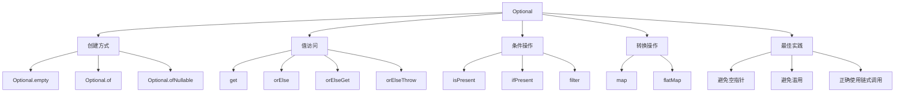
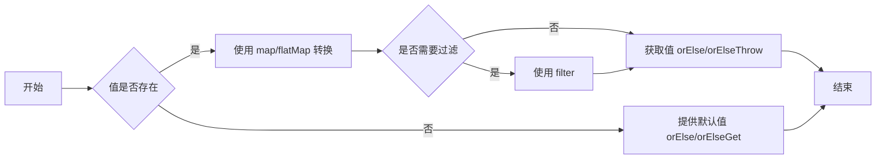

# Java Optional 详解与最佳实践



## 一、Optional 概述

### 1.1 Optional 是什么？

`java.util.Optional<T>` 是 Java 8 引入的**容器对象**，用于：

- 明确表示"值可能不存在"
- 减少 `NullPointerException`
- 编写更简洁、可读性更强的代码
- 强制开发者显式处理空值情况

### 1.2 为什么需要 Optional？

| 传统方式问题 | Optional 解决方案 |
|--------------|-------------------|
| **隐式空值**：方法可能返回 null，调用方不知情 | **显式空值**：方法返回 Optional，明确告知可能无值 |
| **多层嵌套空检查**：深层对象访问需要多级 null 检查 | **链式操作**：使用 map/flatMap 避免嵌套检查 |
| **空指针异常**：运行时 NPE 导致崩溃 | **安全访问**：提供安全方法获取值 |
| **意图不清晰**：方法签名无法表达空值可能性 | **自文档化**：Optional 类型说明可能无值 |

### 1.3 核心设计原则

1. **非空容器**：Optional 本身永远不为 null
2. **不可变对象**：创建后内容不可更改
3. **值导向**：设计用于方法返回类型
4. **功能完备**：提供函数式操作接口

## 二、创建 Optional 对象

### 2.1 三种创建方式

```java
// 1. 创建空Optional
Optional<String> emptyOpt = Optional.empty();

// 2. 创建非空Optional（值不能为null，否则抛NPE）
String name = "John";
Optional<String> nameOpt = Optional.of(name);

// 3. 创建可能为空的Optional
String nullableName = null;
Optional<String> nullableNameOpt = Optional.ofNullable(nullableName);
```

### 2.2 工厂方法对比

| 方法 | 参数要求 | null处理 | 使用场景 |
|------|----------|----------|----------|
| `Optional.empty()` | 无 | 创建空容器 | 表示无结果 |
| `Optional.of(value)` | 非null值 | 参数null抛NPE | 确定值不为null时 |
| `Optional.ofNullable(value)` | 任意值 | value为null时返回空Optional | 不确定值是否为null时 |

## 三、访问 Optional 值

### 3.1 安全访问方法

```java
Optional<String> opt = Optional.of("Java");

// 1. 直接获取值（不推荐，可能抛NoSuchElementException）
String value = opt.get();

// 2. 存在时返回值，否则返回默认值
String result1 = opt.orElse("Default");

// 3. 存在时返回值，否则由Supplier生成
String result2 = opt.orElseGet(() -> generateDefault());

// 4. 存在时返回值，否则抛出异常
String result3 = opt.orElseThrow(() -> 
    new IllegalStateException("Value not present"));

// 5. 存在时执行操作
opt.ifPresent(val -> System.out.println("Value: " + val));
```

### 3.2 值访问方法对比

| 方法 | 返回值 | 空值处理 | 使用建议 |
|------|--------|----------|----------|
| `get()` | T | 抛异常 | **避免使用**，除非确定值存在 |
| `orElse(T)` | T | 返回默认值 | 默认值计算简单时使用 |
| `orElseGet(Supplier)` | T | 调用Supplier生成值 | 默认值计算复杂时使用 |
| `orElseThrow(Supplier)` | T | 抛出自定义异常 | 值必须存在时使用 |
| `ifPresent(Consumer)` | void | 无操作 | 只需消费值无需返回时 |

## 四、条件操作与过滤

### 4.1 条件检查

```java
// 1. 检查值是否存在
Optional<String> opt = /* ... */;
if (opt.isPresent()) {
    // 安全操作
}

// 2. 使用ifPresent避免显式检查
opt.ifPresent(val -> process(val));

// 3. 存在时处理，不存在时执行其他操作
opt.ifPresentOrElse(
    val -> System.out.println("Value: " + val),
    () -> System.out.println("Value absent")
);
```

### 4.2 过滤值

```java
// 过滤满足条件的值
Optional<String> longName = name.filter(n -> n.length() > 5);

// 示例：用户邮箱验证
public Optional<User> validateUser(User user) {
    return Optional.ofNullable(user)
        .filter(u -> u.getEmail() != null)
        .filter(u -> u.getEmail().contains("@"))
        .filter(u -> u.getAge() >= 18);
}

// 链式过滤
Optional<String> result = Optional.of("hello@world.com")
    .filter(email -> email.contains("@"))
    .filter(email -> email.endsWith(".com"));
```

## 五、转换操作

### 5.1 map 与 flatMap

```java
// 1. map: 值存在时应用函数转换
Optional<String> upperName = name.map(String::toUpperCase);

// 2. flatMap: 当转换函数本身返回Optional时避免嵌套
class User {
    private String email;
    Optional<String> getEmail() {
        return Optional.ofNullable(email);
    }
}

Optional<User> user = Optional.of(new User("test@example.com"));

// 使用map会导致Optional<Optional<String>>
Optional<Optional<String>> badEmail = user.map(User::getEmail);

// 使用flatMap展平结果
Optional<String> goodEmail = user.flatMap(User::getEmail);
```

### 5.2 转换操作对比

| 方法 | 参数类型 | 返回值 | 使用场景 |
|------|----------|--------|----------|
| `map(Function)` | `T -> U` | `Optional<U>` | 简单值转换 |
| `flatMap(Function)` | `T -> Optional<U>` | `Optional<U>` | 避免嵌套Optional |
| `filter(Predicate)` | `T -> boolean` | `Optional<T>` | 基于条件过滤值 |

### 5.3 链式转换示例

```java
// 传统方式（深层空值检查）
public String getCityTraditional(User user) {
    if (user != null) {
        Address address = user.getAddress();
        if (address != null) {
            return address.getCity();
        }
    }
    return "Unknown";
}

// Optional链式操作
public String getCityModern(User user) {
    return Optional.ofNullable(user)
        .map(User::getAddress) // 转换为Optional<Address>
        .map(Address::getCity) // 转换为Optional<String>
        .orElse("Unknown");
}
```

## 六、最佳实践指南

### 6.1 推荐实践

1. **作为方法返回值**

   ```java
   public Optional<User> findUserById(String id) {
       // 查询可能返回null
       User user = userRepository.findById(id);
       return Optional.ofNullable(user);
   }
   ```

2. **避免Optional作为字段**

   ```java
   // 不推荐
   public class BadClass {
       private Optional<String> name; // 反模式
   }
   
   // 推荐：直接使用String，getter返回Optional
   public class GoodClass {
       private String name;
       
       public Optional<String> getName() {
           return Optional.ofNullable(name);
       }
   }
   ```

3. **集合返回空集合而非Optional**

   ```java
   // 不推荐
   Optional<List<String>> getItems();
   
   // 推荐：返回空集合
   List<String> getItems();
   ```

### 6.2 避免误用

1. **不要调用`get()`而不检查存在性**

   ```java
   // 错误方式
   String name = findUser().get();
   
   // 正确方式
   String name = findUser().orElse("Unknown");
   ```

2. **避免不必要的Optional**

   ```java
   // 不必要
   Optional.of("static value");
   
   // 正确：直接使用值
   String constant = "static value";
   ```

3. **不要过度使用链式调用**

   ```java
   // 过度使用
   Optional.ofNullable(user)
       .map(User::getAddress)
       .map(Address::getStreet)
       .map(Street::getName)
       .orElse(null);
   
   // 更清晰的方式（如果中间步骤可能为null）
   if (user == null) return null;
   Address address = user.getAddress();
   if (address == null) return null;
   // ...
   ```

### 6.3 性能考虑

1. **`orElse()` vs `orElseGet()`**

   ```java
   // orElse() 总是计算默认值（即使值存在）
   String value = opt.orElse(expensiveDefault());
   
   // orElseGet() 只在需要时计算（推荐）
   String value = opt.orElseGet(() -> expensiveDefault());
   ```

2. **避免在循环中创建Optional**

   ```java
   // 低效：每次迭代创建新Optional
   for (User user : users) {
       Optional.ofNullable(user).ifPresent(System.out::println);
   }
   
   // 高效：直接检查
   for (User user : users) {
       if (user != null) {
           System.out.println(user);
       }
   }
   ```

## 七、与 Stream API 结合

### 7.1 Optional 转 Stream

```java
List<User> users = Arrays.asList(
    new User("john@example.com"),
    new User(null),
    new User("sarah@example.com")
);

// 提取所有有效邮箱
List<String> emails = users.stream()
    .map(User::getEmail)       // 返回Optional<String>
    .flatMap(Optional::stream) // 将非空Optional转为Stream
    .toList(); // ["john@example.com", "sarah@example.com"]

// Java 8 替代方案
List<String> emailsLegacy = users.stream()
    .map(User::getEmail)
    .filter(Optional::isPresent)
    .map(Optional::get)
    .toList();
```

### 7.2 Stream 中查找操作

```java
List<Integer> numbers = List.of(1, 2, 3, 4, 5);

// 查找第一个偶数
Optional<Integer> firstEven = numbers.stream()
    .filter(n -> n % 2 == 0)
    .findFirst();

// 查找任意匹配元素
Optional<Integer> anyNegative = numbers.stream()
    .filter(n -> n < 0)
    .findAny();

// 查找最大/最小值
Optional<Integer> max = numbers.stream().max(Integer::compare);
```

## 八、实用扩展方法

### 8.1 自定义工具类

```java
public class OptionalUtils {
    
    /**
     * 当两个Optional都有值时应用函数
     */
    public static <T, U, R> Optional<R> zip(
        Optional<T> opt1, 
        Optional<U> opt2, 
        BiFunction<T, U, R> function) {
        
        return opt1.flatMap(val1 -> 
            opt2.map(val2 -> function.apply(val1, val2))
        );
    }
    
    /**
     * 转换并过滤null
     */
    public static <T, R> Optional<R> mapNotNull(
        Optional<T> optional, 
        Function<T, R> mapper) {
        
        return optional.map(mapper).filter(Objects::nonNull);
    }
}

// 使用示例
Optional<Integer> optA = Optional.of(10);
Optional<Integer> optB = Optional.of(5);
Optional<Integer> sum = OptionalUtils.zip(optA, optB, (a, b) -> a + b);
```

### 8.2 Java 9+ 增强功能

```java
// 1. ifPresentOrElse
opt.ifPresentOrElse(
    value -> System.out.println(value),
    () -> System.out.println("Not present")
);

// 2. or (Java 9+)
Optional<String> result = opt.or(() -> Optional.of("fallback"));

// 3. stream (Java 9+)
Stream<String> stream = opt.stream();
```

## 九、常见问题与解决方案

### 9.1 常见问题排查

| 问题 | 原因 | 解决方案 |
|------|------|----------|
| **NoSuchElementException** | 对空Optional调用get() | 使用orElse/orElseGet等安全方法 |
| **嵌套Optional** | 在map中返回Optional | 改用flatMap |
| **性能问题** | 在循环中创建Optional | 避免在热点路径使用Optional |
| **空Optional处理缺失** | 忘记处理空值情况 | 始终考虑orElse/orElseThrow |
| **Optional参数** | 方法接收Optional参数 | 重载方法或使用null |

### 9.2 与其它特性结合

1. **与记录类型（Java 16+）**

   ```java
   public record UserRecord(
       String name, 
       Optional<String> email // 不推荐
   ) {}
   
   // 正确方式
   public record UserRecord(String name, String email) {
       public Optional<String> email() {
           return Optional.ofNullable(email);
       }
   }
   ```

2. **与模式匹配（Java 21预览）**

   ```java
   Object obj = Optional.of("Java");
   String result = switch (obj) {
       case Optional<String> opt when opt.isPresent() -> opt.get();
       case Optional<?> opt -> "Empty";
       default -> "Unknown";
   };
   ```

## 十、总结：Optional 最佳实践清单

1. **正确使用场景**
   - 作为方法返回值
   - 流操作中的中间结果
   - 明确表示可能缺失的值

2. **避免反模式**
   - 不要作为类字段
   - 不要作为方法参数
   - 不要用于集合类型

3. **安全访问**
   - 优先使用 orElse/orElseGet 而非 get()
   - 使用 map/flatMap 进行链式转换
   - 始终考虑空值情况

4. **性能优化**
   - 在循环外创建 Optional
   - 使用 orElseGet 代替昂贵的 orElse
   - 避免深层嵌套链式调用

5. **现代 Java 特性**
   - 结合 Stream API 使用
   - Java 9+ 使用新方法（ifPresentOrElse, or, stream）
   - 考虑记录类型和模式匹配

> 遵循这些最佳实践，Optional 将帮助您：
>
> - 减少 NullPointerExceptions
> - 编写更清晰、表达力更强的代码
> - 提高 API 设计的质量
> - 促进函数式编程风格



通过本文，您将掌握：

1. Optional 核心概念与设计原则
2. 各种创建和访问方式
3. 转换、过滤和条件操作
4. 与 Stream API 的高效结合
5. 企业级最佳实践与反模式
6. 常见问题解决方案
7. 现代 Java 特性集成
