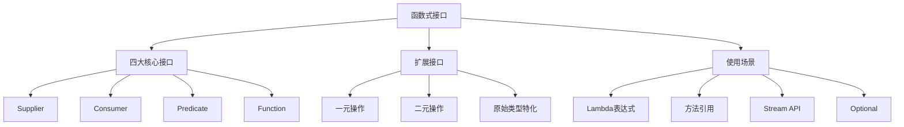
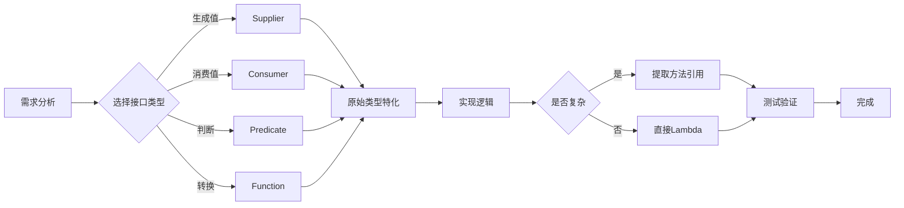

# Java 函数式接口详解与最佳实践



## 一、函数式接口概述

### 1.1 什么是函数式接口？

**函数式接口（Functional Interface）** 是 Java 8 引入的核心概念，指**只有一个抽象方法**的接口。函数式接口允许使用 Lambda 表达式或方法引用来创建接口的实例。

### 1.2 核心特性

- **单一抽象方法（SAM）**：必须且只能有一个抽象方法
- **可选注解**：`@FunctionalInterface` 标注确保接口符合规范
- **默认方法**：可以包含多个默认方法
- **静态方法**：可以包含多个静态方法
- **继承 Object 方法**：可以包含 Object 类的方法

### 1.3 函数式接口的价值

| 传统方式 | 函数式编程 |
|---------|------------|
| 匿名内部类冗长 | Lambda 表达式简洁 |
| 代码重复率高 | 行为参数化 |
| 难以并行处理 | Stream API 并行化 |
| 状态管理复杂 | 无状态操作 |

## 二、内置函数式接口完整清单

### 2.1 四大核心接口

| 接口 | 方法签名 | 描述 | 使用场景 |
|------|----------|------|----------|
| **Supplier<T>** | `T get()` | 无参返回结果 | 延迟计算、对象工厂 |
| **Consumer<T>** | `void accept(T t)` | 接收参数无返回 | 遍历操作、副作用处理 |
| **Predicate<T>** | `boolean test(T t)` | 接收参数返回布尔值 | 过滤条件、验证逻辑 |
| **Function<T,R>** | `R apply(T t)` | 接收参数返回结果 | 数据转换、映射操作 |

### 2.2 一元操作接口

| 接口 | 方法签名 | 描述 |
|------|----------|------|
| UnaryOperator<T> | `T apply(T t)` | 一元操作（Function 子接口） |
| IntUnaryOperator | `int applyAsInt(int operand)` | 整型一元操作 |
| LongUnaryOperator | `long applyAsLong(long operand)` | 长整型一元操作 |
| DoubleUnaryOperator | `double applyAsDouble(double operand)` | 双精度一元操作 |

### 2.3 二元操作接口

| 接口 | 方法签名 | 描述 |
|------|----------|------|
| BiConsumer<T,U> | `void accept(T t, U u)` | 接收两个参数无返回 |
| BiPredicate<T,U> | `boolean test(T t, U u)` | 接收两个参数返回布尔 |
| BiFunction<T,U,R> | `R apply(T t, U u)` | 接收两个参数返回结果 |
| BinaryOperator<T> | `T apply(T t1, T t2)` | 二元操作（BiFunction 子接口） |

### 2.4 原始类型特化接口

#### 2.4.1 Supplier 变体

| 接口 | 方法签名 | 描述 |
|------|----------|------|
| BooleanSupplier | `boolean getAsBoolean()` | 布尔值提供者 |
| IntSupplier | `int getAsInt()` | 整型提供者 |
| LongSupplier | `long getAsLong()` | 长整型提供者 |
| DoubleSupplier | `double getAsDouble()` | 双精度提供者 |

#### 2.4.2 Consumer 变体

| 接口 | 方法签名 | 描述 |
|------|----------|------|
| IntConsumer | `void accept(int value)` | 整型消费者 |
| LongConsumer | `void accept(long value)` | 长整型消费者 |
| DoubleConsumer | `void accept(double value)` | 双精度消费者 |
| ObjIntConsumer<T> | `void accept(T t, int value)` | 对象+整型消费者 |
| ObjLongConsumer<T> | `void accept(T t, long value)` | 对象+长整型消费者 |
| ObjDoubleConsumer<T> | `void accept(T t, double value)` | 对象+双精度消费者 |

#### 2.4.3 Predicate 变体

| 接口 | 方法签名 | 描述 |
|------|----------|------|
| IntPredicate | `boolean test(int value)` | 整型断言 |
| LongPredicate | `boolean test(long value)` | 长整型断言 |
| DoublePredicate | `boolean test(double value)` | 双精度断言 |

#### 2.4.4 Function 变体

| 接口 | 方法签名 | 描述 |
|------|----------|------|
| IntFunction<R> | `R apply(int value)` | 整型转对象 |
| LongFunction<R> | `R apply(long value)` | 长整型转对象 |
| DoubleFunction<R> | `R apply(double value)` | 双精度转对象 |
| ToIntFunction<T> | `int applyAsInt(T value)` | 对象转整型 |
| ToLongFunction<T> | `long applyAsLong(T value)` | 对象转长整型 |
| ToDoubleFunction<T> | `double applyAsDouble(T value)` | 对象转双精度 |
| IntToLongFunction | `long applyAsLong(int value)` | 整型转长整型 |
| IntToDoubleFunction | `double applyAsDouble(int value)` | 整型转双精度 |
| LongToIntFunction | `int applyAsInt(long value)` | 长整型转整型 |
| LongToDoubleFunction | `double applyAsDouble(long value)` | 长整型转双精度 |
| DoubleToIntFunction | `int applyAsInt(double value)` | 双精度转整型 |
| DoubleToLongFunction | `long applyAsLong(double value)` | 双精度转长整型 |

## 三、函数式接口使用详解

### 3.1 基本使用示例

```java
// Supplier - 提供当前时间
Supplier<LocalDateTime> timeSupplier = LocalDateTime::now;
System.out.println("当前时间: " + timeSupplier.get());

// Consumer - 打印消息
Consumer<String> printer = System.out::println;
printer.accept("Hello, Functional Interface!");

// Predicate - 验证偶数
Predicate<Integer> isEven = n -> n % 2 == 0;
System.out.println("10是偶数吗? " + isEven.test(10)); // true

// Function - 字符串转长度
Function<String, Integer> lengthFunc = String::length;
System.out.println("'Java'长度: " + lengthFunc.apply("Java")); // 4
```

### 3.2 组合操作

```java
// Predicate 组合
Predicate<Integer> isPositive = n -> n > 0;
Predicate<Integer> isEvenPositive = isPositive.and(isEven);
System.out.println("6是正偶数吗? " + isEvenPositive.test(6)); // true

// Function 组合
Function<Integer, Integer> square = n -> n * n;
Function<Integer, Integer> increment = n -> n + 1;
Function<Integer, Integer> squareThenIncrement = square.andThen(increment);
System.out.println("3的平方加1: " + squareThenIncrement.apply(3)); // 10

// Consumer 链式调用
Consumer<String> c1 = s -> System.out.print("长度: ");
Consumer<String> c2 = s -> System.out.println(s.length());
Consumer<String> combined = c1.andThen(c2);
combined.accept("Java"); // 输出: 长度: 4
```

### 3.3 原始类型特化使用

```java
// 避免自动装箱开销
IntPredicate isPrime = n -> {
    if (n < 2) return false;
    for (int i = 2; i <= Math.sqrt(n); i++) {
        if (n % i == 0) return false;
    }
    return true;
};

// 高效原始类型操作
IntUnaryOperator squareOp = x -> x * x;
IntStream.range(1, 10)
    .map(squareOp)
    .forEach(System.out::println);
```

## 四、自定义函数式接口

### 4.1 创建自定义接口

```java
@FunctionalInterface
public interface TriFunction<T, U, V, R> {
    R apply(T t, U u, V v);
    
    // 默认方法
    default <K> TriFunction<T, U, V, K> andThen(Function<? super R, ? extends K> after) {
        Objects.requireNonNull(after);
        return (T t, U u, V v) -> after.apply(apply(t, u, v));
    }
}

// 使用示例
TriFunction<Integer, Integer, Integer, Integer> volume = 
    (length, width, height) -> length * width * height;
System.out.println("体积: " + volume.apply(2, 3, 4)); // 24
```

### 4.2 何时需要自定义接口？

1. **需要三个以上参数**：如 TriFunction
2. **特定领域操作**：如 TradeValidator
3. **异常处理需求**：如 CheckedFunction
4. **特殊组合逻辑**：如 ChainableProcessor

### 4.3 带异常处理的函数式接口

```java
@FunctionalInterface
public interface CheckedFunction<T, R> {
    R apply(T t) throws Exception;
    
    static <T, R> Function<T, R> unchecked(CheckedFunction<T, R> function) {
        return t -> {
            try {
                return function.apply(t);
            } catch (Exception e) {
                throw new RuntimeException(e);
            }
        };
    }
}

// 使用
CheckedFunction<String, Integer> parser = Integer::parseInt;
Function<String, Integer> safeParser = CheckedFunction.unchecked(parser);
```

## 五、最佳实践指南

### 5.1 接口选择原则

| 使用场景 | 推荐接口 | 示例 |
|----------|----------|------|
| 无参生成值 | Supplier | `() -> "default"` |
| 消费单个值 | Consumer | `s -> System.out.println(s)` |
| 值判断 | Predicate | `n -> n > 0` |
| 值转换 | Function | `s -> s.length()` |
| 二元操作 | BinaryOperator | `(a, b) -> a + b` |
| 原始类型操作 | 特化接口 | `IntPredicate` |

### 5.2 代码可读性优化

```java
// 避免过度复杂的Lambda
// 不推荐
Function<String, String> complex = s -> {
    String trimmed = s.trim();
    if (trimmed.isEmpty()) return "empty";
    return trimmed.substring(0, 1).toUpperCase() + trimmed.substring(1);
};

// 推荐：提取方法引用
Function<String, String> better = StringUtil::capitalize;

class StringUtil {
    static String capitalize(String s) {
        String trimmed = s.trim();
        if (trimmed.isEmpty()) return "empty";
        return trimmed.substring(0, 1).toUpperCase() + trimmed.substring(1);
    }
}
```

### 5.3 性能优化策略

1. **优先使用原始类型特化接口**

   ```java
   // 低效：自动装箱
   Function<Integer, Integer> square = x -> x * x;
   
   // 高效：无装箱开销
   IntUnaryOperator squareOp = x -> x * x;
   ```

2. **复用函数对象**

   ```java
   // 避免重复创建相同函数
   private static final Predicate<String> IS_EMPTY = String::isEmpty;
   
   void process(List<String> list) {
       list.stream()
           .filter(IS_EMPTY.negate())
           .forEach(System.out::println);
   }
   ```

3. **延迟执行优化**

   ```java
   // 使用Supplier延迟高开销计算
   public static String getConfigValue(Supplier<String> valueSupplier) {
       if (isCacheEnabled()) {
           return cachedValue;
       }
       return valueSupplier.get(); // 仅当需要时计算
   }
   ```

### 5.4 测试与调试

```java
// 测试函数式接口
@Test
void testStringProcessor() {
    Function<String, String> toUpperCase = String::toUpperCase;
    
    assertEquals("JAVA", toUpperCase.apply("java"));
    assertNotEquals("java", toUpperCase.apply("JAVA"));
}

// 调试Lambda表达式
List<String> names = Arrays.asList("Alice", "Bob", "Charlie");
names.stream()
    .peek(name -> System.out.println("处理前: " + name))
    .map(String::toUpperCase)
    .peek(name -> System.out.println("处理后: " + name))
    .collect(Collectors.toList());
```

## 六、典型应用场景

### 6.1 Stream API 中使用

```java
List<Product> products = Arrays.asList(
    new Product("Laptop", 1200, "Electronics"),
    new Product("Desk", 300, "Furniture"),
    new Product("Phone", 800, "Electronics")
);

// 使用多个函数式接口组合操作
Map<String, Double> categoryPrices = products.stream()
    .filter(p -> p.getPrice() > 500) // Predicate
    .collect(Collectors.groupingBy(
        Product::getCategory, // Function
        Collectors.summingDouble(Product::getPrice) // ToDoubleFunction
    ));

System.out.println(categoryPrices); // {Electronics=2000.0}
```

### 6.2 Optional 中使用

```java
public Optional<String> findUserEmail(long id) {
    return userRepository.findById(id)
        .map(User::getEmail) // Function
        .filter(email -> !email.isEmpty()); // Predicate
}

public void processOrder(long orderId) {
    orderRepository.findById(orderId)
        .ifPresent(order -> { // Consumer
            order.process();
            notificationService.sendConfirmation(order);
        });
}
```

### 6.3 策略模式实现

```java
@FunctionalInterface
public interface DiscountStrategy {
    double applyDiscount(double price);
}

public class OrderProcessor {
    private DiscountStrategy discountStrategy;
    
    public void setDiscountStrategy(DiscountStrategy strategy) {
        this.discountStrategy = strategy;
    }
    
    public double calculateFinalPrice(double price) {
        return discountStrategy.applyDiscount(price);
    }
}

// 使用
OrderProcessor processor = new OrderProcessor();

// 设置会员折扣策略
processor.setDiscountStrategy(price -> price * 0.9);

// 设置节日折扣策略
processor.setDiscountStrategy(price -> price > 100 ? price - 20 : price);

System.out.println("最终价格: " + processor.calculateFinalPrice(150));
```

## 七、常见问题与解决方案

### 7.1 常见问题排查

| 问题 | 原因 | 解决方案 |
|------|------|----------|
| **编译错误：非函数式接口** | 接口有多个抽象方法 | 检查是否只包含一个抽象方法 |
| **性能问题** | 原始类型自动装箱 | 使用原始类型特化接口 |
| **空指针异常** | Lambda内引用空对象 | 使用Optional或空安全检查 |
| **难以调试** | Lambda无显式名称 | 使用方法引用或命名函数 |
| **变量捕获问题** | Lambda修改外部变量 | 使用数组或Atomic类包装 |

### 7.2 高阶函数技巧

1. **柯里化（Currying）**

   ```java
   Function<Integer, Function<Integer, Integer>> adder = a -> b -> a + b;
   Function<Integer, Integer> add5 = adder.apply(5);
   System.out.println(add5.apply(3)); // 8
   ```

2. **函数组合工厂**

   ```java
   public static <T, U, V> Function<T, V> compose(
           Function<T, U> f1, Function<U, V> f2) {
       return f1.andThen(f2);
   }
   
   Function<String, Integer> strToInt = Integer::parseInt;
   Function<Integer, String> intToHex = Integer::toHexString;
   Function<String, String> hexParser = compose(strToInt, intToHex);
   ```

3. **异常处理封装**

   ```java
   public static <T, R> Function<T, Optional<R>> safeApply(
           CheckedFunction<T, R> function) {
       return t -> {
           try {
               return Optional.ofNullable(function.apply(t));
           } catch (Exception e) {
               return Optional.empty();
           }
       };
   }
   ```

### 7.3 Java 16+ 记录类型支持

```java
// 记录类型与函数式接口结合
public record Point(int x, int y) {
    // 记录类型自动包含构造函数和访问器
}

// 使用函数式接口处理记录
Function<Point, String> pointFormatter = 
    p -> String.format("(%d, %d)", p.x(), p.y());
    
BiFunction<Point, Point, Double> distanceCalculator = 
    (p1, p2) -> Math.sqrt(Math.pow(p2.x() - p1.x(), 2) + Math.pow(p2.y() - p1.y(), 2));
```

## 八、总结：函数式接口最佳实践

1. **优先使用标准接口**：尽量使用 `java.util.function` 包中的接口
2. **关注性能**：原始类型操作使用特化接口
3. **保持简洁**：避免超过3行的Lambda，复杂逻辑提取方法
4. **合理命名**：函数式变量使用描述性名称
5. **组合优于继承**：利用 `andThen`、`compose` 构建操作链
6. **防御式编程**：处理可能的空值和异常
7. **文档注释**：为自定义函数式接口添加Javadoc



> 通过掌握函数式接口，您将能够：
>
> - 编写更简洁、表达力更强的代码
> - 充分利用 Stream API 的强大功能
> - 实现高效的行为参数化
> - 提升代码的可维护性和可测试性
> - 为函数式编程范式打下坚实基础

**官方资源**：

- [java.util.function Javadoc](https://docs.oracle.com/en/java/javase/17/docs/api/java.base/java/util/function/package-summary.html)
- [Java Lambda 表达式教程](https://docs.oracle.com/javase/tutorial/java/javaOO/lambdaexpressions.html)
- [Java 函数式编程指南](https://github.com/java8/Java8InAction)
