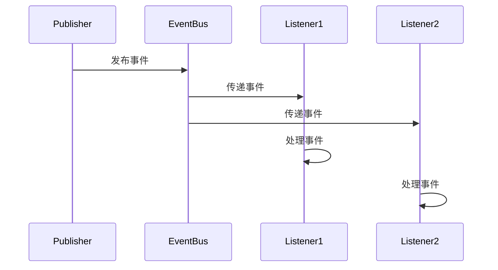
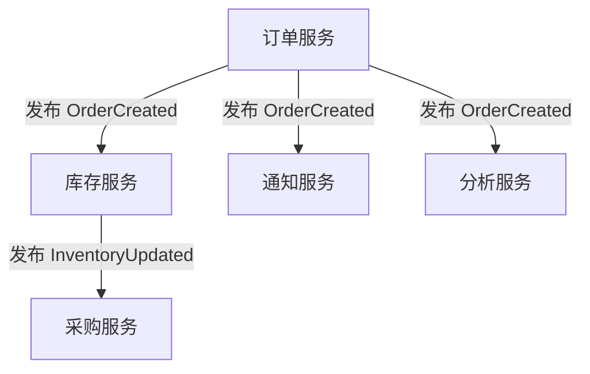

# Spring 事件监听机制详解与最佳实践

## 1. 引言

Spring 事件监听机制是 Spring 框架中基于**观察者模式**的实现，提供了一种**松耦合**的组件间通信方式。这种机制允许应用程序的不同部分相互通信而无需直接依赖，极大地提高了系统的**可扩展性**和**可维护性**。

### 核心优势

- **解耦组件**：发布者和订阅者之间无需相互引用
- **异步处理**：支持后台执行耗时操作
- **事务集成**：可与 Spring 事务管理协同工作
- **扩展性强**：轻松添加新事件处理逻辑而不影响现有代码

## 2. 核心概念

### 2.1 事件模型三要素

| 组件 | 描述 | 接口/注解 |
|------|------|------------|
| **事件 (Event)** | 封装事件信息的对象 | 继承 `ApplicationEvent` |
| **发布者 (Publisher)** | 触发事件的对象 | `ApplicationEventPublisher` |
| **监听器 (Listener)** | 处理事件的对象 | `ApplicationListener` 或 `@EventListener` |

### 2.2 工作原理



## 3. Spring 内置事件完整清单

### 3.1 核心框架事件

| 事件类 | 触发时机 | 引入版本 |
|--------|----------|----------|
| `ContextRefreshedEvent` | ApplicationContext 初始化或刷新完成 | Spring 1.0 |
| `ContextStartedEvent` | ApplicationContext 启动后 | Spring 1.0 |
| `ContextStoppedEvent` | ApplicationContext 停止后 | Spring 1.0 |
| `ContextClosedEvent` | ApplicationContext 关闭后 | Spring 1.0 |
| `RequestHandledEvent` | HTTP 请求处理完成后 | Spring 1.0 |
| `ServletRequestHandledEvent` | `RequestHandledEvent` 的子类，添加 Servlet 相关信息 | Spring 2.5 |

### 3.2 Spring Boot 特有事件

| 事件类 | 触发时机 | 引入版本 |
|--------|----------|----------|
| `ApplicationStartingEvent` | SpringApplication 启动后，任何处理前 | Spring Boot 1.0 |
| `ApplicationEnvironmentPreparedEvent` | Environment 准备好后，Context 创建前 | Spring Boot 1.0 |
| `ApplicationContextInitializedEvent` | ApplicationContext 准备好后，Bean 加载前 | Spring Boot 1.0 |
| `ApplicationPreparedEvent` | Bean 定义加载后，Context 刷新前 | Spring Boot 1.0 |
| `ApplicationReadyEvent` | 应用准备就绪，可以接收请求 | Spring Boot 1.0 |
| `ApplicationFailedEvent` | 应用启动失败时 | Spring Boot 1.0 |
| `WebServerInitializedEvent` | Web 服务器启动后 | Spring Boot 2.0 |
| `DataSourceSchemaCreatedEvent` | 数据源初始化完成后 | Spring Boot 2.5 |

### 3.3 事务相关事件

| 事件类 | 触发时机 | 引入版本 |
|--------|----------|----------|
| `TransactionApplicationEvent` | 事务相关事件的基类 | Spring 4.2 |
| `AfterCommitEvent` | 事务成功提交后 | Spring 4.2 |
| `AfterRollbackEvent` | 事务回滚后 | Spring 4.2 |
| `AfterCompletionEvent` | 事务完成后（无论提交或回滚） | Spring 4.2 |

### 3.4 其他框架事件

| 事件类 | 触发时机 | 引入版本 |
|--------|----------|----------|
| `DistributedCacheEvent` | 分布式缓存事件基类 | Spring 5.2 |
| `EntityCreatedEvent` | JPA 实体创建后 | Spring Data 2.1 |
| `EntityModifiedEvent` | JPA 实体修改后 | Spring Data 2.1 |
| `EntityDeletedEvent` | JPA 实体删除后 | Spring Data 2.1 |
| `BindingsChangedEvent` | Spring Cloud Stream 绑定变更时 | Spring Cloud Stream 3.0 |

## 4. 自定义事件

### 4.1 创建自定义事件

```java
public class OrderCreatedEvent extends ApplicationEvent {
    private final Order order;

    public OrderCreatedEvent(Object source, Order order) {
        super(source);
        this.order = order;
    }

    public Order getOrder() {
        return order;
    }
}
```

### 4.2 发布事件

```java
@Service
public class OrderService {
    private final ApplicationEventPublisher eventPublisher;

    public OrderService(ApplicationEventPublisher eventPublisher) {
        this.eventPublisher = eventPublisher;
    }

    @Transactional
    public Order createOrder(OrderRequest request) {
        Order order = // 创建订单逻辑
        eventPublisher.publishEvent(new OrderCreatedEvent(this, order));
        return order;
    }
}
```

## 5. 事件监听方式

### 5.1 实现 ApplicationListener 接口

```java
@Component
public class OrderCreatedListener implements ApplicationListener<OrderCreatedEvent> {
    
    @Override
    public void onApplicationEvent(OrderCreatedEvent event) {
        Order order = event.getOrder();
        // 处理订单创建事件
        sendNotification(order);
        updateInventory(order);
    }
    
    private void sendNotification(Order order) { ... }
    private void updateInventory(Order order) { ... }
}
```

### 5.2 使用 @EventListener 注解（推荐）

```java
@Component
public class OrderEventListener {
    
    private static final Logger log = LoggerFactory.getLogger(OrderEventListener.class);

    @EventListener
    public void handleOrderCreated(OrderCreatedEvent event) {
        log.info("处理订单创建事件: {}", event.getOrder().getId());
        // 业务逻辑
    }
    
    @EventListener
    public void handlePaymentCompleted(PaymentCompletedEvent event) {
        log.info("处理支付完成事件: {}", event.getPaymentId());
        // 业务逻辑
    }
}
```

### 5.3 异步事件监听

```java
@Configuration
@EnableAsync
public class AsyncConfig {
    @Bean
    public Executor taskExecutor() {
        ThreadPoolTaskExecutor executor = new ThreadPoolTaskExecutor();
        executor.setCorePoolSize(5);
        executor.setMaxPoolSize(10);
        executor.setQueueCapacity(100);
        executor.setThreadNamePrefix("Async-Event-");
        executor.initialize();
        return executor;
    }
}

@Component
public class AsyncOrderListener {
    
    @Async
    @EventListener
    public void handleOrderAsync(OrderCreatedEvent event) {
        // 异步处理耗时操作
        generateInvoice(event.getOrder());
    }
    
    private void generateInvoice(Order order) { 
        // 模拟耗时操作
        Thread.sleep(2000);
        log.info("为订单 {} 生成发票", order.getId());
    }
}
```

### 5.4 事务绑定事件监听

```java
@Component
public class TransactionalEventListenerExample {

    @TransactionalEventListener(
        phase = TransactionPhase.AFTER_COMMIT,
        classes = OrderCreatedEvent.class
    )
    public void handleAfterCommit(OrderCreatedEvent event) {
        // 只有在事务成功提交后才会执行
        sendEmailNotification(event.getOrder());
    }

    @TransactionalEventListener(
        phase = TransactionPhase.AFTER_ROLLBACK,
        classes = OrderCreatedEvent.class
    )
    public void handleAfterRollback(OrderCreatedEvent event) {
        // 事务回滚时执行
        log.warn("订单创建失败: {}", event.getOrder().getId());
    }
}
```

## 6. 高级特性

### 6.1 条件化事件监听

```java
@EventListener(condition = "#event.order.totalAmount > 1000")
public void handleLargeOrder(OrderCreatedEvent event) {
    // 只处理金额大于1000的订单
    notifyManager(event.getOrder());
}
```

### 6.2 有序事件监听

```java
@Component
public class OrderListeners {
    
    @Order(1)
    @EventListener
    public void validateOrder(OrderCreatedEvent event) {
        // 首先执行：验证订单
    }
    
    @Order(2)
    @EventListener
    public void processPayment(OrderCreatedEvent event) {
        // 其次执行：处理支付
    }
    
    @Order(3)
    @EventListener
    public void sendConfirmation(OrderCreatedEvent event) {
        // 最后执行：发送确认
    }
}
```

### 6.3 泛型事件

```java
public class EntityEvent<T> extends ApplicationEvent {
    private final T entity;
    
    public EntityEvent(Object source, T entity) {
        super(source);
        this.entity = entity;
    }
    
    public T getEntity() {
        return entity;
    }
}

// 监听特定类型的泛型事件
@EventListener
public void onUserCreated(EntityEvent<User> event) {
    User user = event.getEntity();
    // 处理用户创建事件
}
```

## 7. 最佳实践

### 7.1 设计原则

1. **单一职责**：每个监听器只处理单一逻辑
2. **事件粒度**：设计细粒度事件（如OrderCreated而非OrderUpdated）
3. **无状态设计**：避免在监听器中维护状态
4. **幂等处理**：确保监听器可安全重试

### 7.2 性能优化

```java
// 避免在监听器中执行耗时操作
@Async
@EventListener
public void handleResourceIntensiveEvent(ResourceIntensiveEvent event) {
    // 异步执行耗时任务
}

// 使用条件过滤不必要事件
@EventListener(condition = "#event.priority == T(EventPriority).HIGH")
public void handleHighPriority(MyEvent event) {
    // 只处理高优先级事件
}
```

### 7.3 错误处理

```java
@Component
public class ErrorHandlingListener {

    @EventListener
    public void handleOrderEvent(OrderCreatedEvent event) {
        try {
            // 业务逻辑
        } catch (Exception e) {
            // 1. 记录错误
            log.error("处理订单事件失败: {}", event.getOrder().getId(), e);
            
            // 2. 重试机制（示例）
            retryService.scheduleRetry(event);
            
            // 3. 触发错误处理事件
            eventPublisher.publishEvent(new EventProcessingFailedEvent(this, event, e));
        }
    }
}
```

### 7.4 避免常见陷阱

- **循环事件**：避免在事件处理中触发新事件导致无限循环
- **事务边界**：确保理解 `@TransactionalEventListener` 的行为
- **事件顺序**：不要依赖监听器的执行顺序（除非显式使用 `@Order`）
- **内存泄漏**：避免在事件对象中持有大型资源
- **同步阻塞**：耗时操作始终使用异步处理

## 8. 测试事件监听

### 8.1 Spring Boot 测试示例

```java
@SpringBootTest
public class OrderEventTest {

    @Autowired
    private ApplicationEventPublisher eventPublisher;
    
    @Autowired
    private OrderService orderService;
    
    @MockBean
    private NotificationService notificationService;
    
    @Captor
    private ArgumentCaptor<OrderCreatedEvent> eventCaptor;

    @Test
    public void shouldPublishOrderCreatedEvent() {
        // 创建测试订单
        OrderRequest request = new OrderRequest(/* ... */);
        orderService.createOrder(request);
        
        // 验证事件发布
        verify(notificationService).handleOrderEvent(eventCaptor.capture());
        OrderCreatedEvent event = eventCaptor.getValue();
        assertNotNull(event.getOrder());
    }
    
    @Test
    @DirtiesContext
    public void testAsyncEventProcessing() throws InterruptedException {
        // 发布事件
        eventPublisher.publishEvent(new OrderCreatedEvent(this, new Order()));
        
        // 等待异步处理完成
        Thread.sleep(1000);
        
        // 验证异步处理结果
        verify(notificationService).sendConfirmation(any(Order.class));
    }
}
```

## 9. 典型应用场景

### 9.1 业务工作流解耦



### 9.2 跨服务通信（微服务）

```java
// 订单服务
@EventListener
public void handlePaymentCompleted(PaymentCompletedEvent event) {
    // 支付完成，准备发货
    shippingService.prepareShipping(event.getOrderId());
}

// 支付服务
@Service
public class PaymentService {
    private final ApplicationEventPublisher publisher;
    
    public void completePayment(Long orderId) {
        // 支付处理逻辑
        publisher.publishEvent(new PaymentCompletedEvent(this, orderId));
    }
}
```

### 9.3 系统监控与审计

```java
@EventListener
public void auditEvent(ApplicationEvent event) {
    if (event instanceof AbstractAuditableEvent) {
        auditRepository.save(createAuditRecord(event));
    }
}

@EventListener
public void monitorSystemHealth(ContextRefreshedEvent event) {
    healthMonitor.checkSystemComponents();
}
```

## 10. 总结

### 核心价值

- **解耦神器**：彻底分离业务组件间的依赖
- **扩展性强**：新增功能只需添加监听器
- **异步处理**：提升系统响应速度和吞吐量
- **事务集成**：确保事件处理与业务操作一致性

### 最佳实践总结

1. **命名规范**：使用 `XXXEvent` 命名事件类
2. **事件设计**：事件应包含足够信息但避免大型对象
3. **异步优先**：耗时操作始终使用 `@Async`
4. **事务感知**：关键操作使用 `@TransactionalEventListener`
5. **错误处理**：实现健壮的错误处理和重试机制
6. **性能监控**：监控事件处理时间和吞吐量

> **架构师提示**：在微服务架构中，可将 Spring 事件与消息中间件（如 RabbitMQ 或 Kafka）集成，实现跨服务的领域事件分发，构建更健壮的分布式系统。

## 附录：常见问题解答

**Q：如何确保事件监听器执行顺序？**  
A：使用 `@Order` 注解指定监听器顺序：

```java
@Order(1)
@EventListener
public void firstListener(MyEvent event) { ... }

@Order(2)
@EventListener
public void secondListener(MyEvent event) { ... }
```

**Q：事件处理过程中抛出异常会怎样？**  
A：默认会传播到事件发布者。使用 `@Async` 时异常不会传播，需单独处理：

```java
@Async
@EventListener
public void asyncEvent(MyEvent event) {
    try {
        // ...
    } catch (Exception e) {
        // 处理异常
    }
}
```

**Q：如何监听所有事件？**  
A：监听 `ApplicationEvent` 基类：

```java
@EventListener
public void handleAllEvents(ApplicationEvent event) {
    log.info("收到事件: {}", event.getClass().getName());
}
```

**Q：Spring Boot 事件和普通 Spring 事件有何区别？**  
A：Spring Boot 事件是标准 Spring 事件的扩展，提供更细粒度的应用生命周期事件。所有事件都通过相同的机制发布和处理。

**Q：事件太多会影响性能吗？**  
A：合理设计不会。遵循以下原则：

- 避免在监听器中执行耗时同步操作
- 使用条件过滤不必要事件
- 为耗时操作使用异步监听
- 监控事件处理时间
