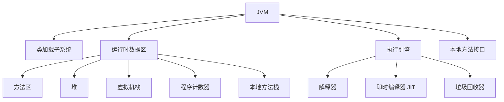
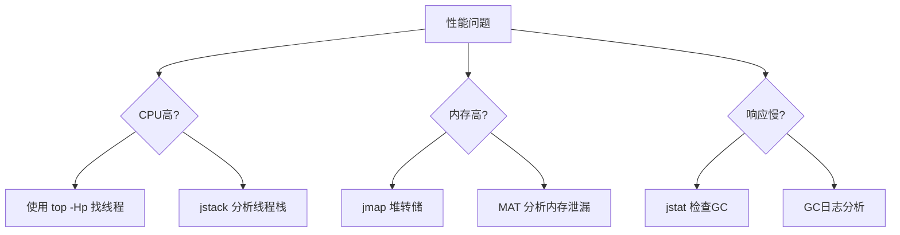

# JVM（Java 虚拟机）详解与最佳实践

## 1. JVM 架构概述

Java 虚拟机（JVM）是 Java 平台的核心，负责执行 Java 字节码，提供内存管理、垃圾回收和安全机制等关键功能。

### JVM 核心组件



## 2. 运行时数据区详解

### 2.1 内存区域划分

| 区域 | 描述 | 线程共享 | 异常类型 |
|------|------|----------|----------|
| **方法区** | 存储类信息、常量、静态变量 | 是 | OutOfMemoryError |
| **堆** | 对象实例和数组 | 是 | OutOfMemoryError |
| **虚拟机栈** | 方法调用栈帧 | 否 | StackOverflowError |
| **本地方法栈** | Native 方法调用 | 否 | StackOverflowError |
| **程序计数器** | 当前线程执行的字节码行号 | 否 | 无 |

### 2.2 堆内存结构（JDK 8+）

```
+------------------------------+
|          Young Generation    |
|   +--------+   +--------+    |
|   | Eden   |   | S0/S1  |    | <-- Survivor Space
|   +--------+   +--------+    |
+------------------------------+
|       Old Generation         | <-- Tenured Space
+------------------------------+
|      Metaspace (off-heap)    | <-- 取代永久代
+------------------------------+
```

## 3. 垃圾回收机制

### 3.1 GC 算法对比

| 算法 | 原理 | 优点 | 缺点 |
|------|------|------|------|
| **标记-清除** | 标记可达对象后清除未标记对象 | 简单 | 内存碎片 |
| **复制** | 将存活对象复制到新空间 | 无碎片 | 空间利用率低 |
| **标记-整理** | 标记后整理存活对象 | 无碎片 | 效率较低 |
| **分代收集** | 不同代使用不同算法 | 高效 | 实现复杂 |

### 3.2 垃圾收集器

| 收集器 | 类型 | 适用场景 | 启用参数 |
|--------|------|----------|----------|
| **Serial** | 单线程 | 客户端应用 | `-XX:+UseSerialGC` |
| **Parallel/Throughput** | 多线程 | 吞吐量优先 | `-XX:+UseParallelGC` |
| **CMS** | 并发标记清除 | 低延迟应用 | `-XX:+UseConcMarkSweepGC` |
| **G1** | 分区域收集 | 大内存、低延迟 | `-XX:+UseG1GC` |
| **ZGC** | 并发压缩 | 超大堆、超低延迟 | `-XX:+UseZGC` |
| **Shenandoah** | 并发压缩 | 低延迟 | `-XX:+UseShenandoahGC` |

## 4. JVM 监控与诊断工具

### 4.1 命令行工具

| 工具 | 描述 | 常用命令 |
|------|------|----------|
| **jps** | JVM 进程状态 | `jps -l` |
| **jstat** | JVM 统计监控 | `jstat -gcutil <pid> 1000` |
| **jinfo** | 配置信息 | `jinfo -flags <pid>` |
| **jmap** | 内存映射 | `jmap -heap <pid>` |
| **jstack** | 线程堆栈 | `jstack -l <pid>` |

### 4.2 图形化工具

- **VisualVM**：多合一监控工具
- **JConsole**：基本监控和管理
- **Java Mission Control (JMC)**：高级性能分析
- **Eclipse Memory Analyzer (MAT)**：内存泄漏分析

## 5. Spring Boot 项目 JVM 调优指南

### 5.1 调优原则

1. **测量先行**：基于监控数据调优
2. **循序渐进**：一次只改一个参数
3. **合理预期**：平衡吞吐量和延迟
4. **场景驱动**：根据应用类型选择策略

### 5.2 基础参数设置

```bash
# 启动示例
java -jar -Xms2g -Xmx2g -XX:+UseG1GC -XX:MaxGCPauseMillis=200 \
     -XX:MetaspaceSize=256m -XX:MaxMetaspaceSize=256m \
     -XX:+HeapDumpOnOutOfMemoryError -XX:HeapDumpPath=/path/to/dumps \
     -XX:+PrintGCDetails -Xloggc:/path/to/gc.log \
     your-spring-boot-app.jar
```

### 5.3 调优参数详解

#### 内存设置

| 参数 | 描述 | 推荐值 |
|------|------|--------|
| `-Xms` | 初始堆大小 | 等于 `-Xmx` |
| `-Xmx` | 最大堆大小 | 物理内存的 50-80% |
| `-XX:MetaspaceSize` | 元空间初始大小 | 256m |
| `-XX:MaxMetaspaceSize` | 元空间最大大小 | 512m |
| `-Xss` | 线程栈大小 | 默认 1m（微服务可减至 256k） |

#### G1 收集器优化

```bash
-XX:+UseG1GC 
-XX:MaxGCPauseMillis=200          # 目标暂停时间
-XX:InitiatingHeapOccupancyPercent=45 # 启动并发GC周期时的堆占用率
-XX:G1ReservePercent=10           # 保留堆内存百分比
-XX:ConcGCThreads=4               # 并发GC线程数
```

#### 垃圾回收日志

```bash
-XX:+PrintGCDetails 
-XX:+PrintGCDateStamps 
-Xloggc:/path/to/gc-%t.log 
-XX:+UseGCLogFileRotation 
-XX:NumberOfGCLogFiles=5 
-XX:GCLogFileSize=20M
```

### 5.4 Spring Boot 特定优化

#### 应用启动优化

```bash
# 减少类加载时间
-XX:TieredStopAtLevel=1

# 类数据共享
-XX:+UseAppCDS
-XX:SharedArchiveFile=app-cds.jsa

# 提前编译（GraalVM）
native-image -jar your-app.jar
```

#### 内存泄漏预防

```java
@SpringBootApplication
public class MyApp {
    public static void main(String[] args) {
        // 禁用 JMX 缓存以减少内存占用
        System.setProperty("spring.jmx.enabled", "false");
        SpringApplication.run(MyApp.class, args);
    }
}
```

### 5.5 基于 Actuator 的监控

```yaml
# application.yml
management:
  endpoints:
    web:
      exposure:
        include: health,info,metrics,prometheus
  metrics:
    export:
      prometheus:
        enabled: true
  endpoint:
    health:
      show-details: always
```

访问端点：

- `/actuator/metrics/jvm.memory.used`
- `/actuator/metrics/jvm.gc.pause`
- `/actuator/metrics/jvm.threads.live`

## 6. JVM 调优最佳实践

### 6.1 内存调优策略

1. **堆大小**：设置 `-Xms` 和 `-Xmx` 相同，避免运行时调整
2. **新生代比例**：`-XX:NewRatio=2`（老年代:新生代=2:1）
3. **元空间**：监控 `Metaspace` 使用，设置合理的最大值
4. **直接内存**：`-XX:MaxDirectMemorySize` 限制 NIO 直接内存

### 6.2 GC 调优策略

```bash
# G1 调优示例（8核CPU，16G内存）
-XX:+UseG1GC
-XX:MaxGCPauseMillis=150
-XX:InitiatingHeapOccupancyPercent=40
-XX:ConcGCThreads=4
-XX:ParallelGCThreads=8
-XX:G1HeapRegionSize=8m
```

### 6.3 线程优化

1. **栈大小**：微服务可设置 `-Xss256k`
2. **线程池**：监控线程数，避免过多线程导致上下文切换
3. **锁优化**：使用 `jstack` 检测死锁和锁竞争

### 6.4 容器环境调优

```bash
# 使用容器内存限制
-XX:+UseContainerSupport 
-XX:MaxRAMPercentage=75.0 
-XX:InitialRAMPercentage=50.0

# 在 Dockerfile 中使用
FROM openjdk:11-jre
ENV JAVA_OPTS="-XX:+UseContainerSupport -XX:MaxRAMPercentage=75.0"
CMD java ${JAVA_OPTS} -jar /app.jar
```

## 7. 性能问题诊断与解决

### 7.1 常见问题排查流程



### 7.2 内存泄漏诊断

1. 获取堆转储：`jmap -dump:live,format=b,file=heap.bin <pid>`
2. 使用 MAT 分析：
   - 查找 `Retained Heap` 最大的对象
   - 检查 `Leak Suspects` 报告
   - 分析 `Dominator Tree`
3. 常见泄漏源：
   - 静态集合类
   - 未关闭的资源（连接、流）
   - 线程局部变量未清理
   - 缓存未设置上限

### 7.3 GC 问题诊断

```bash
# 查看GC统计
jstat -gcutil <pid> 1000 10

# 分析GC日志关键指标
- Young GC 频率：>10秒/次为佳
- Young GC 耗时：<100ms
- Full GC 频率：无或极少
- Full GC 耗时：<1秒
```

## 8. Spring Boot 项目调优实战

### 8.1 Web 应用调优配置

```bash
# Tomcat 优化（application.properties）
server.tomcat.max-threads=200
server.tomcat.min-spare-threads=10
server.tomcat.accept-count=100
server.tomcat.max-connections=10000
server.tomcat.connection-timeout=5s

# JVM 参数
-Xms4g -Xmx4g 
-XX:+UseG1GC 
-XX:MaxGCPauseMillis=150
-XX:InitiatingHeapOccupancyPercent=35
-XX:G1ReservePercent=15
-Djava.security.egd=file:/dev/./urandom
```

### 8.2 批处理应用调优

```bash
# 大内存应用配置
-Xms16g -Xmx16g 
-XX:+UseParallelGC 
-XX:ParallelGCThreads=8 
-XX:NewRatio=1 
-XX:SurvivorRatio=8
-XX:+AlwaysPreTouch

# 禁用不必要的功能
spring.main.web-application-type=none
spring.autoconfigure.exclude=org.springframework.boot.autoconfigure.web.servlet.*
```

### 8.3 微服务调优策略

```bash
# 小内存配置（512M-2G）
-Xms512m -Xmx512m 
-XX:+UseSerialGC 
-XX:TieredStopAtLevel=1 
-XX:MinHeapFreeRatio=20 
-XX:MaxHeapFreeRatio=40 
-Xss256k
-XX:+UseContainerSupport 
-XX:MaxRAMPercentage=80.0

# 添加健康检查
management.health.diskspace.enabled=true
```

## 9. JVM 最佳实践总结

### 9.1 调优黄金法则

1. **不要过早优化**：基于实际性能数据进行
2. **理解应用特性**：Web/批处理/微服务需求不同
3. **监控驱动调优**：使用 Prometheus + Grafana 持续监控
4. **分阶段优化**：先内存设置，再GC，最后线程
5. **文档化变更**：记录每次调优参数和效果

### 9.2 Spring Boot 调优清单

1. [ ] 设置合理的堆内存大小
2. [ ] 选择适合的垃圾收集器
3. [ ] 配置GC日志和OOM转储
4. [ ] 优化Tomcat/Undertow线程池
5. [ ] 启用Actuator监控端点
6. [ ] 移除不必要的自动配置
7. [ ] 容器环境启用UseContainerSupport
8. [ ] 设置合理的元空间大小
9. [ ] 优化线程栈大小
10. [ ] 定期进行性能测试

> **生产环境检查表**：每次部署前验证JVM参数、监控配置和健康检查端点

## 附录：常见问题解答

**Q：如何确定最佳堆大小？**  
A：通过以下步骤：

1. 启动应用并加载典型流量
2. 使用 `jstat -gcutil` 监控内存使用
3. 观察老年代占用率是否稳定
4. 调整堆大小使Full GC频率降至最低
5. 保留20-30%内存余量应对峰值

**Q：何时选择G1而非Parallel GC？**  
A：

- G1：堆>4GB、要求低延迟(<200ms)、响应时间敏感应用
- Parallel：批处理、计算密集型、吞吐量优先应用

**Q：Spring Boot应用启动慢如何优化？**  
A：

1. 添加 `-XX:TieredStopAtLevel=1`
2. 使用类数据共享(CDS)：`-XX:+UseAppCDS`
3. 升级Spring Boot版本（持续优化启动性能）
4. 减少不必要的自动配置

**Q：如何诊断CPU 100%问题？**  
A：

1. `top -Hp <pid>` 找高CPU线程
2. `printf "%x\n" <tid>` 转换线程ID
3. `jstack <pid> | grep <nid>` 定位线程栈
4. 分析热点代码（通常为死循环或锁竞争）

**Q：容器中OOMKilled如何解决？**  
A：

1. 确保设置 `-XX:+UseContainerSupport`
2. 使用 `-XX:MaxRAMPercentage` 代替固定值
3. 监控容器内存限制：`docker stats`
4. 添加合理的HeapDump配置
5. 检查Native Memory使用（JNI、NIO等）
