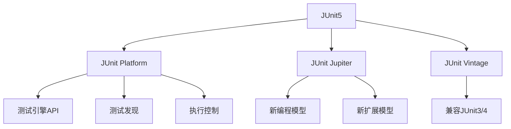
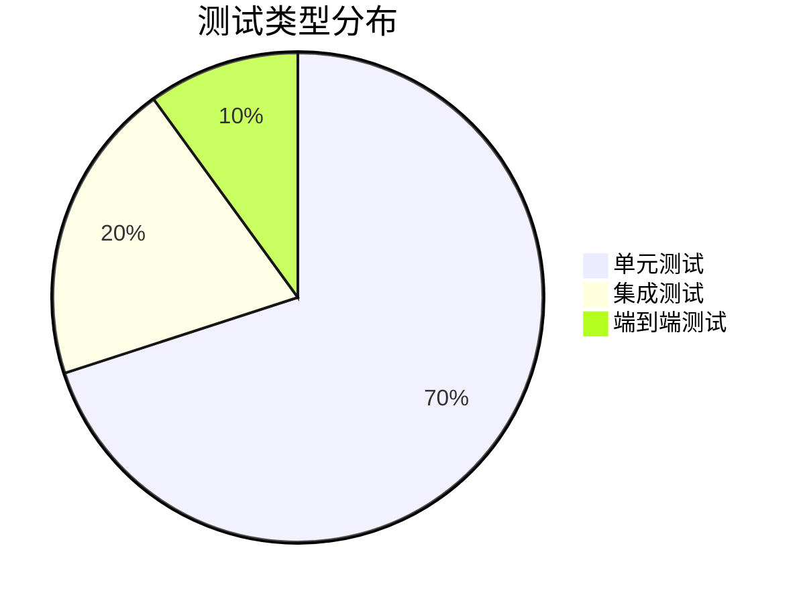

# JUnit5 详解与最佳实践

## 1. JUnit5 架构概述

JUnit5 是 Java 生态系统中最先进的测试框架，由三个核心模块组成：



### 1.1 核心模块对比

| 模块 | 功能 | 依赖 |
|------|------|------|
| **JUnit Platform** | 测试引擎的运行基础 | `junit-platform-engine` |
| **JUnit Jupiter** | 新的编程模型和扩展机制 | `junit-jupiter-api` |
| **JUnit Vintage** | 兼容 JUnit3/4 测试 | `junit-vintage-engine` |

## 2. 基础测试编写

### 2.1 依赖配置 (Maven)

```xml
<dependencies>
    <dependency>
        <groupId>org.junit.jupiter</groupId>
        <artifactId>junit-jupiter-api</artifactId>
        <version>5.10.0</version>
        <scope>test</scope>
    </dependency>
    <dependency>
        <groupId>org.junit.jupiter</groupId>
        <artifactId>junit-jupiter-engine</artifactId>
        <version>5.10.0</version>
        <scope>test</scope>
    </dependency>
</dependencies>

<build>
    <plugins>
        <plugin>
            <groupId>org.apache.maven.plugins</groupId>
            <artifactId>maven-surefire-plugin</artifactId>
            <version>3.0.0</version>
        </plugin>
    </plugins>
</build>
```

### 2.2 第一个测试用例

```java
import org.junit.jupiter.api.Test;
import static org.junit.jupiter.api.Assertions.*;

class CalculatorTest {

    @Test
    void additionTest() {
        Calculator calculator = new Calculator();
        assertEquals(4, calculator.add(2, 2), "2 + 2 应该等于 4");
    }

    @Test
    void divisionByZeroTest() {
        Calculator calculator = new Calculator();
        assertThrows(ArithmeticException.class, () -> calculator.divide(10, 0));
    }
}
```

## 3. 核心注解详解

### 3.1 生命周期注解

| 注解 | 描述 | 执行顺序 |
|------|------|----------|
| `@Test` | 标记测试方法 | N/A |
| `@BeforeAll` | 所有测试前执行一次（静态方法） | 1 |
| `@BeforeEach` | 每个测试前执行 | 2 |
| `@AfterEach` | 每个测试后执行 | 3 |
| `@AfterAll` | 所有测试后执行一次（静态方法） | 4 |

### 3.2 测试配置注解

| 注解 | 描述 | 示例 |
|------|------|------|
| `@DisplayName` | 自定义测试显示名称 | `@DisplayName("用户服务测试")` |
| `@Disabled` | 禁用测试 | `@Disabled("待实现")` |
| `@Tag` | 标记测试分类 | `@Tag("integration")` |
| `@RepeatedTest` | 重复测试 | `@RepeatedTest(5)` |
| `@Timeout` | 设置超时时间 | `@Timeout(value=500, unit=MILLISECONDS)` |

### 3.3 嵌套测试示例

```java
@DisplayName("购物车服务测试")
class ShoppingCartServiceTest {
    
    ShoppingCart cart;
    
    @BeforeEach
    void init() {
        cart = new ShoppingCart();
    }
    
    @Nested
    @DisplayName("当购物车为空时")
    class WhenEmpty {
        
        @Test
        @DisplayName("添加商品应增加商品数量")
        void addItemShouldIncreaseSize() {
            cart.addItem(new Item("Book", 29.99));
            assertEquals(1, cart.getItemCount());
        }
    }
    
    @Nested
    @DisplayName("当购物车有商品时")
    class WhenHasItems {
        
        @BeforeEach
        void addItems() {
            cart.addItem(new Item("Pen", 1.99));
            cart.addItem(new Item("Notebook", 5.99));
        }
        
        @Test
        @DisplayName("移除商品应减少商品数量")
        void removeItemShouldDecreaseSize() {
            cart.removeItem("Pen");
            assertEquals(1, cart.getItemCount());
        }
    }
}
```

## 4. 断言系统详解

### 4.1 核心断言方法

| 方法 | 描述 | 示例 |
|------|------|------|
| `assertEquals` | 验证相等 | `assertEquals(4, result)` |
| `assertNotEquals` | 验证不等 | `assertNotEquals(0, result)` |
| `assertTrue` | 验证为真 | `assertTrue(user.isActive())` |
| `assertFalse` | 验证为假 | `assertFalse(file.isHidden())` |
| `assertNull` | 验证为 null | `assertNull(error)` |
| `assertNotNull` | 验证非 null | `assertNotNull(response)` |
| `assertThrows` | 验证抛出异常 | `assertThrows(IllegalArgumentException.class, () -> {...})` |
| `assertAll` | 分组断言 | 见下方示例 |
| `assertTimeout` | 验证执行时间 | `assertTimeout(Duration.ofMillis(100), () -> {...})` |

### 4.2 高级断言示例

```java
@Test
@DisplayName("用户对象完整验证")
void userValidationTest() {
    User user = userService.register("test@example.com", "Password123");
    
    assertAll("用户属性验证",
        () -> assertNotNull(user.getId(), "ID 不应为空"),
        () -> assertEquals("test@example.com", user.getEmail(), "邮箱不匹配"),
        () -> assertTrue(user.isActive(), "用户应处于激活状态"),
        () -> assertNotNull(user.getRegistrationDate(), "注册日期不应为空")
    );
    
    // 集合断言
    List<String> roles = user.getRoles();
    assertIterableEquals(List.of("USER"), roles, "默认角色应为USER");
    
    // 超时断言
    assertTimeoutPreemptively(Duration.ofMillis(500), () -> {
        // 执行耗时操作
        userService.activateUser(user.getId());
    });
}
```

## 5. 参数化测试

### 5.1 基础参数化测试

```java
@ParameterizedTest
@ValueSource(ints = {1, 3, 5, 7, 15})
void isOddTest(int number) {
    assertTrue(NumberUtils.isOdd(number));
}

@ParameterizedTest(name = "{0} + {1} = {2}")
@CsvSource({
    "0, 1, 1",
    "1, 2, 3",
    "10, 20, 30"
})
void addTest(int a, int b, int expected) {
    assertEquals(expected, calculator.add(a, b));
}
```

### 5.2 高级参数源

```java
@ParameterizedTest
@MethodSource("stringProvider")
void methodSourceTest(String argument) {
    assertNotNull(argument);
}

static Stream<String> stringProvider() {
    return Stream.of("apple", "banana", "orange");
}

@ParameterizedTest
@ArgumentsSource(CustomArgumentsProvider.class)
void customSourceTest(int number, String expected) {
    assertEquals(expected, NumberUtils.toWord(number));
}

static class CustomArgumentsProvider implements ArgumentsProvider {
    @Override
    public Stream<? extends Arguments> provideArguments(ExtensionContext context) {
        return Stream.of(
            Arguments.of(1, "one"),
            Arguments.of(2, "two"),
            Arguments.of(3, "three")
        );
    }
}
```

## 6. 测试生命周期与扩展模型

### 6.1 自定义扩展实现

```java
public class BenchmarkExtension implements BeforeEachCallback, AfterEachCallback {
    
    private Map<String, Long> startTimes = new ConcurrentHashMap<>();
    
    @Override
    public void beforeEach(ExtensionContext context) {
        startTimes.put(context.getUniqueId(), System.currentTimeMillis());
    }
    
    @Override
    public void afterEach(ExtensionContext context) {
        long duration = System.currentTimeMillis() - 
                       startTimes.remove(context.getUniqueId());
        System.out.printf("Test %s took %d ms%n", 
                         context.getDisplayName(), duration);
    }
}

// 使用扩展
@ExtendWith(BenchmarkExtension.class)
class PerformanceTest {
    // 测试方法...
}
```

### 6.2 条件测试执行

```java
@Test
@EnabledOnOs(OS.LINUX)
void linuxOnlyTest() {
    // 仅在Linux系统执行
}

@Test
@DisabledIfEnvironmentVariable(named = "CI", matches = "true")
void skipOnCITest() {
    // 在CI环境中跳过
}

@Test
@EnabledIf("customCondition")
void conditionallyEnabledTest() {
    // 根据自定义条件执行
}

boolean customCondition() {
    return LocalDate.now().getDayOfWeek() != DayOfWeek.SUNDAY;
}
```

## 7. 最佳实践指南

### 7.1 测试命名规范

```java
// 反例
@Test
void testAdd() { ... }

// 正例 - BDD风格
@Test
@DisplayName("当添加两个正数时，应返回正确和")
void whenAddingTwoPositiveNumbers_thenReturnCorrectSum() { ... }

// 参数化测试命名
@ParameterizedTest(name = "{0} 应该是闰年")
@ValueSource(ints = {2000, 2004, 2020})
void leapYearTest(int year) { ... }
```

### 7.2 测试结构（AAA模式）

```java
@Test
void transferFundsShouldUpdateBalances() {
    // Arrange - 准备测试数据
    Account accountA = new Account("A", 1000);
    Account accountB = new Account("B", 500);
    BankService service = new BankService();
    
    // Act - 执行操作
    service.transfer(accountA, accountB, 300);
    
    // Assert - 验证结果
    assertAll(
        () -> assertEquals(700, accountA.getBalance(), "账户A余额错误"),
        () -> assertEquals(800, accountB.getBalance(), "账户B余额错误")
    );
}
```

### 7.3 测试隔离与清理

```java
class DatabaseTest {
    
    private static DatabaseConnection connection;
    private TestDataManager dataManager;
    
    @BeforeAll
    static void initDatabase() {
        connection = DatabaseConnection.open();
    }
    
    @AfterAll
    static void closeDatabase() {
        connection.close();
    }
    
    @BeforeEach
    void prepareTestData() {
        dataManager = new TestDataManager(connection);
        dataManager.loadTestData();
    }
    
    @AfterEach
    void cleanTestData() {
        dataManager.clearTestData();
    }
    
    @Test
    void testQuery() {
        // 使用干净的测试数据执行测试
    }
}
```

## 8. 高级测试技巧

### 8.1 Mockito 集成

```java
@ExtendWith(MockitoExtension.class)
class UserServiceTest {
    
    @Mock
    private UserRepository userRepository;
    
    @InjectMocks
    private UserService userService;
    
    @Test
    void getUserByIdShouldReturnUser() {
        // 准备模拟行为
        User mockUser = new User("test@example.com");
        when(userRepository.findById(1L)).thenReturn(Optional.of(mockUser));
        
        // 执行测试
        User result = userService.getUserById(1L);
        
        // 验证结果
        assertEquals("test@example.com", result.getEmail());
        verify(userRepository, times(1)).findById(1L);
    }
    
    @Test
    void getUserByIdNotFoundShouldThrow() {
        when(userRepository.findById(anyLong())).thenReturn(Optional.empty());
        
        assertThrows(UserNotFoundException.class, 
            () -> userService.getUserById(1L));
    }
}
```

### 8.2 测试驱动开发 (TDD) 示例

```java
// 步骤1: 编写失败测试
@Test
void newAccountShouldHaveZeroBalance() {
    Account account = new Account();
    assertEquals(0, account.getBalance());
}

// 步骤2: 实现最小功能使测试通过
public class Account {
    private int balance = 0;
    public int getBalance() { return balance; }
}

// 步骤3: 添加存款测试
@Test
void depositShouldIncreaseBalance() {
    Account account = new Account();
    account.deposit(100);
    assertEquals(100, account.getBalance());
}

// 步骤4: 实现存款功能
public class Account {
    private int balance = 0;
    public void deposit(int amount) { balance += amount; }
    public int getBalance() { return balance; }
}

// 步骤5: 重构改进代码
// (无重构需要)
```

## 9. Spring Boot 集成测试

### 9.1 WebMvc 测试

```java
@WebMvcTest(UserController.class)
class UserControllerTest {
    
    @Autowired
    private MockMvc mockMvc;
    
    @MockBean
    private UserService userService;
    
    @Test
    void getUserByIdShouldReturn200() throws Exception {
        User mockUser = new User(1L, "test@example.com");
        when(userService.getUserById(1L)).thenReturn(mockUser);
        
        mockMvc.perform(get("/users/1"))
            .andExpect(status().isOk())
            .andExpect(jsonPath("$.id").value(1))
            .andExpect(jsonPath("$.email").value("test@example.com"));
    }
    
    @Test
    void createUserShouldReturn201() throws Exception {
        User newUser = new User("new@example.com");
        when(userService.createUser(any())).thenReturn(newUser);
        
        mockMvc.perform(post("/users")
                .contentType(MediaType.APPLICATION_JSON)
                .content("{\"email\":\"new@example.com\"}"))
            .andExpect(status().isCreated())
            .andExpect(header().exists("Location"));
    }
}
```

### 9.2 数据层测试

```java
@DataJpaTest
@AutoConfigureTestDatabase(replace = Replace.NONE)
class UserRepositoryTest {
    
    @Autowired
    private TestEntityManager entityManager;
    
    @Autowired
    private UserRepository userRepository;
    
    @Test
    void findByEmailShouldReturnUser() {
        // 准备数据
        User user = new User("test@example.com");
        entityManager.persist(user);
        entityManager.flush();
        
        // 执行查询
        Optional<User> found = userRepository.findByEmail("test@example.com");
        
        // 验证结果
        assertTrue(found.isPresent());
        assertEquals(user.getEmail(), found.get().getEmail());
    }
}
```

### 9.3 完整集成测试

```java
@SpringBootTest(webEnvironment = WebEnvironment.RANDOM_PORT)
@Testcontainers
class ApplicationIntegrationTest {
    
    @Autowired
    private TestRestTemplate restTemplate;
    
    @Container
    static PostgreSQLContainer<?> postgres = new PostgreSQLContainer<>("postgres:15")
        .withDatabaseName("testdb")
        .withUsername("test")
        .withPassword("test");
    
    @DynamicPropertySource
    static void configureProperties(DynamicPropertyRegistry registry) {
        registry.add("spring.datasource.url", postgres::getJdbcUrl);
        registry.add("spring.datasource.username", postgres::getUsername);
        registry.add("spring.datasource.password", postgres::getPassword);
    }
    
    @Test
    void contextLoads() {
        // 验证应用上下文加载成功
    }
    
    @Test
    void healthCheckShouldReturnUp() {
        ResponseEntity<String> response = restTemplate.getForEntity("/actuator/health", String.class);
        assertEquals(HttpStatus.OK, response.getStatusCode());
        assertTrue(response.getBody().contains("UP"));
    }
}
```

## 10. 持续集成与测试报告

### 10.1 Maven 配置示例

```xml
<build>
    <plugins>
        <plugin>
            <groupId>org.apache.maven.plugins</groupId>
            <artifactId>maven-surefire-plugin</artifactId>
            <version>3.0.0</version>
            <configuration>
                <includes>
                    <include>**/*Test.java</include>
                    <include>**/*Tests.java</include>
                </includes>
                <excludedGroups>integration</excludedGroups>
                <properties>
                    <configurationParameters>
                        junit.jupiter.execution.parallel.enabled = true
                        junit.jupiter.execution.parallel.mode.default = concurrent
                    </configurationParameters>
                </properties>
            </configuration>
        </plugin>
        
        <plugin>
            <groupId>org.apache.maven.plugins</groupId>
            <artifactId>maven-failsafe-plugin</artifactId>
            <version>3.0.0</version>
            <executions>
                <execution>
                    <goals>
                        <goal>integration-test</goal>
                        <goal>verify</goal>
                    </goals>
                    <configuration>
                        <includes>
                            <include>**/*IT.java</include>
                        </includes>
                        <groups>integration</groups>
                    </configuration>
                </execution>
            </executions>
        </plugin>
    </plugins>
</build>
```

### 10.2 测试报告生成

```xml
<dependency>
    <groupId>org.junit.platform</groupId>
    <artifactId>junit-platform-reporting</artifactId>
    <version>1.10.0</version>
    <scope>test</scope>
</dependency>
```

生成 HTML 报告：

```java
public class TestReportGenerator {
    public static void main(String[] args) {
        LauncherDiscoveryRequest request = LauncherDiscoveryRequestBuilder.request()
            .selectors(selectPackage("com.example.tests"))
            .build();
        
        SummaryGeneratingListener summaryListener = new SummaryGeneratingListener();
        
        try (FileWriter writer = new FileWriter("build/test-report.html")) {
            HtmlReportsDetailWriter htmlWriter = new HtmlReportsDetailWriter(writer);
            LegacyXmlReportGeneratingListener xmlListener = 
                new LegacyXmlReportGeneratingListener(Paths.get("build"), writer);
            
            Launcher launcher = LauncherFactory.create();
            launcher.registerTestExecutionListeners(summaryListener, xmlListener);
            launcher.execute(request);
            
            TestExecutionSummary summary = summaryListener.getSummary();
            summary.printTo(new PrintWriter(System.out));
        }
    }
}
```

## 11. 最佳实践总结

### 11.1 测试金字塔原则



### 11.2 测试代码质量标准

1. **可读性**：清晰的命名和结构
2. **独立性**：测试之间无依赖关系
3. **快速性**：单元测试应在毫秒级完成
4. **确定性**：相同输入总是产生相同结果
5. **全面性**：覆盖边界条件、异常场景

### 11.3 测试覆盖率指南

| 覆盖类型 | 推荐目标 | 工具 |
|----------|----------|------|
| **行覆盖率** | 70-80% | JaCoCo |
| **分支覆盖率** | 80-90% | JaCoCo |
| **突变测试** | >90% | PITest |
| **代码复杂度** | <10 | JaCoCo |

> **黄金法则**：不要盲目追求100%覆盖率，应关注关键业务逻辑和复杂算法

## 附录：常见问题解答

**Q：JUnit5 与 JUnit4 的主要区别？**  
A：

1. 架构：模块化设计（Platform, Jupiter, Vintage）
2. 注解：`@Before` → `@BeforeEach`, `@Test` 不再需要 `public`
3. 断言：引入 `assertAll` 和 lambda 支持
4. 扩展：更强大的扩展模型替代 `@Rule`
5. 参数化：更丰富的参数化测试支持

**Q：如何并行运行测试？**  
A：

1. 配置 `junit.jupiter.execution.parallel.enabled=true`
2. 设置并行模式：

   ```properties
   junit.jupiter.execution.parallel.mode.default = concurrent
   junit.jupiter.execution.parallel.mode.classes.default = concurrent
   ```

3. 使用 `@Execution(CONCURRENT)` 控制单个测试

**Q：如何测试私有方法？**  
A：**不推荐直接测试私有方法**。正确做法：

1. 通过公有方法间接测试
2. 将私有方法提取到工具类中测试
3. 必要时使用反射（最后手段）：

   ```java
   Method method = MyClass.class.getDeclaredMethod("privateMethod");
   method.setAccessible(true);
   Object result = method.invoke(instance);
   ```

**Q：如何跳过某些测试？**  
A：

1. 使用 `@Disabled` 注解
2. 条件测试：`@EnabledOnOs`, `@DisabledIfEnvironmentVariable`
3. 使用标签过滤：`@Tag("slow")` + Maven 配置 `excludedGroups`

**Q：如何测试日志输出？**  
A：使用 `OutputCapture` 扩展：

```java
@ExtendWith(OutputCaptureExtension.class)
class LoggingTest {
    
    @Test
    void testLogOutput(CapturedOutput output) {
        Logger logger = LoggerFactory.getLogger(LoggingTest.class);
        logger.info("Test message");
        
        assertTrue(output.getOut().contains("Test message"));
    }
}
```
