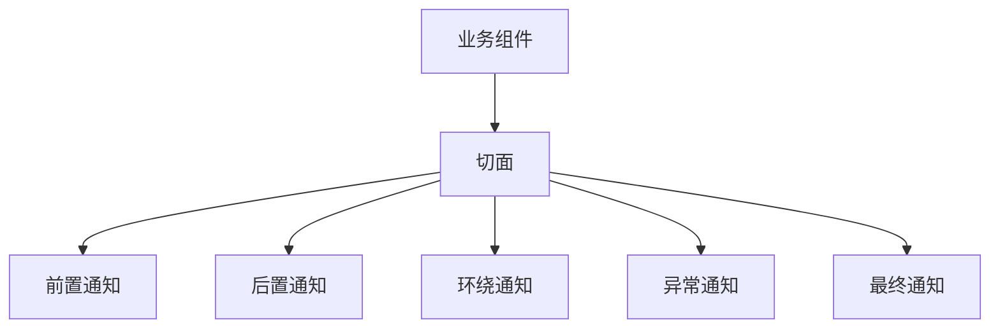

# Spring Boot AOP 详解与最佳实践

## 目录

- [1. AOP 核心概念](#1-aop-核心概念)
- [2. Spring Boot 中启用 AOP](#2-spring-boot-中启用-aop)
- [3. 切点表达式详解](#3-切点表达式详解)
- [4. 五种通知类型](#4-五种通知类型)
- [5. 切面优先级](#5-切面优先级)
- [6. 最佳实践](#6-最佳实践)
- [7. 常见问题与解决方案](#7-常见问题与解决方案)
- [8. 总结](#8-总结)

## 1. AOP 核心概念

**AOP（Aspect-Oriented Programming）** 是一种编程范式，旨在将横切关注点（如日志、事务、安全等）从核心业务逻辑中分离出来。

| 概念          | 说明                                                                 |
|---------------|----------------------------------------------------------------------|
| **切面(Aspect)** | 横切关注点的模块化实现，包含通知和切点                              |
| **连接点(Joinpoint)** | 程序执行过程中的特定点（如方法调用、异常抛出）                      |
| **切点(Pointcut)** | 匹配连接点的表达式，定义通知何时执行                                |
| **通知(Advice)** | 切面在特定连接点执行的动作（如前置、后置通知）                      |
| **织入(Weaving)** | 将切面应用到目标对象并创建代理对象的过程                            |



## 2. Spring Boot 中启用 AOP

### 2.1 添加依赖

```xml
<dependency>
    <groupId>org.springframework.boot</groupId>
    <artifactId>spring-boot-starter-aop</artifactId>
</dependency>
```

### 2.2 启用AOP支持

```java
@SpringBootApplication
@EnableAspectJAutoProxy // 启用AspectJ自动代理
public class Application {
    public static void main(String[] args) {
        SpringApplication.run(Application.class, args);
    }
}
```

### 2.3 创建切面组件

```java
@Aspect
@Component
public class LoggingAspect {
    // 切点和通知将在后续章节实现
}
```

## 3. 切点表达式详解

### 3.1 常用表达式类型

| 表达式                     | 说明                                     |
|---------------------------|------------------------------------------|
| `execution(...)`          | 匹配方法执行连接点（最常用）             |
| `@annotation(...)`        | 匹配带有指定注解的方法                   |
| `within(...)`             | 匹配指定类型内的方法                     |
| `args(...)`               | 匹配参数类型符合指定模式的方法           |

### 3.2 通配符语法

```java
// 基本格式
execution(
    [修饰符] 返回类型 [类路径].方法名(参数列表) [异常]
)

// 示例
@Pointcut("execution(public * com.example.service.*.*(..))")
public void serviceMethods() {} // 匹配service包下所有公共方法

@Pointcut("@annotation(com.example.annotations.LogExecutionTime)")
public void logExecutionTimeAnnotation() {} // 匹配带@LogExecutionTime注解的方法
```

### 3.3 组合切点

```java
@Pointcut("serviceMethods() && logExecutionTimeAnnotation()")
public void monitoredServices() {}
```

## 4. 五种通知类型

### 4.1 前置通知(Before)

```java
@Before("serviceMethods()")
public void logMethodStart(JoinPoint joinPoint) {
    String methodName = joinPoint.getSignature().getName();
    log.info("开始执行方法: {}", methodName);
}
```

### 4.2 后置通知(After)

```java
@After("serviceMethods()")
public void logMethodEnd(JoinPoint joinPoint) {
    log.info("方法执行结束: {}", joinPoint.getSignature().getName());
}
```

### 4.3 返回通知(AfterReturning)

```java
@AfterReturning(
    pointcut = "serviceMethods()",
    returning = "result"
)
public void logMethodReturn(JoinPoint joinPoint, Object result) {
    log.info("方法 {} 返回结果: {}", 
        joinPoint.getSignature().getName(), result);
}
```

### 4.4 异常通知(AfterThrowing)

```java
@AfterThrowing(
    pointcut = "serviceMethods()",
    throwing = "ex"
)
public void logException(JoinPoint joinPoint, Exception ex) {
    log.error("方法 {} 抛出异常: {}", 
        joinPoint.getSignature().getName(), ex.getMessage());
}
```

### 4.5 环绕通知(Around) - 最强大的通知类型

```java
@Around("monitoredServices()")
public Object measureExecutionTime(ProceedingJoinPoint joinPoint) throws Throwable {
    long start = System.currentTimeMillis();
    
    // 执行目标方法
    Object result = joinPoint.proceed();
    
    long duration = System.currentTimeMillis() - start;
    log.info("方法 {} 执行耗时: {} ms", 
        joinPoint.getSignature().getName(), duration);
    
    return result;
}
```

### 4.6 自定义注解示例

```java
@Retention(RetentionPolicy.RUNTIME)
@Target(ElementType.METHOD)
public @interface LogExecutionTime {
}

// 使用注解
@Service
public class OrderService {
    @LogExecutionTime
    public Order createOrder(OrderRequest request) {
        // 业务逻辑
    }
}
```

## 5. 切面优先级

当多个切面作用于同一个连接点时，执行顺序很重要：

```java
@Aspect
@Component
@Order(1) // 数字越小优先级越高
public class ValidationAspect {
    @Before("execution(* com.example.service.*.*(..))")
    public void validateInput(JoinPoint joinPoint) {
        // 参数验证逻辑
    }
}

@Aspect
@Component
@Order(2)
public class LoggingAspect {
    @Before("execution(* com.example.service.*.*(..))")
    public void logMethodStart(JoinPoint joinPoint) {
        // 日志记录
    }
}
```

**执行顺序**:

1. `ValidationAspect` 验证
2. `LoggingAspect` 日志
3. 目标方法执行
4. `LoggingAspect` 后置处理
5. `ValidationAspect` 后置处理

## 6. 最佳实践

### 6.1 适用场景

✅ **日志记录** - 统一的方法调用日志  
✅ **性能监控** - 方法执行时间统计  
✅ **事务管理** - `@Transactional` 的实现基础  
✅ **安全控制** - 权限检查  
✅ **参数校验** - 前置统一校验  
✅ **异常处理** - 统一异常转换  

### 6.2 性能优化建议

1. **精确切点定义**：避免使用过于宽泛的切点表达式

   ```java
   // 不推荐 - 范围过大
   @Pointcut("execution(* com.example..*(..))")
   
   // 推荐 - 精确限定包和方法
   @Pointcut("execution(public * com.example.service.*Service.*(..))")
   ```

2. **避免在切面中执行耗时操作**：特别是高频调用的方法

3. **缓存切点匹配结果**：Spring 默认会缓存切点匹配结果

4. **优先使用注解驱动切面**：相比 XML 配置更高效

### 6.3 事务管理集成

```java
@Aspect
@Component
public class TransactionAspect {
    
    @Autowired
    private PlatformTransactionManager transactionManager;
    
    @Around("@annotation(transactional)")
    public Object manageTransaction(ProceedingJoinPoint joinPoint, 
                                    Transactional transactional) throws Throwable {
        TransactionStatus status = transactionManager.getTransaction(
            new DefaultTransactionDefinition());
        
        try {
            Object result = joinPoint.proceed();
            transactionManager.commit(status);
            return result;
        } catch (Exception ex) {
            transactionManager.rollback(status);
            throw ex;
        }
    }
}
```

### 6.4 安全控制示例

```java
@Aspect
@Component
public class SecurityAspect {
    
    @Before("@annotation(requiresAdmin)")
    public void checkAdminPermission(JoinPoint joinPoint, 
                                     RequiresAdmin requiresAdmin) {
        Authentication auth = SecurityContextHolder.getContext().getAuthentication();
        if (!auth.getAuthorities().contains("ROLE_ADMIN")) {
            throw new AccessDeniedException("需要管理员权限");
        }
    }
}
```

## 7. 常见问题与解决方案

### 问题1: 切面不生效

**可能原因**：

- 切面类未添加 `@Component` 注解
- 未启用 `@EnableAspectJAutoProxy`
- 切点表达式匹配错误
- 目标方法是 `final` 或 `private`

**解决方案**：

1. 确认切面类被 Spring 管理
2. 检查是否启用 AOP 自动代理
3. 使用调试模式验证切点匹配
4. 避免代理 `final` 和 `private` 方法

### 问题2: 自调用问题

```java
@Service
public class OrderService {
    
    public void processOrder(Order order) {
        validateOrder(order); // 自调用，AOP 不生效
    }
    
    @LogExecutionTime
    public void validateOrder(Order order) {
        // 验证逻辑
    }
}
```

**解决方案**：

1. 使用 `AopContext.currentProxy()`

   ```java
   ((OrderService) AopContext.currentProxy()).validateOrder(order);
   ```

2. 重构代码，避免自调用
3. 使用 AspectJ 编译时织入

### 问题3: 循环依赖

**场景**：切面依赖被代理对象

**解决方案**：

1. 使用 `@Lazy` 注解延迟注入

   ```java
   @Aspect
   @Component
   public class MyAspect {
       @Lazy
       @Autowired
       private MyService myService; // 被代理的服务
   }
   ```

2. 通过 `ApplicationContext` 获取 Bean
3. 重构设计，避免切面依赖目标对象

## 8. 总结

Spring Boot AOP 提供了一种优雅的方式处理横切关注点：

- 合理使用 **五种通知类型** 覆盖不同场景
- 精确的 **切点表达式** 是高效 AOP 的关键
- **@Order** 注解解决多切面执行顺序问题
- 遵循 **最佳实践** 避免性能问题和常见陷阱
- 在日志、监控、事务、安全等场景发挥重要作用


**最终建议**：在项目中适度使用 AOP，避免过度设计。将 AOP 用于真正的横切关注点，保持核心业务逻辑的清晰和简洁。
