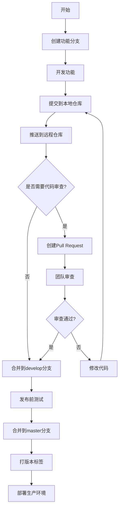

# Git常用命令与工作流程详解及Spring Boot整合最佳实践

## 文档概述

本文档全面介绍Git的核心概念、常用命令、经典工作流程，并结合Spring Boot项目展示Git在实际开发中的最佳实践。内容包含可运行的代码示例和工作流程图，帮助开发者掌握高效协作的版本控制方法。



## 一、Git核心概念

### 1.1 版本控制系统

- **集中式**：SVN、CVS（单一中央仓库）
- **分布式**：Git、Mercurial（每个开发者拥有完整仓库）

### 1.2 Git核心组件

| 组件         | 说明                          |
|--------------|-----------------------------|
| 工作目录     | 本地文件系统                 |
| 暂存区(Index)| 准备提交的变更               |
| 本地仓库     | 完整的项目历史               |
| 远程仓库     | 团队共享的中央代码库         |

## 二、Git常用命令详解

### 2.1 配置与初始化

```bash
# 全局配置用户信息
git config --global user.name "Your Name"
git config --global user.email "your.email@example.com"

# 初始化新仓库
git init spring-boot-project

# 克隆现有仓库
git clone https://github.com/user/spring-boot-project.git
```

### 2.2 基础工作流命令

```bash
# 查看当前状态
git status

# 添加文件到暂存区
git add src/main/java/com/example/MyController.java

# 提交到本地仓库
git commit -m "feat: add user authentication endpoint"

# 查看提交历史（精简版）
git log --oneline --graph
```

### 2.3 分支管理

```bash
# 创建新分支
git branch feature/user-authentication

# 切换分支
git checkout feature/user-authentication

# 创建并切换分支（一步完成）
git checkout -b hotfix/login-issue

# 合并分支到当前分支
git merge feature/user-authentication

# 删除分支
git branch -d feature/user-authentication
```

### 2.4 远程仓库操作

```bash
# 添加远程仓库
git remote add origin https://github.com/user/repo.git

# 推送到远程分支
git push -u origin feature/user-authentication

# 拉取远程更新
git pull origin develop

# 获取远程更新（不自动合并）
git fetch origin
```

### 2.5 撤销与回退

```bash
# 撤销工作区修改
git checkout -- src/main/resources/application.properties

# 撤销暂存区文件
git reset HEAD src/main/resources/application.properties

# 回退到指定提交
git reset --hard a1b2c3d

# 创建新提交来撤销之前的更改
git revert a1b2c3d
```

## 三、Git经典工作流程 - Git Flow

### 3.1 分支模型


### 3.2 分支说明

1. **main/master**：生产环境稳定分支
2. **develop**：开发集成分支
3. **feature/**：功能开发分支
4. **release/**：版本发布准备分支
5. **hotfix/**：紧急修复分支

### 3.3 工作流程步骤

1. 从`develop`创建`feature`分支
2. 在`feature`分支开发新功能
3. 完成开发后合并到`develop`
4. 准备发布时从`develop`创建`release`分支
5. 在`release`分支进行测试和修复
6. 发布时合并到`main`并打标签
7. 紧急修复从`main`创建`hotfix`分支
8. 修复后合并到`main`和`develop`

## 四、Spring Boot项目Git最佳实践

### 4.1 .gitignore配置

```gitignore
# Spring Boot特定忽略项
/target/
!**/src/main/**
!**/src/test/**

# 构建输出
build/
out/
bin/

# IDE文件
.idea/
*.iml
*.ipr
*.iws

# 日志文件
*.log
logs/

# 环境配置文件
.env
application-*.properties
!application-default.properties

# Mac系统文件
.DS_Store
```

### 4.2 分支策略示例

```bash
# 开始新功能开发
git checkout -b feature/user-profile develop

# 常规开发提交
git add .
git commit -m "feat: add user profile endpoint"

# 完成功能开发后
git checkout develop
git merge --no-ff feature/user-profile
git branch -d feature/user-profile
```

### 4.3 提交信息规范

使用[Conventional Commits](https://www.conventionalcommits.org/)规范：

```plain
<类型>[可选范围]: <描述>

[可选正文]

[可选脚注]
```

**常用类型**：

- `feat`：新功能
- `fix`：错误修复
- `docs`：文档变更
- `style`：代码格式调整
- `refactor`：重构代码
- `test`：测试相关
- `chore`：构建过程或辅助工具变更

**示例**：

```bash
git commit -m "feat(authentication): implement JWT token validation

- Add TokenProvider class
- Implement token validation filter
- Update security configuration"
```

### 4.4 版本标签管理

```bash
# 创建带注释的标签
git tag -a v1.2.0 -m "Release version 1.2.0 with user management"

# 推送标签到远程
git push origin v1.2.0

# 查看标签列表
git tag -l
```

## 五、Spring Boot项目集成Git完整示例

### 5.1 初始化Spring Boot项目

```bash
# 使用Spring Initializr创建项目
curl https://start.spring.io/starter.zip -d dependencies=web,jpa \
-d groupId=com.example -d artifactId=myapp -o myapp.zip
unzip myapp.zip && cd myapp

# 初始化Git仓库
git init
git add .
git commit -m "chore: initial commit from Spring Initializr"
```

### 5.2 功能开发工作流

```bash
# 创建新功能分支
git checkout -b feature/product-catalog develop

# 开发产品管理功能
# ... 编写代码 ...

# 提交功能实现
git add src/main/java/com/example/product/
git commit -m "feat(product): implement product catalog CRUD operations"

# 编写测试
git add src/test/java/com/example/product/
git commit -m "test(product): add repository and controller tests"

# 合并到开发分支
git checkout develop
git merge --no-ff feature/product-catalog -m "Merge product catalog feature"
git branch -d feature/product-catalog
```

### 5.3 发布流程

```bash
# 创建发布分支
git checkout -b release/1.0.0 develop

# 版本号更新（在pom.xml中）
sed -i '' 's/<version>0.0.1-SNAPSHOT<\/version>/<version>1.0.0<\/version>/' pom.xml

# 提交版本更新
git add pom.xml
git commit -m "chore: prepare release 1.0.0"

# 合并到主分支并打标签
git checkout main
git merge --no-ff release/1.0.0 -m "Release v1.0.0"
git tag -a v1.0.0 -m "Production release v1.0.0"

# 合并回develop
git checkout develop
git merge --no-ff release/1.0.0 -m "Merge release 1.0.0 into develop"

# 删除发布分支
git branch -d release/1.0.0
```

## 六、团队协作最佳实践

### 6.1 Pull Request流程

1. 在功能分支开发完成后推送到远程
2. 在GitHub/GitLab创建Pull Request到develop分支
3. 团队成员进行代码审查
4. 通过CI/CD流水线自动化测试
5. 审查通过后合并分支

### 6.2 解决合并冲突

```bash
# 拉取最新代码时发现冲突
git pull origin develop

# 查看冲突文件
git status

# 手动解决冲突后标记为已解决
git add resolved-file.java

# 完成合并
git commit -m "Merge branch 'develop' into feature/payment"
```

### 6.3 使用rebase保持历史整洁

```bash
# 在功能分支上
git fetch origin
git rebase origin/develop

# 解决可能出现的冲突
git add .
git rebase --continue

# 推送到远程（需要强制推送）
git push origin feature/payment -f
```

## 七、Git与CI/CD集成（以Jenkins为例）

### 7.1 Jenkinsfile示例

```groovy
pipeline {
    agent any
    
    stages {
        stage('Checkout') {
            steps {
                git branch: 'develop', 
                url: 'https://github.com/user/spring-boot-app.git'
            }
        }
        
        stage('Build') {
            steps {
                sh './mvnw clean package'
            }
        }
        
        stage('Test') {
            steps {
                sh './mvnw test'
            }
        }
        
        stage('Deploy to Staging') {
            when {
                branch 'main'
            }
            steps {
                sh './deploy-to-staging.sh'
            }
        }
    }
    
    post {
        success {
            slackSend color: 'good', message: "Build Successful: ${env.BUILD_URL}"
        }
        failure {
            slackSend color: 'danger', message: "Build Failed: ${env.BUILD_URL}"
        }
    }
}
```

## 八、总结

### 8.1 Git最佳实践要点

1. **分支策略**：严格执行Git Flow分支模型
2. **提交规范**：使用Conventional Commits
3. **小步提交**：频繁提交小变更单元
4. **代码审查**：强制Pull Request流程
5. **自动化测试**：CI/CD流水线保障质量
6. **语义化版本**：使用Semantic Versioning
7. **保护主分支**：禁止直接向main/develop推送

### 8.2 推荐工具

- **Git客户端**：GitKraken、SourceTree
- **代码托管**：GitHub、GitLab、Bitbucket
- **CI/CD**：Jenkins、GitHub Actions、GitLab CI
- **代码质量**：SonarQube、Checkstyle

通过遵循这些最佳实践，团队可以在Spring Boot项目中实现高效、可靠的Git协作流程，显著提升开发效率和代码质量。

> **提示**：定期使用`git gc`优化本地仓库性能，清理不需要的分支和对象可保持仓库健康状态。
