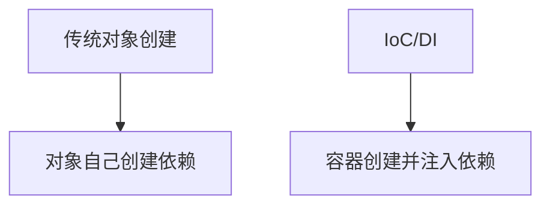
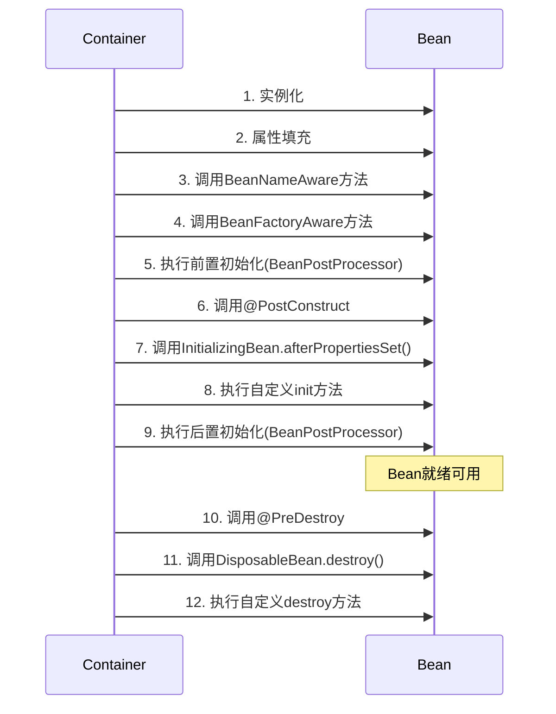

# Spring IoC（控制反转）容器详解与最佳实践

## 1. IoC 核心概念解析

### 1.1 什么是控制反转（IoC）

**控制反转**是一种设计原则，将对象创建和依赖管理的控制权从应用程序代码转移到外部容器。传统编程中对象主动创建依赖，而IoC中**容器负责创建对象并注入依赖**。

### 1.2 依赖注入（DI） vs IoC

- **IoC**：更广泛的概念，指控制权的反转
- **DI**：IoC的具体实现方式，通过构造函数、Setter方法或字段直接注入依赖



### 1.3 Spring IoC 容器核心接口

| 接口 | 描述 | 特点 |
|------|------|------|
| `BeanFactory` | 基础容器 | 提供基本DI支持，延迟加载 |
| `ApplicationContext` | 高级容器 | 继承BeanFactory，添加企业级功能（AOP、事件、资源处理等） |

## 2. 容器配置方式对比

### 2.1 XML 配置（传统方式）

```xml
<!-- beans.xml -->
<beans xmlns="http://www.springframework.org/schema/beans"
       xmlns:xsi="http://www.w3.org/2001/XMLSchema-instance"
       xsi:schemaLocation="http://www.springframework.org/schema/beans 
       http://www.springframework.org/schema/beans/spring-beans.xsd">

    <bean id="userService" class="com.example.UserServiceImpl">
        <property name="userRepository" ref="userRepository"/>
    </bean>

    <bean id="userRepository" class="com.example.JdbcUserRepository"/>
</beans>
```

### 2.2 注解配置（推荐）

```java
@Component
public class UserServiceImpl implements UserService {
    @Autowired
    private UserRepository userRepository;
}

@Repository
public class JdbcUserRepository implements UserRepository {}
```

### 2.3 Java Config（纯Java配置）

```java
@Configuration
public class AppConfig {
    
    @Bean
    public UserService userService(UserRepository userRepository) {
        return new UserServiceImpl(userRepository);
    }
    
    @Bean
    public UserRepository userRepository() {
        return new JdbcUserRepository();
    }
}
```

### 2.4 配置方式选择建议

| 场景 | 推荐方式 |
|------|----------|
| 新项目 | Java Config + 注解 |
| 旧项目迁移 | 混合使用（逐步迁移） |
| 需要动态配置 | XML + 属性文件 |
| 简单微服务 | 全注解方式 |

## 3. Bean 生命周期管理

### 3.1 Bean 生命周期关键阶段



### 3.2 生命周期回调示例

```java
@Component
public class LifecycleBean implements InitializingBean, DisposableBean {
    
    @PostConstruct
    public void customInit() {
        System.out.println("@PostConstruct method called");
    }
    
    @Override
    public void afterPropertiesSet() {
        System.out.println("InitializingBean.afterPropertiesSet() called");
    }
    
    @PreDestroy
    public void customDestroy() {
        System.out.println("@PreDestroy method called");
    }
    
    @Override
    public void destroy() {
        System.out.println("DisposableBean.destroy() called");
    }
}
```

## 4. 依赖注入最佳实践

### 4.1 注入方式对比

| 方式 | 示例 | 优点 | 缺点 |
|------|------|------|------|
| **构造器注入** | `public UserService(UserRepository repo)` | 不可变依赖、易测试 | 参数多时代码冗长 |
| **Setter注入** | `setRepo(UserRepository repo)` | 可选依赖、灵活 | 可能导致部分初始化状态 |
| **字段注入** | `@Autowired private Repo repo;` | 简洁 | 不易测试、破坏封装性 |

### 4.2 推荐实践

```java
@Service
public class OrderService {
    
    // 强制依赖使用构造器注入
    private final PaymentProcessor paymentProcessor;
    private final InventoryService inventoryService;
    
    @Autowired
    public OrderService(PaymentProcessor paymentProcessor, 
                        InventoryService inventoryService) {
        this.paymentProcessor = paymentProcessor;
        this.inventoryService = inventoryService;
    }
    
    // 可选依赖使用Setter注入
    private EmailService emailService;
    
    @Autowired(required = false)
    public void setEmailService(EmailService emailService) {
        this.emailService = emailService;
    }
}
```

## 5. Bean 作用域管理

### 5.1 Spring 支持的作用域

| 作用域 | 描述 | 典型用例 |
|--------|------|----------|
| **singleton** | 默认作用域，每个容器一个实例 | 无状态服务、DAO |
| **prototype** | 每次请求创建新实例 | 有状态对象 |
| **request** | Web请求作用域 | HTTP请求相关数据 |
| **session** | 用户会话作用域 | 用户会话数据 |
| **application** | ServletContext作用域 | 全局应用数据 |
| **websocket** | WebSocket会话作用域 | WebSocket相关数据 |

### 5.2 作用域配置示例

```java
@Configuration
public class ScopeConfig {
    
    // 默认单例
    @Bean
    public SingletonService singletonService() {
        return new SingletonService();
    }
    
    // 原型作用域
    @Bean
    @Scope("prototype")
    public PrototypeService prototypeService() {
        return new PrototypeService();
    }
}
```

## 6. 条件化配置与Profile

### 6.1 Profile 环境隔离

```java
@Configuration
@Profile("dev")
public class DevConfig {
    @Bean
    public DataSource dataSource() {
        return new EmbeddedDatabaseBuilder()
            .setType(EmbeddedDatabaseType.H2)
            .build();
    }
}

@Configuration
@Profile("prod")
public class ProdConfig {
    @Bean
    public DataSource dataSource() {
        return DataSourceBuilder.create()
            .url("jdbc:mysql://prod-db:3306/app")
            .username("admin")
            .password("secure")
            .build();
    }
}
```

### 6.2 条件化Bean创建

```java
@Configuration
public class ConditionalConfig {
    
    @Bean
    @ConditionalOnProperty(name = "cache.enabled", havingValue = "true")
    public CacheManager cacheManager() {
        return new EhCacheManager();
    }
    
    @Bean
    @ConditionalOnMissingBean(CacheManager.class)
    public CacheManager noOpCacheManager() {
        return new NoOpCacheManager();
    }
}
```

## 7. 高级容器特性

### 7.1 容器事件机制

```java
// 自定义事件
public class OrderCreatedEvent extends ApplicationEvent {
    public OrderCreatedEvent(Order source) {
        super(source);
    }
}

// 发布事件
@Service
public class OrderService {
    @Autowired
    private ApplicationEventPublisher eventPublisher;
    
    public void createOrder(Order order) {
        // 创建订单逻辑...
        eventPublisher.publishEvent(new OrderCreatedEvent(order));
    }
}

// 监听事件
@Component
public class OrderEventListener {
    
    @EventListener
    public void handleOrderCreated(OrderCreatedEvent event) {
        System.out.println("Received order created event: " + event.getSource());
    }
}
```

### 7.2 BeanPostProcessor 应用

```java
@Component
public class CustomBeanPostProcessor implements BeanPostProcessor {
    
    @Override
    public Object postProcessBeforeInitialization(Object bean, String beanName) {
        System.out.println("Before init: " + beanName);
        return bean;
    }
    
    @Override
    public Object postProcessAfterInitialization(Object bean, String beanName) {
        System.out.println("After init: " + beanName);
        if (bean instanceof Auditable) {
            return new AuditableProxy(bean);
        }
        return bean;
    }
}
```

## 8. 最佳实践总结

### 8.1 设计原则

1. **面向接口编程**：依赖接口而非具体实现

   ```java
   // 推荐
   @Autowired
   private UserRepository userRepository;
   
   // 避免
   @Autowired
   private JdbcUserRepository jdbcUserRepository;
   ```

2. **单一职责原则**：每个Bean专注于单一功能
3. **依赖最小化**：只注入必要的依赖
4. **避免循环依赖**：重构设计或使用setter注入解决

### 8.2 性能优化

- 合理使用作用域：无状态Bean使用singleton
- 延迟初始化：`@Lazy`注解用于启动时不急需的Bean
- 避免过度使用AOP：代理会增加性能开销
- 使用`@Configuration(proxyBeanMethods = false)`减少CGLIB代理

### 8.3 测试策略

```java
@SpringBootTest
class UserServiceTest {
    
    @MockBean
    private UserRepository userRepository;  // 自动替换容器中的Bean
    
    @Autowired
    private UserService userService;
    
    @Test
    void testGetUser() {
        // 配置Mock行为
        when(userRepository.findById(1L)).thenReturn(new User(1, "test"));
        
        User user = userService.getUserById(1L);
        assertEquals("test", user.getName());
    }
}
```

### 8.4 常见陷阱与解决方案

| 问题 | 现象 | 解决方案 |
|------|------|----------|
| **循环依赖** | 启动失败：BeanCurrentlyInCreationException | 1. 使用setter注入<br>2. 重构设计<br>3. @Lazy延迟注入 |
| **作用域错误** | 状态不一致或内存泄漏 | 1. 确保有状态Bean使用prototype<br>2. Web作用域对象避免注入singleton |
| **过度使用自动装配** | 依赖关系不明确 | 1. 关键依赖使用构造器注入<br>2. 使用@Qualifier指定具体Bean |
| **未处理异常** | Bean初始化失败 | 1. 实现InitializingBean时处理异常<br>2. 在@PostConstruct中捕获异常 |

## 9. 完整示例：电商订单处理

```java
// 领域模型
public record Product(Long id, String name, BigDecimal price) {}
public record Order(Long id, List<Product> products, String status) {}

// 仓储接口
public interface OrderRepository {
    Order save(Order order);
}

// 服务层
@Service
public class OrderService {
    private final OrderRepository orderRepository;
    private final PaymentService paymentService;
    private final InventoryService inventoryService;

    @Autowired
    public OrderService(OrderRepository orderRepository, 
                       PaymentService paymentService,
                       InventoryService inventoryService) {
        this.orderRepository = orderRepository;
        this.paymentService = paymentService;
        this.inventoryService = inventoryService;
    }

    @Transactional
    public Order placeOrder(Order order) {
        // 检查库存
        inventoryService.checkInventory(order.products());
        
        // 处理支付
        paymentService.processPayment(order);
        
        // 保存订单
        Order savedOrder = orderRepository.save(
            new Order(null, order.products(), "COMPLETED")
        );
        
        // 发送事件
        applicationEventPublisher.publishEvent(new OrderPlacedEvent(savedOrder));
        
        return savedOrder;
    }
}

// 配置类
@Configuration
@EnableTransactionManagement
public class AppConfig {
    
    @Bean
    @Profile("dev")
    public OrderRepository inMemoryOrderRepository() {
        return new InMemoryOrderRepository();
    }
    
    @Bean
    @Profile("prod")
    public OrderRepository jdbcOrderRepository(DataSource dataSource) {
        return new JdbcOrderRepository(dataSource);
    }
    
    @Bean
    public PlatformTransactionManager transactionManager(DataSource dataSource) {
        return new DataSourceTransactionManager(dataSource);
    }
}
```

## 10. 总结

Spring IoC容器是现代Java应用的基石，通过掌握：

- 依赖注入的正确使用方式
- Bean生命周期的精细控制
- 环境敏感的配置管理
- 容器高级特性的合理应用

结合本文的最佳实践，您可以构建出：
✅ 松耦合、高内聚的系统架构  
✅ 易于测试和维护的代码结构  
✅ 适应不同环境的灵活配置  
✅ 高性能的企业级应用

**最后建议**：随着Spring Boot的普及，建议结合Spring Boot的自动配置特性，进一步简化IoC容器的配置和管理，提升开发效率。
