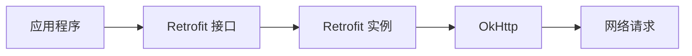

# Retrofit2 详解与 Spring Boot 整合最佳实践

## 1. Retrofit2 概述

**Retrofit2** 是 Square 公司开发的一款类型安全的 HTTP 客户端库，专为 Android 和 Java 应用设计。它通过将 HTTP API 转换为 Java/Kotlin 接口，简化了网络请求的处理过程。

### 核心优势

- **声明式 API 定义**：通过接口和注解定义 HTTP 请求
- **类型安全**：自动序列化/反序列化请求和响应
- **高度可扩展**：支持多种转换器、拦截器和适配器
- **简洁高效**：减少样板代码，提升开发效率



## 2. Retrofit2 核心组件

### 2.1 注解类型

| 注解类别       | 常用注解                          | 说明                          |
|----------------|----------------------------------|-------------------------------|
| HTTP 方法      | `@GET`, `@POST`, `@PUT`, `@DELETE` | 定义请求方法                  |
| 路径参数       | `@Path`                          | 替换 URL 中的占位符           |
| 查询参数       | `@Query`, `@QueryMap`            | 添加 URL 查询参数             |
| 请求体         | `@Body`                          | 发送对象作为请求体            |
| 表单编码       | `@FormUrlEncoded`, `@Field`      | 发送表单数据                  |
| 多部分请求     | `@Multipart`, `@Part`            | 上传文件或复杂数据            |
| 头部信息       | `@Header`, `@Headers`            | 添加请求头                    |

### 2.2 核心类

- **Retrofit**：入口类，用于创建 API 接口实例
- **Call**：表示一个可以执行的 HTTP 请求
- **Converter**：处理请求/响应的序列化（如 Gson、Jackson）
- **CallAdapter**：适配返回值类型（如 RxJava、CompletableFuture）
- **Interceptor**：拦截请求/响应（日志、认证等）

## 3. Retrofit2 基本使用

### 3.1 添加依赖

```gradle
// Maven
<dependency>
    <groupId>com.squareup.retrofit2</groupId>
    <artifactId>retrofit</artifactId>
    <version>2.9.0</version>
</dependency>
<dependency>
    <groupId>com.squareup.retrofit2</groupId>
    <artifactId>converter-gson</artifactId>
    <version>2.9.0</version>
</dependency>
```

### 3.2 定义 API 接口

```java
public interface UserService {
    @GET("users/{id}")
    Call<User> getUserById(@Path("id") Long userId);

    @POST("users")
    @FormUrlEncoded
    Call<User> createUser(
        @Field("name") String name,
        @Field("email") String email
    );

    @Multipart
    @POST("avatar")
    Call<ResponseBody> uploadAvatar(
        @Part MultipartBody.Part file,
        @Part("description") RequestBody description
    );
}
```

### 3.3 创建 Retrofit 实例

```java
Retrofit retrofit = new Retrofit.Builder()
    .baseUrl("https://api.example.com/")
    .addConverterFactory(GsonConverterFactory.create())
    .client(new OkHttpClient.Builder()
        .addInterceptor(new HttpLoggingInterceptor().setLevel(HttpLoggingInterceptor.Level.BODY))
        .build())
    .build();

UserService userService = retrofit.create(UserService.class);
```

### 3.4 执行请求

```java
// 同步请求
Response<User> response = userService.getUserById(1L).execute();
if (response.isSuccessful()) {
    User user = response.body();
}

// 异步请求
userService.getUserById(1L).enqueue(new Callback<User>() {
    @Override
    public void onResponse(Call<User> call, Response<User> response) {
        // 处理成功响应
    }

    @Override
    public void onFailure(Call<User> call, Throwable t) {
        // 处理失败
    }
});
```

## 4. Spring Boot 整合 Retrofit2

### 4.1 添加 Spring Boot 依赖

```gradle
// Spring Boot Starter Web
implementation 'org.springframework.boot:spring-boot-starter-web'

// Retrofit2
implementation 'com.squareup.retrofit2:retrofit:2.9.0'
implementation 'com.squareup.retrofit2:converter-gson:2.9.0'

// 可选：与 Spring 的异步支持集成
implementation 'com.squareup.retrofit2:adapter-java8:2.9.0'
```

### 4.2 配置 Retrofit Bean

```java
@Configuration
public class RetrofitConfig {

    @Value("${api.base.url}")
    private String baseUrl;

    @Bean
    public OkHttpClient okHttpClient() {
        return new OkHttpClient.Builder()
            .connectTimeout(30, TimeUnit.SECONDS)
            .readTimeout(30, TimeUnit.SECONDS)
            .writeTimeout(30, TimeUnit.SECONDS)
            .addInterceptor(new HttpLoggingInterceptor().setLevel(Level.BASIC))
            .build();
    }

    @Bean
    public Retrofit retrofit(OkHttpClient okHttpClient) {
        return new Retrofit.Builder()
            .baseUrl(baseUrl)
            .client(okHttpClient)
            .addConverterFactory(GsonConverterFactory.create())
            .addCallAdapterFactory(Java8CallAdapterFactory.create())
            .build();
    }

    @Bean
    public UserService userService(Retrofit retrofit) {
        return retrofit.create(UserService.class);
    }
}
```

### 4.3 在 Service 中使用 Retrofit

```java
@Service
public class UserIntegrationService {

    private final UserService userService;

    public UserIntegrationService(UserService userService) {
        this.userService = userService;
    }

    public CompletableFuture<User> getUserAsync(Long userId) {
        return userService.getUserById(userId);
    }

    @Retryable(value = {IOException.class}, maxAttempts = 3, backoff = @Backoff(delay = 1000))
    public User getUserSync(Long userId) throws IOException {
        Response<User> response = userService.getUserById(userId).execute();
        if (!response.isSuccessful()) {
            throw new HttpClientErrorException(
                HttpStatus.valueOf(response.code()),
                "Failed to get user: " + response.errorBody().string()
            );
        }
        return response.body();
    }
}
```

### 4.4 在 Controller 中调用

```java
@RestController
@RequestMapping("/api/users")
public class UserController {

    private final UserIntegrationService userIntegrationService;

    public UserController(UserIntegrationService userIntegrationService) {
        this.userIntegrationService = userIntegrationService;
    }

    @GetMapping("/{id}")
    public ResponseEntity<User> getUser(@PathVariable Long id) {
        try {
            User user = userIntegrationService.getUserSync(id);
            return ResponseEntity.ok(user);
        } catch (IOException e) {
            return ResponseEntity.status(HttpStatus.SERVICE_UNAVAILABLE).build();
        }
    }

    @GetMapping("/async/{id}")
    public CompletableFuture<ResponseEntity<User>> getUserAsync(@PathVariable Long id) {
        return userIntegrationService.getUserAsync(id)
            .thenApply(ResponseEntity::ok)
            .exceptionally(ex -> ResponseEntity.status(HttpStatus.INTERNAL_SERVER_ERROR).build());
    }
}
```

## 5. 最佳实践

### 5.1 配置管理

**application.yml**

```yaml
api:
  base:
    url: https://api.example.com/v1/
  timeout: 5000
  max-retries: 3
```

### 5.2 全局异常处理

```java
@RestControllerAdvice
public class GlobalExceptionHandler {

    @ExceptionHandler(RetrofitErrorException.class)
    public ResponseEntity<ErrorResponse> handleRetrofitError(RetrofitErrorException ex) {
        ErrorResponse error = new ErrorResponse(
            "API_SERVICE_ERROR",
            ex.getMessage(),
            Instant.now()
        );
        return new ResponseEntity<>(error, ex.getStatusCode());
    }
    
    // 自定义异常类
    public static class RetrofitErrorException extends RuntimeException {
        private final HttpStatus statusCode;
        
        public RetrofitErrorException(String message, HttpStatus statusCode) {
            super(message);
            this.statusCode = statusCode;
        }
        
        public HttpStatus getStatusCode() {
            return statusCode;
        }
    }
}
```

### 5.3 认证拦截器

```java
public class AuthInterceptor implements Interceptor {

    private final String apiKey;

    public AuthInterceptor(String apiKey) {
        this.apiKey = apiKey;
    }

    @Override
    public Response intercept(Chain chain) throws IOException {
        Request original = chain.request();
        Request request = original.newBuilder()
            .header("Authorization", "Bearer " + apiKey)
            .header("Accept", "application/json")
            .method(original.method(), original.body())
            .build();
        return chain.proceed(request);
    }
}

// 在配置中使用
@Bean
public OkHttpClient okHttpClient(@Value("${api.key}") String apiKey) {
    return new OkHttpClient.Builder()
        .addInterceptor(new AuthInterceptor(apiKey))
        .build();
}
```

### 5.4 性能优化

1. **复用 OkHttpClient 实例**

   ```java
   @Bean
   @Scope("singleton")
   public OkHttpClient okHttpClient() {
       return new OkHttpClient();
   }
   ```

2. **连接池配置**

   ```java
   ConnectionPool connectionPool = new ConnectionPool(5, 5, TimeUnit.MINUTES);
   
   OkHttpClient client = new OkHttpClient.Builder()
       .connectionPool(connectionPool)
       .build();
   ```

3. **启用响应缓存**

   ```java
   File cacheDir = new File(System.getProperty("java.io.tmpdir"), "retrofit-cache");
   Cache cache = new Cache(cacheDir, 10 * 1024 * 1024); // 10MB
   
   OkHttpClient client = new OkHttpClient.Builder()
       .cache(cache)
       .build();
   ```

### 5.5 测试策略

**Mock 测试示例**

```java
@SpringBootTest
@AutoConfigureMockMvc
class UserControllerTest {

    @Autowired
    private MockMvc mockMvc;

    @MockBean
    private UserService userService;

    @Test
    void shouldReturnUserWhenExists() throws Exception {
        User mockUser = new User(1L, "John Doe", "john@example.com");
        when(userService.getUserById(1L)).thenReturn(CallHelpers.successCall(mockUser));
        
        mockMvc.perform(get("/api/users/1"))
            .andExpect(status().isOk())
            .andExpect(jsonPath("$.name").value("John Doe"));
    }
}

// 辅助工具类
class CallHelpers {
    public static <T> Call<T> successCall(T body) {
        return new Call<T>() {
            @Override
            public Response<T> execute() {
                return Response.success(body);
            }
            
            // 其他方法实现...
        };
    }
}
```

## 6. 高级功能

### 6.1 与 Spring Cloud 集成

**在微服务环境中使用服务发现**

```java
@Bean
public Retrofit retrofit(OkHttpClient okHttpClient, 
                         DiscoveryClient discoveryClient,
                         @Value("${user.service.id}") String serviceId) {
    
    List<ServiceInstance> instances = discoveryClient.getInstances(serviceId);
    if (instances.isEmpty()) {
        throw new IllegalStateException("No instances available for service: " + serviceId);
    }
    
    ServiceInstance instance = instances.get(0);
    String baseUrl = "http://" + instance.getHost() + ":" + instance.getPort() + "/";
    
    return new Retrofit.Builder()
        .baseUrl(baseUrl)
        .client(okHttpClient)
        .addConverterFactory(GsonConverterFactory.create())
        .build();
}
```

### 6.2 响应式支持

```java
// 添加依赖
implementation 'com.squareup.retrofit2:adapter-rxjava3:2.9.0'

// 接口定义
public interface ReactiveUserService {
    @GET("users/{id}")
    Observable<User> getUserById(@Path("id") Long userId);
}

// 配置
@Bean
public Retrofit retrofit(OkHttpClient okHttpClient) {
    return new Retrofit.Builder()
        .baseUrl(baseUrl)
        .client(okHttpClient)
        .addConverterFactory(GsonConverterFactory.create())
        .addCallAdapterFactory(RxJava3CallAdapterFactory.create())
        .build();
}

// 使用
public Flux<User> getUsers(List<Long> userIds) {
    return Flux.fromIterable(userIds)
        .flatMap(id -> reactiveUserService.getUserById(id).toFlowable())
        .onErrorResume(e -> Flux.empty());
}
```

## 7. 常见问题解决

### 7.1 问题：JSON 解析失败

**解决方案**：

- 确保 POJO 结构与 JSON 匹配
- 使用 `@SerializedName` 注解处理字段名不一致
- 添加 null 安全处理：

  ```java
  Gson gson = new GsonBuilder()
      .serializeNulls()
      .setLenient()
      .create();
      
  Retrofit retrofit = new Retrofit.Builder()
      .addConverterFactory(GsonConverterFactory.create(gson))
  ```

### 7.2 问题：超时设置不生效

**解决方案**：

```java
OkHttpClient client = new OkHttpClient.Builder()
    .connectTimeout(10, TimeUnit.SECONDS)
    .readTimeout(30, TimeUnit.SECONDS)
    .writeTimeout(15, TimeUnit.SECONDS)
    .build();
```

### 7.3 问题：文件上传进度监控

**解决方案**：

```java
public static RequestBody createProgressRequestBody(File file, 
                                                  Consumer<Float> progressCallback) {
    return new RequestBody() {
        @Override
        public MediaType contentType() {
            return MediaType.parse("multipart/form-data");
        }

        @Override
        public void writeTo(BufferedSink sink) throws IOException {
            long total = file.length();
            long uploaded = 0;
            
            try (Source source = Okio.source(file)) {
                Buffer buffer = new Buffer();
                long read;
                while ((read = source.read(buffer, 2048)) != -1) {
                    sink.write(buffer, read);
                    uploaded += read;
                    progressCallback.accept((float) uploaded / total);
                }
            }
        }
    };
}

// 使用
RequestBody requestBody = createProgressRequestBody(file, progress -> {
    log.info("Upload progress: {}%", progress * 100);
});
```

## 8. 总结

Retrofit2 与 Spring Boot 的整合提供了强大的 HTTP 客户端能力，结合两者的优势可以实现：

1. **声明式 API 定义** - 简洁的接口描述 HTTP 请求
2. **高效的类型转换** - 自动处理 JSON/XML 序列化
3. **灵活的可扩展性** - 拦截器、转换器、适配器
4. **生产级健壮性** - 超时控制、重试机制、错误处理
5. **现代化集成** - 响应式编程、服务发现、配置管理

**推荐实践组合**：

- 使用 `OkHttpClient` 作为底层实现
- 结合 Gson 进行 JSON 处理
- 添加日志拦截器用于调试
- 使用 Java8 或 RxJava 适配器进行异步处理
- 通过 Spring 的 `@Retryable` 实现重试机制
- 集成 Spring Cloud 服务发现

通过遵循本文的最佳实践，您可以构建出高性能、可维护且健壮的 HTTP 客户端集成方案，满足企业级应用的需求。
