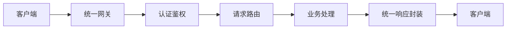
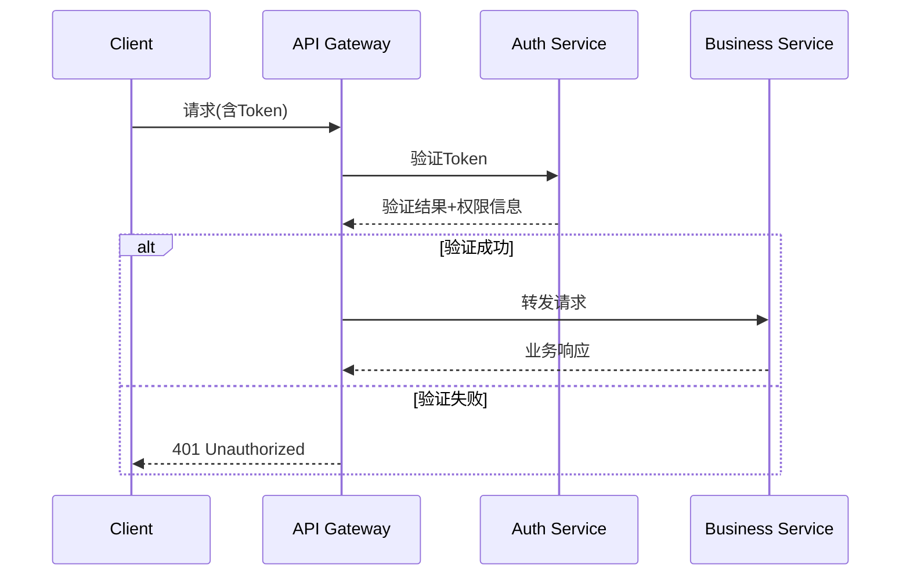

# Spring MVC 通用接口规范详解与最佳实践

## 文档概述

本文档旨在为Spring MVC项目提供一套**标准化、高可用**的RESTful API设计规范，借鉴支付宝开放平台、MCP等业界成熟实践，确保接口的**一致性、可维护性和安全性**。

---

## 1. 核心设计原则

### 1.1 RESTful 基础原则

| 原则 | 说明 | 示例 |
|------|------|------|
| **资源导向** | 使用名词表示资源 | `/users` 而不是 `/getUsers` |
| **HTTP动词** | 正确使用HTTP方法 | GET(查), POST(增), PUT(改), DELETE(删) |
| **无状态** | 服务端不保存客户端状态 | 每次请求包含完整上下文 |
| **HATEOAS** | 超媒体作为应用状态引擎 | 响应中包含相关资源链接 |

### 1.2 统一接口规范



---

## 2. 请求规范

### 2.1 URL 设计规范

- **格式**：`https://api.domain.com/v{version}/{resource}[/{id}[/sub-resource]]`
- **示例**：

  ```bash
  GET /v1/users/123/orders  # 获取用户123的所有订单
  PUT /v2/products/789      # 更新ID为789的商品
  ```

### 2.2 HTTP 头部规范

| 头部字段 | 必选 | 说明 | 示例值 |
|---------|------|------|--------|
| `Authorization` | ✓ | 认证令牌 | `Bearer xxxxx.yyyyy.zzzzz` |
| `Content-Type` | ✓ | 请求体类型 | `application/json;charset=UTF-8` |
| `X-Request-Id` | ✓ | 请求唯一ID | `req_1234567890abcdef` |
| `X-Client-Version` | ✓ | 客户端版本 | `android/3.2.1` |

### 2.3 请求参数规范

```java
// 查询参数示例
@GetMapping("/users")
public ApiResponse<List<User>> searchUsers(
    @RequestParam(required = false, defaultValue = "1") int page,
    @RequestParam(required = false, defaultValue = "20") int size,
    @RequestParam(required = false) String name) {
    // 业务逻辑
}
```

### 2.4 请求体规范

```json
// POST /v1/users 请求体
{
  "user": {
    "name": "张三",
    "email": "zhangsan@example.com",
    "phone": "13800138000"
  },
  "metadata": {
    "source": "mobile_app",
    "requestId": "req_20230625001"
  }
}
```

---

## 3. 响应规范

### 3.1 响应状态码

| 状态码 | 含义 | 使用场景 |
|--------|------|----------|
| 200 OK | 成功 | 常规成功响应 |
| 201 Created | 创建成功 | 资源创建成功 |
| 400 Bad Request | 请求错误 | 参数验证失败 |
| 401 Unauthorized | 未授权 | 身份验证失败 |
| 403 Forbidden | 禁止访问 | 权限不足 |
| 404 Not Found | 资源不存在 | 请求资源不存在 |
| 500 Internal Server Error | 服务器错误 | 未处理的异常 |

### 3.2 统一响应体结构

```json
{
  "code": 200,                // 业务状态码
  "message": "操作成功",       // 人类可读消息
  "data": { ... },            // 业务数据
  "timestamp": 1687680000000, // 服务器时间戳
  "traceId": "trace_123456"   // 请求追踪ID
}
```

### 3.3 业务状态码设计

| 状态码区间 | 类别 | 说明 |
|------------|------|------|
| 1000-1999 | 成功 | 业务操作成功 |
| 2000-2999 | 客户端错误 | 参数校验/权限问题 |
| 3000-3999 | 服务端错误 | 系统内部异常 |
| 4000-4999 | 第三方服务错误 | 依赖服务异常 |

---

## 4. 异常处理规范

### 4.1 全局异常处理器

```java
@ControllerAdvice
public class GlobalExceptionHandler {

    @ExceptionHandler(MethodArgumentNotValidException.class)
    public ResponseEntity<ApiResponse<?>> handleValidationException(
            MethodArgumentNotValidException ex) {
        
        List<String> errors = ex.getBindingResult()
            .getFieldErrors()
            .stream()
            .map(FieldError::getDefaultMessage)
            .collect(Collectors.toList());
        
        return ResponseEntity.status(HttpStatus.BAD_REQUEST)
            .body(ApiResponse.error(2001, "参数校验失败", errors));
    }

    @ExceptionHandler(BusinessException.class)
    public ResponseEntity<ApiResponse<?>> handleBusinessException(
            BusinessException ex) {
        
        return ResponseEntity.status(ex.getHttpStatus())
            .body(ApiResponse.error(ex.getCode(), ex.getMessage()));
    }
}
```

### 4.2 自定义业务异常

```java
public class BusinessException extends RuntimeException {
    private final int code;
    private final HttpStatus httpStatus;

    public BusinessException(int code, String message, HttpStatus httpStatus) {
        super(message);
        this.code = code;
        this.httpStatus = httpStatus;
    }

    // Getters
}
```

---

## 5. 安全规范

### 5.1 认证与授权



### 5.2 安全防护措施

1. **HTTPS**：强制使用TLS 1.2+
2. **速率限制**：防止DDoS攻击

   ```java
   @RateLimiter(name = "apiLimit", fallback = "rateLimitFallback")
   @GetMapping("/sensitive-data")
   public ApiResponse<Data> getSensitiveData() { ... }
   ```

3. **敏感数据脱敏**：

   ```json
   {
     "id": "U123456",
     "name": "张*",
     "phone": "138****8000"
   }
   ```

---

## 6. 版本管理

### 6.1 版本控制策略

| 策略 | 优点 | 缺点 | 适用场景 |
|------|------|------|----------|
| **URL路径** | 直观易用 | URL膨胀 | 推荐使用 `/v1/resource` |
| **请求头** | URL简洁 | 不易调试 | 浏览器支持有限 |
| **参数传递** | 简单易实现 | 污染参数 | 不推荐 |

### 6.2 版本演进示例

```java
// v1 版本控制器
@RestController
@RequestMapping("/v1/users")
public class UserControllerV1 { ... }

// v2 版本控制器
@RestController
@RequestMapping("/v2/users")
public class UserControllerV2 { ... }
```

---

## 7. 最佳实践

### 7.1 接口设计黄金法则

1. **单一职责原则**：每个接口只做一件事
2. **幂等性设计**：PUT/DELETE操作多次执行结果相同

   ```java
   @PostMapping("/orders")
   @Idempotent(key = "X-Idempotency-Key", expire = 3600) // 自定义幂等注解
   public ApiResponse<Order> createOrder(@RequestBody OrderRequest request) { ... }
   ```

3. **分页标准化**：

   ```json
   {
     "code": 200,
     "data": {
       "items": [ ... ],
       "page": 1,
       "size": 20,
       "total": 150
     }
   }
   ```

### 7.2 文档化实践

使用 **Springdoc OpenAPI** 自动生成文档：

```java
@Operation(summary = "获取用户详情", description = "根据用户ID获取详细信息")
@ApiResponse(responseCode = "200", description = "成功获取用户信息")
@ApiResponse(responseCode = "404", description = "用户不存在")
@GetMapping("/{id}")
public ApiResponse<User> getUserById(
    @Parameter(description = "用户ID", required = true) 
    @PathVariable String id) { ... }
```

### 7.3 性能优化

1. **响应压缩**：

   ```properties
   # application.properties
   server.compression.enabled=true
   server.compression.mime-types=application/json
   ```

2. **部分响应**（Partial Response）：

   ```plain
   GET /v1/users/123?fields=name,email
   ```

---

## 8. 完整示例

### 8.1 用户注册接口

**请求**:

```http
POST /v1/users HTTP/1.1
Authorization: Bearer xyz.abc.123
Content-Type: application/json
X-Request-Id: req_20230625001

{
  "name": "李四",
  "password": "P@ssw0rd!",
  "email": "lisi@example.com"
}
```

**响应**:

```json
{
  "code": 1001,
  "message": "用户创建成功",
  "data": {
    "userId": "U20230625001",
    "name": "李四",
    "email": "lisi@example.com",
    "createdAt": "2023-06-25T10:30:00Z"
  },
  "timestamp": 1687681800000,
  "traceId": "trace_9876543210"
}
```

### 8.2 Spring MVC 实现

```java
@RestController
@RequestMapping("/v1/users")
public class UserController {

    @PostMapping
    @ResponseStatus(HttpStatus.CREATED)
    public ApiResponse<UserResponse> registerUser(
            @Valid @RequestBody UserRegisterRequest request) {
        
        User user = userService.register(request);
        return ApiResponse.success(
            1001, 
            "用户创建成功", 
            new UserResponse(user)
        );
    }
}

// 统一响应封装
public class ApiResponse<T> {
    private int code;
    private String message;
    private T data;
    private long timestamp = System.currentTimeMillis();
    private String traceId = MDC.get("traceId");
    
    // 静态工厂方法
    public static <T> ApiResponse<T> success(T data) {
        return new ApiResponse<>(1000, "成功", data);
    }
    
    // 其他构造方法和getter
}
```

---

## 9. 持续演进

1. **监控指标**：记录QPS、成功率、延迟等关键指标
2. **兼容性保证**：
   - 新增字段：向后兼容
   - 删除/修改字段：需通过版本迭代
3. **自动化测试**：使用Spring Boot Test确保接口契约

   ```java
   @SpringBootTest
   class UserApiTests {
       
       @Test
       void registerUser_shouldReturn201() {
           // 构造请求
           // 验证响应结构和状态码
       }
   }
   ```

---

## 附录：参考标准

1. [JSON API 规范](https://jsonapi.org/)
2. [支付宝开放平台规范](https://opendocs.alipay.com/common/02khjm)
3. [Google API 设计指南](https://cloud.google.com/apis/design)
4. [Microsoft REST API 指南](https://github.com/microsoft/api-guidelines)

> 本规范结合业界最佳实践与Spring MVC特性制定，建议团队根据实际业务需求进行调整并严格执行，定期进行规范复审和更新。
