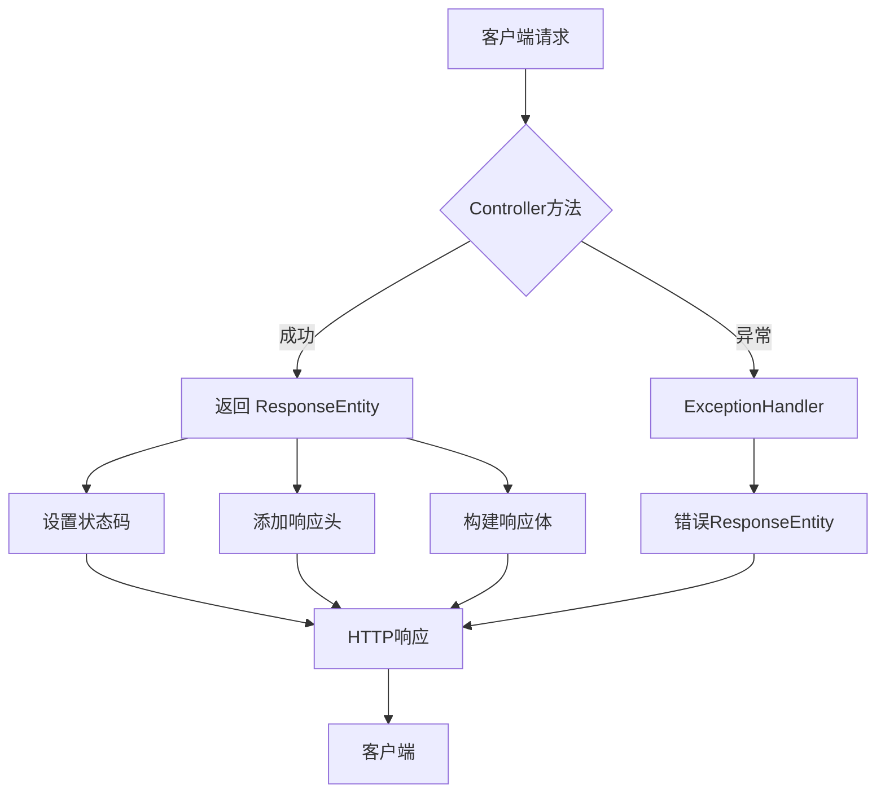

# Spring ResponseEntity 详解与最佳实践

## 目录

- [1. 什么是 ResponseEntity？](#1-什么是-responseentity)
- [2. 核心组件解析](#2-核心组件解析)
- [3. 创建 ResponseEntity 的多种方式](#3-创建-responseentity-的多种方式)
- [4. 最佳实践](#4-最佳实践)
- [5. 高级用法](#5-高级用法)
- [6. 测试建议](#6-测试建议)
- [7. 常见问题解答](#7-常见问题解答)
- [8. 总结](#8-总结)

## 1. 什么是 ResponseEntity？

`ResponseEntity` 是 Spring Framework 中用于表示整个 HTTP 响应的核心类，它包含：

- HTTP 状态码
- 响应头
- 响应体

与简单返回对象相比，`ResponseEntity` 提供了对 HTTP 响应的**完全控制**，使开发者能够精确构建符合 RESTful 规范的响应。

### 主要优势

✅ 精确控制 HTTP 状态码  
✅ 灵活设置自定义响应头  
✅ 支持所有类型的响应体  
✅ 与 Spring 的异常处理无缝集成  
✅ 便于单元测试和集成测试

## 2. 核心组件解析

```java
public class ResponseEntity<T> extends HttpEntity<T> {
    private final Object status;
    
    // 构造方法
    public ResponseEntity(T body, MultiValueMap<String, String> headers, HttpStatus status) {
        super(body, headers);
        this.status = status;
    }
    
    // 获取状态码
    public HttpStatus getStatusCode() { /* ... */ }
    
    // 获取响应头
    public HttpHeaders getHeaders() { /* ... */ }
    
    // 获取响应体
    public T getBody() { /* ... */ }
}
```

### 关键元素说明

| 组件        | 类型                      | 说明                             |
|-------------|---------------------------|----------------------------------|
| **状态码**  | `HttpStatus`              | HTTP 标准状态码 (200, 404等)     |
| **响应头**  | `MultiValueMap<String, String>` | 大小写不敏感的键值对集合       |
| **响应体**  | 泛型 `T`                  | 可以是任意类型 (DTO, String, 资源等) |

## 3. 创建 ResponseEntity 的多种方式

### 3.1 静态工厂方法（推荐）

```java
// 返回200 OK + 响应体
@GetMapping("/users/{id}")
public ResponseEntity<User> getUser(@PathVariable Long id) {
    User user = userService.findById(id);
    return ResponseEntity.ok(user);
}

// 自定义状态码
@PostMapping("/users")
public ResponseEntity<User> createUser(@RequestBody User user) {
    User savedUser = userService.save(user);
    return ResponseEntity.status(HttpStatus.CREATED).body(savedUser);
}

// 带自定义响应头
@GetMapping("/download")
public ResponseEntity<Resource> downloadFile() {
    Resource file = fileService.loadFile();
    return ResponseEntity.ok()
            .header("Content-Disposition", "attachment; filename=report.pdf")
            .contentType(MediaType.APPLICATION_PDF)
            .body(file);
}
```

### 3.2 Builder 模式（Spring 5+）

```java
@PutMapping("/users/{id}")
public ResponseEntity<?> updateUser(
        @PathVariable Long id, 
        @RequestBody UserUpdateRequest request) {
    
    userService.updateUser(id, request);
    
    return ResponseEntity.noContent()
            .header("X-Operation-Result", "success")
            .build();
}
```

### 3.3 构造函数方式

```java
@DeleteMapping("/users/{id}")
public ResponseEntity<Void> deleteUser(@PathVariable Long id) {
    userService.delete(id);
    return new ResponseEntity<>(HttpStatus.NO_CONTENT);
}
```

### 3.4 常用状态码快捷方法

| 方法                   | 对应状态码     |
|------------------------|---------------|
| `ok()`                 | 200 OK        |
| `created(URI location)`| 201 Created   |
| `accepted()`           | 202 Accepted  |
| `noContent()`          | 204 No Content|
| `badRequest()`         | 400 Bad Request |
| `notFound()`           | 404 Not Found |
| `internalServerError()`| 500 Internal Server Error |

## 4. 最佳实践

### 4.1 正确的状态码选择

```java
// 正确使用状态码示例
@PostMapping("/orders")
public ResponseEntity<Order> createOrder(@RequestBody Order order) {
    Order createdOrder = orderService.create(order);
    URI location = ServletUriComponentsBuilder
            .fromCurrentRequest()
            .path("/{id}")
            .buildAndExpand(createdOrder.getId())
            .toUri();
    
    // 201 Created 并返回资源位置
    return ResponseEntity.created(location).body(createdOrder);
}

@DeleteMapping("/orders/{id}")
public ResponseEntity<Void> cancelOrder(@PathVariable String id) {
    orderService.cancel(id);
    // 204 No Content 表示操作成功但无返回体
    return ResponseEntity.noContent().build();
}
```

### 4.2 响应头管理

```java
// ETag 和缓存控制示例
@GetMapping("/products/{id}")
public ResponseEntity<Product> getProduct(@PathVariable Long id) {
    Product product = productService.getById(id);
    String etag = "\"" + product.getVersion() + "\"";
    
    return ResponseEntity.ok()
            .eTag(etag)
            .cacheControl(CacheControl.maxAge(30, TimeUnit.MINUTES))
            .body(product);
}

// CORS 设置
@GetMapping("/api/data")
public ResponseEntity<Data> getData() {
    Data data = dataService.fetchData();
    return ResponseEntity.ok()
            .header("Access-Control-Allow-Origin", "https://trusted-domain.com")
            .body(data);
}
```

### 4.3 异常处理集成

```java
@RestControllerAdvice
public class GlobalExceptionHandler {
    
    @ExceptionHandler(ResourceNotFoundException.class)
    public ResponseEntity<ErrorResponse> handleResourceNotFound(
            ResourceNotFoundException ex) {
        
        ErrorResponse error = new ErrorResponse(
                "NOT_FOUND", 
                ex.getMessage(),
                Instant.now());
        
        return ResponseEntity.status(HttpStatus.NOT_FOUND).body(error);
    }
    
    @ExceptionHandler(MethodArgumentNotValidException.class)
    public ResponseEntity<ValidationErrorResponse> handleValidationErrors(
            MethodArgumentNotValidException ex) {
        
        List<FieldError> fieldErrors = ex.getBindingResult().getFieldErrors();
        ValidationErrorResponse error = new ValidationErrorResponse(
                "VALIDATION_FAILED",
                "Invalid request content",
                fieldErrors.stream()
                    .collect(Collectors.toMap(
                        FieldError::getField,
                        FieldError::getDefaultMessage)));
        
        return ResponseEntity.badRequest().body(error);
    }
}
```

### 4.4 响应体设计原则

```java
// 统一响应格式示例
public class ApiResponse<T> {
    private String status;   // "success" 或 "error"
    private T data;
    private String message;
    
    // 构造方法省略
}

// 控制器使用
@GetMapping("/items/{id}")
public ResponseEntity<ApiResponse<Item>> getItem(@PathVariable String id) {
    Item item = itemService.findById(id);
    ApiResponse<Item> response = new ApiResponse<>("success", item, null);
    return ResponseEntity.ok(response);
}

@ExceptionHandler(Exception.class)
public ResponseEntity<ApiResponse<Void>> handleGeneralException(Exception ex) {
    ApiResponse<Void> response = new ApiResponse<>("error", null, ex.getMessage());
    return ResponseEntity.status(HttpStatus.INTERNAL_SERVER_ERROR)
                         .body(response);
}
```

## 5. 高级用法

### 5.1 流式传输大文件

```java
@GetMapping("/large-file")
public ResponseEntity<StreamingResponseBody> streamLargeFile() {
    StreamingResponseBody stream = outputStream -> {
        try (InputStream is = new FileInputStream("large-file.dat")) {
            byte[] buffer = new byte[8192];
            int bytesRead;
            while ((bytesRead = is.read(buffer)) != -1) {
                outputStream.write(buffer, 0, bytesRead);
                outputStream.flush();
            }
        }
    };
    
    return ResponseEntity.ok()
            .contentType(MediaType.APPLICATION_OCTET_STREAM)
            .header("Content-Disposition", "attachment; filename=large-file.dat")
            .body(stream);
}
```

### 5.2 条件请求处理 (ETag/Last-Modified)

```java
@GetMapping("/documents/{id}")
public ResponseEntity<Document> getDocument(
        @PathVariable Long id,
        WebRequest request) {
    
    Document doc = documentService.getDocument(id);
    
    // 检查ETag
    String etag = "\"" + doc.getVersion() + "\"";
    if (request.checkNotModified(etag)) {
        return null; // 返回304 Not Modified
    }
    
    // 检查最后修改时间
    if (request.checkNotModified(doc.getLastModified().toEpochMilli())) {
        return null; // 返回304 Not Modified
    }
    
    return ResponseEntity.ok()
            .eTag(etag)
            .lastModified(doc.getLastModified())
            .body(doc);
}
```

### 5.3 分页响应

```java
@GetMapping("/articles")
public ResponseEntity<PageResponse<Article>> getArticles(
        @RequestParam(defaultValue = "0") int page,
        @RequestParam(defaultValue = "20") int size) {
    
    Page<Article> articlePage = articleService.getArticles(page, size);
    
    PageResponse<Article> response = new PageResponse<>(
            articlePage.getContent(),
            articlePage.getNumber(),
            articlePage.getSize(),
            articlePage.getTotalElements(),
            articlePage.getTotalPages());
    
    return ResponseEntity.ok()
            .header("X-Total-Count", String.valueOf(articlePage.getTotalElements()))
            .body(response);
}

// 分页响应DTO
public record PageResponse<T>(
        List<T> content,
        int page,
        int size,
        long totalElements,
        int totalPages) {}
```

## 6. 测试建议

### 6.1 单元测试示例

```java
@ExtendWith(MockitoExtension.class)
class UserControllerTest {

    @Mock
    private UserService userService;
    
    @InjectMocks
    private UserController userController;

    @Test
    void getUser_ShouldReturn200AndUser_WhenExists() {
        // 准备
        User mockUser = new User(1L, "john@example.com");
        when(userService.findById(1L)).thenReturn(mockUser);
        
        // 执行
        ResponseEntity<User> response = userController.getUser(1L);
        
        // 断言
        assertThat(response.getStatusCode()).isEqualTo(HttpStatus.OK);
        assertThat(response.getBody()).isEqualTo(mockUser);
    }

    @Test
    void createUser_ShouldReturn201WithLocationHeader() {
        // 准备
        User newUser = new User(null, "new@example.com");
        User savedUser = new User(1L, "new@example.com");
        when(userService.save(newUser)).thenReturn(savedUser);
        
        // 执行
        ResponseEntity<User> response = userController.createUser(newUser);
        
        // 断言
        assertThat(response.getStatusCode()).isEqualTo(HttpStatus.CREATED);
        assertThat(response.getHeaders().getLocation())
            .hasPath("/users/1");
        assertThat(response.getBody()).isEqualTo(savedUser);
    }
}
```

### 6.2 集成测试 (Spring Boot Test)

```java
@SpringBootTest
@AutoConfigureMockMvc
class UserControllerIntegrationTest {

    @Autowired
    private MockMvc mockMvc;
    
    @Test
    void deleteUser_ShouldReturn204() throws Exception {
        mockMvc.perform(delete("/users/1"))
                .andExpect(status().isNoContent());
    }
    
    @Test
    void getNonExistingUser_ShouldReturn404() throws Exception {
        mockMvc.perform(get("/users/999"))
                .andExpect(status().isNotFound())
                .andExpect(jsonPath("$.error").value("NOT_FOUND"))
                .andExpect(jsonPath("$.message").exists());
    }
}
```

## 7. 常见问题解答

### Q1: ResponseEntity 和 @ResponseBody 有什么区别？

- **@ResponseBody**：将方法返回值直接序列化到响应体中，状态码默认为200
- **ResponseEntity**：提供对状态码、响应头和响应体的完全控制

### Q2: 什么时候应该使用 ResponseEntity?

✔️ 需要返回非200状态码时  
✔️ 需要添加自定义响应头时  
✔️ 处理文件下载或流式响应时  
✔️ 实现条件请求（ETag/Last-Modified）时  
✔️ 需要精确控制HTTP响应细节时

### Q3: 如何处理空响应体？

使用 `Void` 类型并返回 `noContent()`：

```java
@DeleteMapping("/{id}")
public ResponseEntity<Void> deleteResource(@PathVariable String id) {
    service.delete(id);
    return ResponseEntity.noContent().build();
}
```

### Q4: 如何设置多个响应头？

使用 `header()` 方法链或 `headers()` 方法：

```java
// 方法链
return ResponseEntity.ok()
        .header("Header1", "Value1")
        .header("Header2", "Value2")
        .body(data);

// 使用HttpHeaders对象
HttpHeaders headers = new HttpHeaders();
headers.add("Header1", "Value1");
headers.add("Header2", "Value2");
return new ResponseEntity<>(data, headers, HttpStatus.OK);
```

## 8. 总结

**ResponseEntity 是构建精确 HTTP 响应的首选工具**：

- 使用静态工厂方法或 Builder 模式创建响应
- 为不同操作选择合适的状态码
- 利用响应头实现缓存、安全性和元数据传递
- 通过统一响应格式保持 API 一致性
- 结合异常处理提供有意义的错误响应
- 使用流式响应处理大文件传输
- 通过条件请求优化带宽使用

> **最佳实践核心原则**：始终返回最符合 RESTful 语义的 HTTP 状态码，提供足够的信息让客户端正确处理响应。



通过合理使用 ResponseEntity，您可以构建出符合 REST 规范、易于客户端使用且具有良好文档化的 API。
