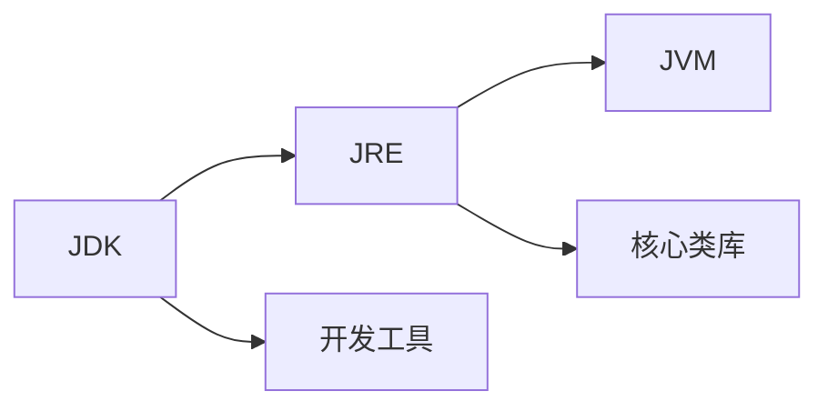
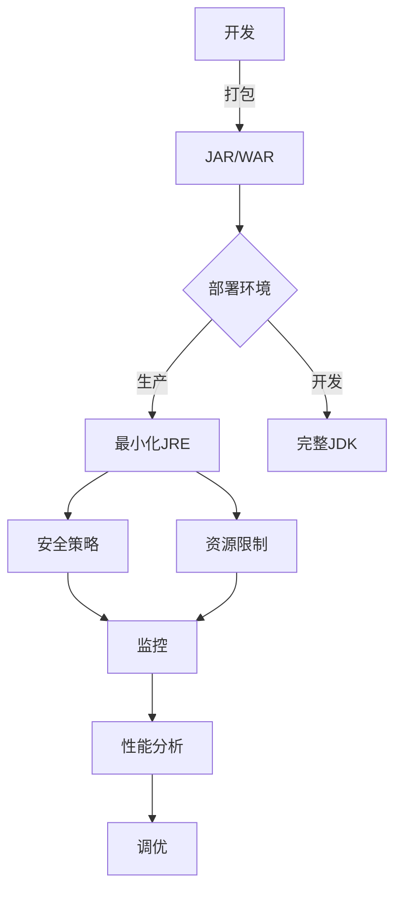

# JRE（Java 运行时环境）详解与最佳实践

## 1. 概述

### 1.1 什么是 JRE？

**Java 运行时环境（JRE）** 是运行 Java 应用程序的必备环境。它包含 Java 虚拟机（JVM）、核心类库（Java Class Library）和其他支持文件，但不包含开发工具（如编译器、调试器）。

### 1.2 JRE 与 JDK 的关系

- **JDK（Java Development Kit）**：包含 JRE + 开发工具（编译器、调试器等）
- **JRE（Java Runtime Environment）**：仅包含运行 Java 程序所需的组件
- **JVM（Java Virtual Machine）**：JRE 的核心组件，负责执行字节码



### 1.3 JRE 的主要组件

| 组件 | 描述 |
|------|------|
| **Java 虚拟机（JVM）** | 执行字节码的虚拟机 |
| **Java 核心类库** | 提供基础功能的 Java 类（如 java.lang, java.util） |
| **Java 启动器** | 启动 JVM 并执行主类的工具 |
| **支持库** | 本地库（如字体、UI 支持） |
| **配置文件** | 安全策略、扩展设置等 |

## 2. 安装与配置

### 2.1 安装 JRE

#### Windows 示例（使用命令行）

```powershell
# 下载 Adoptium JRE
Invoke-WebRequest -Uri "https://github.com/adoptium/temurin17-binaries/releases/download/jdk-17.0.4.1%2B1/OpenJDK17U-jre_x64_windows_hotspot_17.0.4.1_1.msi" -OutFile "temurin-jre.msi"

# 静默安装
msiexec /i temurin-jre.msi /quiet ADDLOCAL=FeatureMain
```

#### Linux 示例（Debian/Ubuntu）

```bash
# 安装 OpenJDK JRE
sudo apt update
sudo apt install -y openjdk-17-jre

# 验证安装
java -version
```

### 2.2 环境变量配置

**Windows：**

```batch
:: 设置 JAVA_HOME
setx JAVA_HOME "C:\Program Files\Java\jre-17"

:: 添加到 PATH
setx PATH "%PATH%;%JAVA_HOME%\bin"
```

**Linux/macOS：**

```bash
# 编辑 ~/.bashrc 或 ~/.zshrc
export JAVA_HOME=/usr/lib/jvm/java-17-openjdk-amd64
export PATH=$PATH:$JAVA_HOME/bin

# 使配置生效
source ~/.bashrc
```

## 3. 运行 Java 应用程序

### 3.1 基础执行命令

```bash
# 运行 JAR 文件
java -jar application.jar

# 运行带主类的程序
java com.example.MainClass

# 指定类路径
java -cp "lib/*:config" com.example.MainApp
```

### 3.2 JRE 常用参数

#### 内存配置

```bash
# 设置初始堆大小
java -Xms256m -jar app.jar

# 设置最大堆大小
java -Xmx2g -jar app.jar

# 设置元空间大小（Java 8+）
java -XX:MaxMetaspaceSize=512m -jar app.jar
```

#### 垃圾回收器选择

```bash
# 使用 G1 垃圾回收器（推荐）
java -XX:+UseG1GC -jar app.jar

# 使用 ZGC（低延迟）
java -XX:+UseZGC -jar app.jar
```

## 4. 安全最佳实践

### 4.1 及时更新 JRE

```bash
# 检查 JRE 版本和更新
java -version

# 定期检查安全公告：
# https://www.oracle.com/security-alerts/
```

### 4.2 安全策略配置

**java.policy 示例：**

```java
// 授予代码基本权限
grant {
    permission java.io.FilePermission "/tmp/*", "read,write";
    permission java.net.SocketPermission "*.example.com:443", "connect";
};

// 拒绝危险权限
grant codeBase "file:/path/to/untrusted.jar" {
    permission java.lang.RuntimePermission "setSecurityManager", "deny";
};
```

应用策略文件：

```bash
java -Djava.security.manager -Djava.security.policy=my.policy -jar app.jar
```

### 4.3 安全实践清单

1. **最小权限原则**：仅授予必要权限
2. **类加载隔离**：使用类加载器隔离不受信任的代码
3. **代码签名验证**：验证 JAR 文件的数字签名
4. **禁用危险特性**：如 JNI、反射等（必要时）

## 5. 性能调优

### 5.1 JVM 监控工具

#### 常用命令

```bash
# 查看 JVM 进程
jps -l

# 监控内存和线程
jconsole

# 堆转储分析
jmap -dump:format=b,file=heapdump.hprof <pid>
jhat heapdump.hprof

# 线程分析
jstack <pid> > thread_dump.txt
```

### 5.2 性能调优参数

**示例配置：**

```bash
java -server \
     -Xms2g -Xmx2g \          # 固定堆大小减少动态调整
     -XX:+UseG1GC \           # 使用 G1 回收器
     -XX:MaxGCPauseMillis=200 \ # 目标暂停时间
     -XX:ParallelGCThreads=4 \ # 并行 GC 线程数
     -XX:ConcGCThreads=2 \    # 并发 GC 线程数
     -XX:+HeapDumpOnOutOfMemoryError \ # OOM 时自动转储
     -jar production-app.jar
```

### 5.3 容器环境优化

**Docker 示例：**

```dockerfile
FROM eclipse-temurin:17-jre

# 设置容器感知的 JVM 参数
ENV JAVA_OPTS="-XX:+UseContainerSupport -XX:MaxRAMPercentage=75.0"

COPY target/app.jar /app.jar

ENTRYPOINT ["sh", "-c", "java ${JAVA_OPTS} -jar /app.jar"]
```

## 6. 常见问题排查

### 6.1 典型错误解决方案

| 错误类型 | 解决方案 |
|----------|----------|
| **UnsupportedClassVersionError** | 升级 JRE 到匹配的主版本 |
| **OutOfMemoryError** | 增加 -Xmx 值，分析内存泄漏 |
| **NoClassDefFoundError** | 检查类路径，确保 JAR 完整 |
| **ClassNotFoundException** | 验证依赖是否在类路径中 |

### 6.2 诊断命令示例

```bash
# 检查依赖项
jdeps --class-path 'libs/*' application.jar

# 检查模块信息
java -jar jd-cli.jar application.jar

# 分析启动性能
java -XX:+PrintCompilation -XX:+UnlockDiagnosticVMOptions -jar app.jar
```

## 7. JRE 模块化（Java 9+）

### 7.1 创建自定义运行时

```bash
# 生成模块依赖列表
jdeps --list-deps application.jar

# 创建最小化 JRE
jlink --output custom-jre \
      --add-modules java.base,java.sql,java.logging \
      --strip-debug \
      --compress=2
```

### 7.2 模块化优势

1. **更小的分发包**：仅包含必要模块
2. **更快的启动时间**：减少类加载开销
3. **更强的封装性**：模块边界明确
4. **增强的安全性**：减少攻击面

## 8. 最佳实践总结

1. **版本管理**：
   - 使用 LTS 版本（如 Java 11, 17, 21）
   - 定期更新补丁版本

2. **安全配置**：
   - 启用安全管理器（关键应用）
   - 限制敏感操作权限

3. **性能优化**：
   - 根据负载选择合适的 GC
   - 监控并调整堆大小
   - 在容器中启用容器支持

4. **部署实践**：
   - 生产环境使用专用服务账户
   - 使用 JRE 而非完整 JDK
   - 创建自定义运行时镜像（Java 9+）

5. **监控与维护**：
   - 启用 GC 日志记录：`-Xlog:gc*:file=gc.log`
   - 配置 OOM 自动转储
   - 使用 APM 工具持续监控



## 9. 资源推荐

1. **官方文档**：
   - [Oracle JRE 文档](https://docs.oracle.com/en/java/javase/index.html)
   - [OpenJDK 文档](https://openjdk.org/groups/)

2. **工具集合**：
   - [Eclipse Temurin](https://adoptium.net/) - 多平台 JRE 分发
   - [VisualVM](https://visualvm.github.io/) - 强大的监控工具
   - [JProfiler](https://www.ej-technologies.com/products/jprofiler/overview.html) - 商业分析工具

3. **安全资源**：
   - [CVE 数据库](https://cve.mitre.org/)
   - [OWASP Java 安全指南](https://cheatsheetseries.owasp.org/cheatsheets/Java_Security_Cheat_Sheet.html)

> **提示**：生产环境建议使用经过认证的 JRE 发行版（如 Temurin、Amazon Corretto、Microsoft Build of OpenJDK），并定期进行安全审计。
