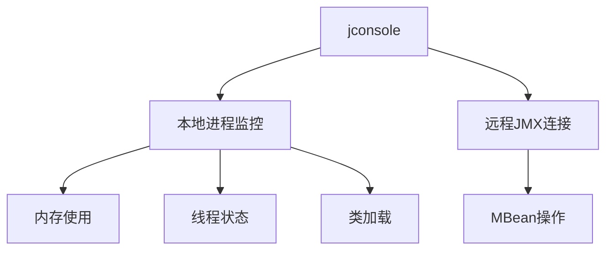
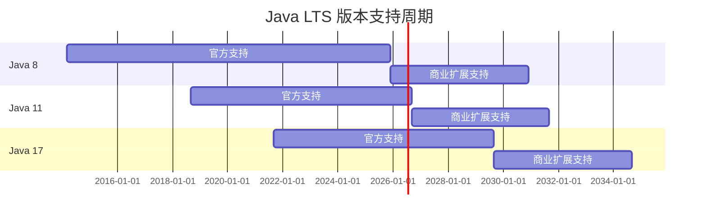

# JDK（Java 开发工具包）详解与最佳实践

## 1. JDK 概述

**JDK（Java Development Kit）** 是 Oracle 公司提供的 Java 开发工具包，包含编写、编译、调试和运行 Java 应用程序所需的所有组件。它是 Java 生态系统的核心基础，为开发者提供了一套完整的开发环境。

### JDK 核心组成

| 组件 | 描述 |
|------|------|
| **JRE** | Java 运行时环境（包含 JVM 和核心类库） |
| **编译器** | `javac` 将 Java 源代码编译为字节码 |
| **工具集** | `java`, `jar`, `javadoc`, `jdb` 等 |
| **类库** | Java 标准库（如 `java.lang`, `java.util`） |
| **附加库** | 如 XML 处理、数据库连接等 |

### JDK 版本演进


## 2. JDK 安装与配置

### 安装步骤

1. 下载对应平台的 JDK 安装包（[Oracle JDK](https://www.oracle.com/java/) 或 [OpenJDK](https://jdk.java.net/)）
2. 运行安装程序（Windows/macOS）或解压（Linux）
3. 配置环境变量

### 环境变量配置

**Windows:**

```batch
setx JAVA_HOME "C:\Program Files\Java\jdk-17"
setx PATH "%PATH%;%JAVA_HOME%\bin"
```

**Linux/macOS:**

```bash
export JAVA_HOME=/usr/lib/jvm/jdk-17
export PATH=$PATH:$JAVA_HOME/bin
```

### 验证安装

```bash
java -version
javac -version
```

**预期输出:**

```bash
java version "17.0.2" 2022-01-18 LTS
Java(TM) SE Runtime Environment (build 17.0.2+8-LTS-86)
Java HotSpot(TM) 64-Bit Server VM (build 17.0.2+8-LTS-86, mixed mode)
```

## 3. JDK 核心工具详解

### 3.1 Java 编译器 (javac)

```bash
# 编译单个文件
javac HelloWorld.java

# 编译整个目录
javac -d out/ src/*.java

# 指定类路径
javac -cp lib/*.jar;. MainApp.java
```

### 3.2 Java 应用程序启动器 (java)

```bash
# 运行主类
java -cp bin com.example.MainApp

# 启用远程调试
java -agentlib:jdwp=transport=dt_socket,server=y,suspend=n,address=5005 -jar app.jar

# 设置堆内存大小
java -Xms512m -Xmx1024m -jar application.jar
```

### 3.3 JAR 文件工具 (jar)

```bash
# 创建可执行 JAR
jar cfe app.jar MainClass *.class

# 解压 JAR 文件
jar xvf library.jar

# 查看 JAR 内容
jar tf application.jar
```

### 3.4 Java 文档生成器 (javadoc)

```java
/**
 * 计算两个数的和
 * 
 * @param a 第一个加数
 * @param b 第二个加数
 * @return 两数之和
 * @throws IllegalArgumentException 如果参数为负数
 */
public int add(int a, int b) {
    if (a < 0 || b < 0) {
        throw new IllegalArgumentException("参数不能为负数");
    }
    return a + b;
}
```

生成文档：

```bash
javadoc -d docs -sourcepath src -subpackages com.example
```

## 4. JDK 高级工具

### 4.1 JVM 监控工具 (jconsole)



### 4.2 堆转储分析 (jmap + jhat)

```bash
# 生成堆转储
jmap -dump:live,format=b,file=heapdump.hprof <pid>

# 分析堆转储
jhat -port 7000 heapdump.hprof
```

### 4.3 线程分析 (jstack)

```bash
# 获取线程快照
jstack -l <pid> > thread_dump.txt

# 查找死锁
jstack -m <pid> | grep -A 10 "deadlock"
```

## 5. JDK 版本管理最佳实践

### 多版本管理工具

| 工具 | 平台 | 特点 |
|------|------|------|
| **jenv** | 跨平台 | 轻量级版本切换 |
| **sdkman** | Unix-like | 支持多SDK管理 |
| **Jabba** | 跨平台 | 类似nvm的工作流 |

**使用示例 (sdkman):**

```bash
# 安装 sdkman
curl -s "https://get.sdkman.io" | bash

# 列出可用 JDK 版本
sdk list java

# 安装特定版本
sdk install java 17.0.2-tem

# 切换版本
sdk use java 11.0.12-open
```

## 6. JDK 最佳实践

### 6.1 版本选择策略


*数据来源：2023年 JVM 生态系统调查报告。*

**推荐策略：**

- 新项目：选择当前 LTS 版本（如 Java 17）
- 旧项目：升级到最近的 LTS（Java 11 或 17）
- 避免使用非 LTS 版本在生产环境

### 6.2 性能优化配置

**JVM 参数示例：**

```bash
# G1 GC 优化配置
java -XX:+UseG1GC \
     -XX:MaxGCPauseMillis=200 \
     -Xms2g \
     -Xmx2g \
     -XX:MetaspaceSize=256m \
     -XX:MaxMetaspaceSize=512m \
     -jar app.jar
```

**推荐配置：**

1. 设置 -Xms 和 -Xmx 相同值避免堆动态调整
2. 根据应用类型选择 GC 算法：
   - 低延迟：ZGC（Java 15+）
   - 高吞吐：Parallel GC
   - 平衡型：G1 GC（默认）
3. 监控并调整元空间大小

### 6.3 安全最佳实践

- **定期更新 JDK**：至少每季度检查安全更新
- **禁用弱加密算法**：

  ```java
  Security.setProperty("jdk.tls.disabledAlgorithms", "SSLv3, RC4, DES, MD5withRSA");
  ```

- **启用安全管理器**（谨慎使用）：

  ```bash
  java -Djava.security.manager -Djava.security.policy==app.policy MyApp
  ```

### 6.4 模块化开发（Java 9+）

**module-info.java 示例：**

```java
module com.example.myapp {
    requires java.base;
    requires java.logging;
    requires transitive com.example.utils;
    
    exports com.example.myapp.api;
    opens com.example.myapp.internal to com.example.tests;
}
```

**模块化优势：**

- 强封装性
- 显式依赖声明
- 减小运行时镜像（jlink）
- 避免类路径冲突

## 7. 常见问题排查指南

### 7.1 内存泄漏诊断

**步骤：**

1. 使用 `jmap` 生成堆转储
2. 使用 Eclipse MAT 或 VisualVM 分析
3. 查找保留内存最大的对象
4. 检查集合类（如 HashMap, ArrayList）的不当引用

### 7.2 CPU 过高分析

```bash
# 1. 查找高CPU线程
top -H -p <pid>

# 2. 转换线程ID为十六进制
printf "%x\n" <thread_id>

# 3. 获取线程堆栈
jstack <pid> | grep -A 30 <nid>
```

### 7.3 类加载问题

**错误示例：**

```bash
java.lang.ClassNotFoundException: com.example.MyClass
java.lang.NoClassDefFoundError: com/example/MyClass
java.lang.UnsupportedClassVersionError
```

**解决方案：**

- 检查类路径（-classpath）
- 验证依赖版本一致性
- 确认编译目标版本（javac -target）

## 8. 未来发展趋势

### JDK 最新特性概览

| 版本 | 重要特性 |
|------|----------|
| **Java 17** | Sealed Classes, Pattern Matching for switch |
| **Java 21** | Virtual Threads, Record Patterns, Scoped Values |
| **Java 22** | String Templates, Implicit Classes |

### LTS 版本支持周期



## 附录：推荐学习资源

1. [Oracle JDK 官方文档](https://docs.oracle.com/en/java/javase/)
2. [OpenJDK 项目](https://openjdk.org/)
3. [Java 虚拟机规范](https://docs.oracle.com/javase/specs/jvms/se17/html/)
4. [Java 性能调优指南](https://github.com/redhat-performance/tuning-docs)

> **最佳实践总结**：始终使用最新的 LTS 版本，实施持续集成测试 JDK 升级，监控生产环境 JVM 状态，并遵循模块化设计原则。通过合理配置 JVM 参数和定期安全更新，确保 Java 应用的稳定性和安全性。
