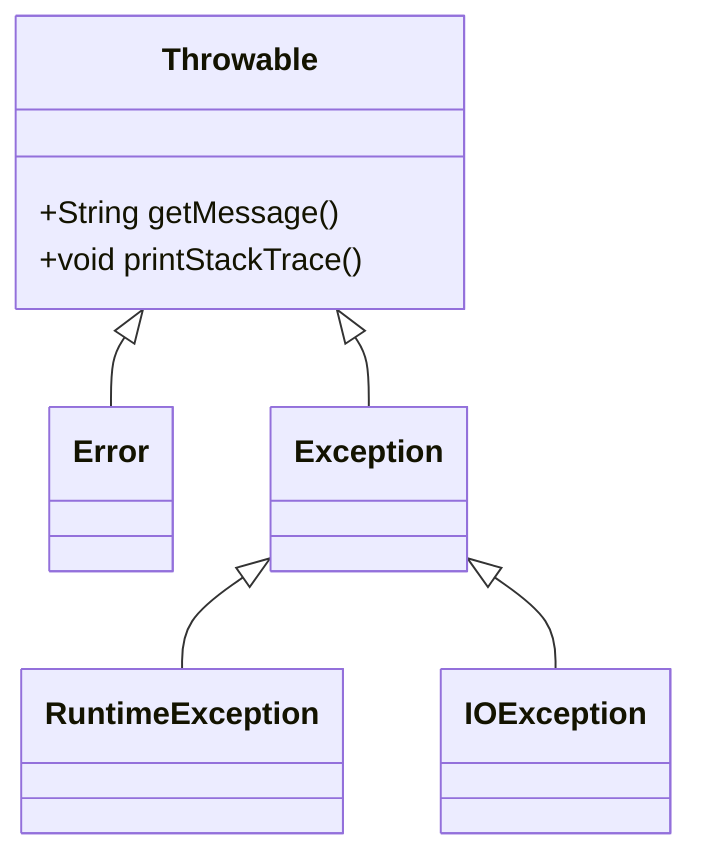

# Java 异常处理详解与最佳实践

## 1. 异常处理概述

### 1.1 什么是异常？

在Java中，**异常**是指程序执行过程中发生的非正常事件，它会中断正常的指令流。异常处理机制让开发者能够优雅地处理运行时错误，提高程序的健壮性。

### 1.2 Java异常体系

Java异常体系继承树：



- **Throwable**：所有错误和异常的基类
- **Error**：严重系统错误（如`OutOfMemoryError`），应用程序通常无法处理
- **Exception**：程序可处理的异常，分为两类：
  - **检查型异常(Checked)**：编译器强制处理（如`IOException`）
  - **非检查型异常(Unchecked)**：`RuntimeException`及其子类（如`NullPointerException`）

## 2. try-catch-finally 基础

### 2.1 基本语法

```java
try {
    // 可能抛出异常的代码
} catch (ExceptionType1 e1) {
    // 处理特定异常
} catch (ExceptionType2 e2) {
    // 处理另一种异常
} finally {
    // 无论是否发生异常都会执行的代码
}
```

### 2.2 多个catch块的处理顺序

```java
public class MultipleCatchDemo {
    public static void main(String[] args) {
        try {
            int[] numbers = {1, 2, 3};
            System.out.println(numbers[5]);  // 抛出ArrayIndexOutOfBoundsException
            String s = null;
            System.out.println(s.length()); // 不会执行到这里
        } catch (ArrayIndexOutOfBoundsException e) {
            System.out.println("数组越界异常: " + e.getMessage());
        } catch (NullPointerException e) {
            System.out.println("空指针异常: " + e.getMessage());
        } catch (Exception e) {
            System.out.println("通用异常处理: " + e.getMessage());
        }
    }
}
```

**重要规则**：

- 捕获顺序必须从具体到一般
- 子类异常必须放在父类异常之前
- 同一try块中只有一个catch块会被执行

### 2.3 finally块的特性

```java
public class FinallyDemo {
    public static void main(String[] args) {
        System.out.println("结果: " + divide(10, 2));
        System.out.println("结果: " + divide(10, 0));
    }

    public static int divide(int a, int b) {
        try {
            return a / b;
        } catch (ArithmeticException e) {
            System.out.println("除零错误: " + e.getMessage());
            return -1;
        } finally {
            System.out.println("执行finally块");
        }
    }
}
```

**finally关键特性**：

1. 无论是否发生异常都会执行
2. 即使try/catch中有return语句也会执行
3. 用于资源清理（关闭文件、数据库连接等）

### 2.4 try-with-resources（Java 7+）

自动资源管理语法：

```java
// 实现AutoCloseable接口的类才能在此结构中使用
class Resource implements AutoCloseable {
    void use() {
        System.out.println("使用资源");
        throw new RuntimeException("操作异常");
    }
    
    @Override
    public void close() {
        System.out.println("资源已关闭");
    }
}

public class TryWithResourcesDemo {
    public static void main(String[] args) {
        try (Resource res = new Resource()) {
            res.use();
        } catch (Exception e) {
            System.out.println("捕获异常: " + e.getMessage());
            Throwable[] suppressed = e.getSuppressed();
            for (Throwable t : suppressed) {
                System.out.println("Suppressed: " + t.getMessage());
            }
        }
    }
}
```

**输出**：

```bash
使用资源
资源已关闭
捕获异常: 操作异常
```

**优势**：

- 自动调用`close()`方法
- 正确处理异常抑制（通过`getSuppressed()`获取）
- 代码更简洁，避免资源泄漏

## 3. throws关键字

### 3.1 方法声明异常

```java
import java.io.*;

public class ThrowsDemo {
    
    // 声明可能抛出的检查型异常
    public static void readFile(String path) throws FileNotFoundException, IOException {
        try (BufferedReader reader = new BufferedReader(new FileReader(path))) {
            String line;
            while ((line = reader.readLine()) != null) {
                System.out.println(line);
            }
        }
    }

    public static void main(String[] args) {
        try {
            readFile("nonexistent.txt");
        } catch (FileNotFoundException e) {
            System.err.println("文件未找到: " + e.getMessage());
        } catch (IOException e) {
            System.err.println("IO错误: " + e.getMessage());
        }
    }
}
```

### 3.2 throws使用规则

1. 用于方法签名声明可能抛出的检查型异常
2. 调用方必须处理或继续声明这些异常
3. 非检查型异常（RuntimeException）不需要声明
4. 子类方法不能声明比父类方法更宽泛的异常类型

## 4. throw关键字

### 4.1 主动抛出异常

```java
public class ThrowDemo {
    
    public static void processAge(int age) {
        if (age < 0) {
            throw new IllegalArgumentException("年龄不能为负数");
        }
        System.out.println("处理年龄: " + age);
    }

    public static void main(String[] args) {
        try {
            processAge(-5);
        } catch (IllegalArgumentException e) {
            System.out.println("捕获异常: " + e.getMessage());
        }
    }
}
```

### 4.2 自定义异常

```java
// 自定义检查型异常
class InsufficientFundsException extends Exception {
    public InsufficientFundsException(String message) {
        super(message);
    }
}

// 自定义非检查型异常
class InvalidAccountException extends RuntimeException {
    public InvalidAccountException(String message) {
        super(message);
    }
}

public class BankingSystem {
    private double balance = 1000.0;
    
    public void withdraw(double amount) throws InsufficientFundsException {
        if (amount > balance) {
            throw new InsufficientFundsException("余额不足。当前余额: " + balance);
        }
        balance -= amount;
        System.out.println("成功取款: " + amount);
    }
    
    public void transfer(String accountNumber) {
        if (accountNumber == null || accountNumber.length() != 12) {
            throw new InvalidAccountException("无效账号: " + accountNumber);
        }
        System.out.println("转账到账号: " + accountNumber);
    }
}
```

## 5. 异常处理最佳实践

### 5.1 基本原则

1. **不要忽略异常**：空catch块是严重的反模式

   ```java
   // 错误示例
   try {
       // ...
   } catch (Exception e) {
       // 什么也不做！
   }
   ```

2. **具体化异常类型**：避免笼统的catch(Exception)

   ```java
   // 推荐做法
   try {
       // 文件操作
   } catch (FileNotFoundException e) {
       // 处理文件不存在
   } catch (IOException e) {
       // 处理其他IO错误
   }
   ```

3. **合理使用检查型与非检查型异常**
   - 检查型异常：可恢复错误（文件不存在、网络中断）
   - 非检查型异常：编程错误（空指针、数组越界）

### 5.2 性能优化

1. **避免在循环中使用try-catch**

   ```java
   // 不推荐
   for (int i = 0; i < 1000; i++) {
       try {
           // 可能出错的代码
       } catch (Exception e) {
           // 处理
       }
   }
   
   // 推荐
   try {
       for (int i = 0; i < 1000; i++) {
           // 可能出错的代码
       }
   } catch (Exception e) {
       // 处理
   }
   ```

2. **重用异常对象**（适用于高频场景）

   ```java
   private static final IllegalArgumentException INVALID_ARG = 
       new IllegalArgumentException("无效参数");
   
   public void validate(Object param) {
       if (param == null) {
           throw INVALID_ARG;
       }
   }
   ```

### 5.3 日志记录规范

```java
import org.slf4j.Logger;
import org.slf4j.LoggerFactory;

public class LoggingBestPractice {
    private static final Logger logger = LoggerFactory.getLogger(LoggingBestPractice.class);
    
    public void processData() {
        try {
            // 业务逻辑
        } catch (BusinessException e) {
            // 记录完整堆栈（仅用于调试）
            logger.error("业务处理失败: {}", e.getMessage(), e);
            
            // 重新抛出或处理
            throw new ProcessingException("处理失败", e);
        } catch (Exception e) {
            // 避免重复记录
            logger.warn("未知错误: {}", e.getMessage());
            throw e;
        }
    }
}
```

**日志要点**：

- 使用合适的日志级别（ERROR/WARN/INFO）
- 包含上下文信息
- 避免重复记录同一异常
- 生产环境避免打印完整堆栈（安全考虑）

## 6. 高级主题

### 6.1 异常链（Chained Exceptions）

```java
public class ExceptionChaining {
    public static void main(String[] args) {
        try {
            lowLevelOperation();
        } catch (HighLevelException e) {
            System.out.println("捕获高级异常: " + e.getMessage());
            System.out.println("根本原因: " + e.getCause().getMessage());
        }
    }
    
    static void lowLevelOperation() throws HighLevelException {
        try {
            // 模拟底层错误
            throw new IOException("磁盘IO错误");
        } catch (IOException e) {
            throw new HighLevelException("高级操作失败", e);
        }
    }
}

class HighLevelException extends Exception {
    public HighLevelException(String message, Throwable cause) {
        super(message, cause);
    }
}
```

### 6.2 异常转换模式

```java
public class ExceptionTranslation {
    public void serviceMethod() throws ServiceException {
        try {
            // 调用DAO层
            daoOperation();
        } catch (DAOException e) {
            // 转换为业务层异常
            throw new ServiceException("服务操作失败", e);
        }
    }
    
    private void daoOperation() throws DAOException {
        // 数据访问操作
    }
}

class ServiceException extends Exception {
    public ServiceException(String message, Throwable cause) {
        super(message, cause);
    }
}

class DAOException extends Exception {
    // DAO层异常实现
}
```

## 7. 常见问题解答

### Q1：finally块中发生异常会怎样？

```java
public class FinallyExceptionDemo {
    public static void main(String[] args) {
        try {
            System.out.println("try 块");
            throw new RuntimeException("主异常");
        } finally {
            System.out.println("finally 块");
            throw new RuntimeException("finally 异常");
        }
    }
}
```

**结果**：

```bash
try 块
finally 块
Exception in thread "main" java.lang.RuntimeException: finally 异常
```

### Q2：try-catch-finally的return执行顺序

```java
public class ReturnOrderDemo {
    public static void main(String[] args) {
        System.out.println("结果: " + test());
    }
    
    public static String test() {
        try {
            System.out.println("try 块");
            return "try 返回值";
        } catch (Exception e) {
            return "catch 返回值";
        } finally {
            System.out.println("finally 块");
            // 如果取消注释，将覆盖返回值
            // return "finally 返回值";
        }
    }
}
```

**输出**：

```
try 块
finally 块
结果: try 返回值
```

## 8. 总结与推荐

### 异常处理黄金法则

1. **尽早抛出**：在检测到错误时立即抛出异常
2. **延迟捕获**：在有能力处理时才捕获异常
3. **文档化**：使用Javadoc记录方法可能抛出的异常
4. **保持原子性**：确保异常不会破坏对象状态
5. **避免异常滥用**：不要用异常控制正常流程

### 推荐资源

- [Oracle官方异常教程](https://docs.oracle.com/javase/tutorial/essential/exceptions/)
- 《Effective Java》第3版 - Joshua Bloch
- 《Java编程思想》第4版 - Bruce Eckel

> 文档更新历史：  
> 2025-06-26 - 初稿  
> 2025-06-27 - 添加自定义异常示例  
> 2025-06-28 - 增强最佳实践部分  

**通过遵循这些原则和实践，您将能够构建更健壮、更易维护的Java应用程序。**
