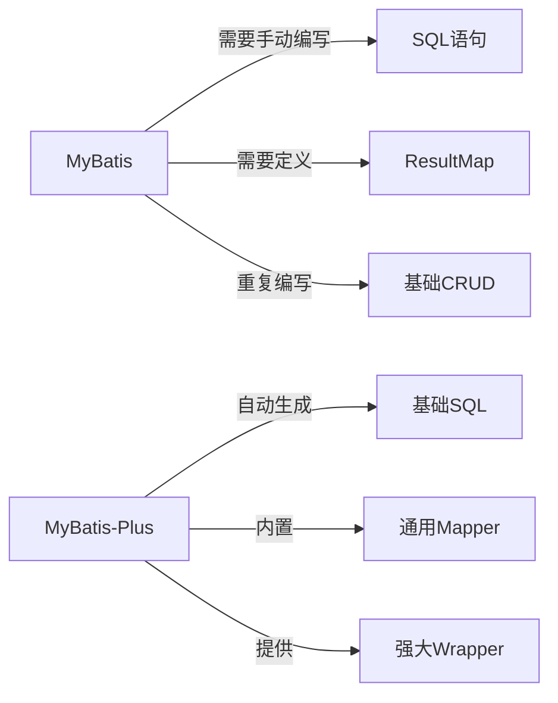
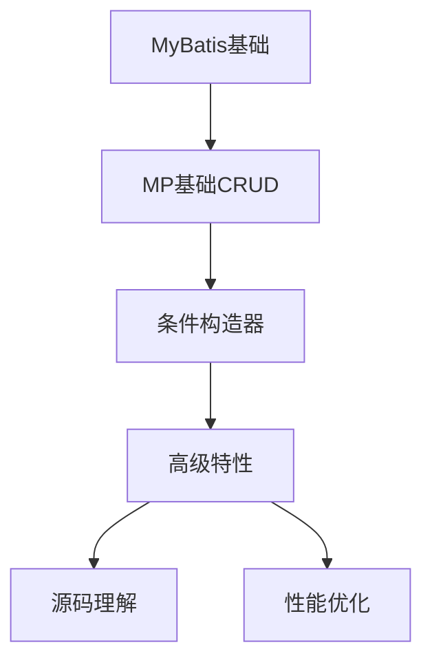

# MyBatis-Plus 详解与 Spring Boot 整合最佳实践

## 目录

- [1. MyBatis-Plus 概述](#1-mybatis-plus-概述)
- [2. Spring Boot 整合 MyBatis-Plus](#2-spring-boot-整合-mybatis-plus)
- [3. 核心功能详解](#3-核心功能详解)
- [4. 高级特性](#4-高级特性)
- [5. 最佳实践](#5-最佳实践)
- [6. 常见问题解决方案](#6-常见问题解决方案)
- [7. 总结](#7-总结)

---

## 1. MyBatis-Plus 概述

<a id="1-mybatis-plus-概述"></a>

**MyBatis-Plus（简称 MP）** 是 MyBatis 的增强工具，在 MyBatis 的基础上只做增强不做改变，简化开发、提高效率。

### 1.1 核心特性

| 特性 | 说明 |
|------|------|
| **强大的 CRUD 操作** | 内置通用 Mapper、通用 Service |
| **条件构造器** | Lambda 表达式编写查询条件 |
| **分页插件** | 支持多种数据库的分页查询 |
| **代码生成器** | 快速生成 Entity、Mapper、Service 等 |
| **全局拦截插件** | 提供全表 delete、update 操作智能阻断 |
| **乐观锁插件** | 实现乐观锁更新机制 |
| **SQL 注入器** | 自定义全局 SQL 方法注入 |

### 1.2 优势对比



---

## 2. Spring Boot 整合 MyBatis-Plus

<a id="2-spring-boot-整合-mybatis-plus"></a>

### 2.1 环境准备

- JDK 1.8+
- Spring Boot 2.3+
- Maven 3.5+

### 2.2 添加依赖

```xml
<dependencies>
    <!-- Spring Boot Starter -->
    <dependency>
        <groupId>org.springframework.boot</groupId>
        <artifactId>spring-boot-starter-web</artifactId>
    </dependency>
    
    <!-- MyBatis-Plus Starter -->
    <dependency>
        <groupId>com.baomidou</groupId>
        <artifactId>mybatis-plus-boot-starter</artifactId>
        <version>3.5.3.1</version>
    </dependency>
    
    <!-- 数据库驱动 -->
    <dependency>
        <groupId>mysql</groupId>
        <artifactId>mysql-connector-java</artifactId>
        <scope>runtime</scope>
    </dependency>
    
    <!-- Lombok -->
    <dependency>
        <groupId>org.projectlombok</groupId>
        <artifactId>lombok</artifactId>
        <optional>true</optional>
    </dependency>
</dependencies>
```

### 2.3 配置数据源

`application.yml` 配置示例：

```yaml
spring:
  datasource:
    driver-class-name: com.mysql.cj.jdbc.Driver
    url: jdbc:mysql://localhost:3306/mp_demo?useSSL=false&useUnicode=true&characterEncoding=utf-8&serverTimezone=Asia/Shanghai
    username: root
    password: 123456

mybatis-plus:
  configuration:
    map-underscore-to-camel-case: true # 开启驼峰命名转换
    log-impl: org.apache.ibatis.logging.stdout.StdOutImpl # 打印SQL日志
  global-config:
    db-config:
      id-type: auto # 主键自增策略
```

### 2.4 基础代码结构

```
src/main/java
├── com.example.demo
│   ├── DemoApplication.java
│   ├── entity
│   │   └── User.java
│   ├── mapper
│   │   └── UserMapper.java
│   ├── service
│   │   ├── UserService.java
│   │   └── impl
│   │       └── UserServiceImpl.java
│   └── controller
│       └── UserController.java
```

---

## 3. 核心功能详解

<a id="3-核心功能详解"></a>

### 3.1 实体类与注解

```java
import com.baomidou.mybatisplus.annotation.*;
import lombok.Data;
import java.util.Date;

@Data
@TableName("sys_user") // 指定表名
public class User {
    @TableId(type = IdType.AUTO) // 主键自增
    private Long id;
    
    private String name;
    private Integer age;
    private String email;
    
    @TableField(fill = FieldFill.INSERT) // 插入时自动填充
    private Date createTime;
    
    @TableField(fill = FieldFill.INSERT_UPDATE) // 插入和更新时填充
    private Date updateTime;
    
    @Version // 乐观锁版本字段
    private Integer version;
    
    @TableLogic // 逻辑删除字段
    private Integer deleted;
}
```

### 3.2 Mapper 接口

```java
import com.baomidou.mybatisplus.core.mapper.BaseMapper;
import com.example.demo.entity.User;

public interface UserMapper extends BaseMapper<User> {
    // 自定义SQL方法
    @Select("SELECT * FROM sys_user WHERE age > #{age}")
    List<User> selectUsersOlderThan(Integer age);
}
```

### 3.3 基础 CRUD 操作

```java
// 插入
User user = new User();
user.setName("John");
user.setAge(30);
user.setEmail("john@example.com");
mapper.insert(user);

// 更新
User updateUser = new User();
updateUser.setId(1L);
updateUser.setEmail("updated@example.com");
mapper.updateById(updateUser);

// 查询
User user = mapper.selectById(1L);

// 删除
mapper.deleteById(1L);
```

### 3.4 条件构造器 QueryWrapper

```java
// 创建条件构造器
QueryWrapper<User> queryWrapper = new QueryWrapper<>();

// 条件查询
queryWrapper
    .gt("age", 18) // age > 18
    .like("name", "Tom") // name like '%Tom%'
    .isNotNull("email"); // email is not null

List<User> userList = mapper.selectList(queryWrapper);

// Lambda 表达式写法（推荐）
LambdaQueryWrapper<User> lambdaQuery = Wrappers.lambdaQuery();
lambdaQuery
    .gt(User::getAge, 18)
    .like(User::getName, "Tom")
    .isNotNull(User::getEmail);

List<User> users = mapper.selectList(lambdaQuery);
```

### 3.5 分页查询

1. 添加分页插件配置

```java
@Configuration
public class MybatisPlusConfig {
    @Bean
    public MybatisPlusInterceptor mybatisPlusInterceptor() {
        MybatisPlusInterceptor interceptor = new MybatisPlusInterceptor();
        interceptor.addInnerInterceptor(new PaginationInnerInterceptor(DbType.MYSQL));
        return interceptor;
    }
}
```

2. 执行分页查询

```java
// 第一页，每页10条
Page<User> page = new Page<>(1, 10);
LambdaQueryWrapper<User> queryWrapper = Wrappers.lambdaQuery();
queryWrapper.ge(User::getAge, 20);

Page<User> userPage = mapper.selectPage(page, queryWrapper);

System.out.println("总记录数: " + userPage.getTotal());
System.out.println("总页数: " + userPage.getPages());
userPage.getRecords().forEach(System.out::println);
```

---

## 4. 高级特性

<a id="4-高级特性"></a>

### 4.1 乐观锁实现

1. 实体类添加 `@Version` 注解

```java
@Version
private Integer version;
```

2. 配置乐观锁插件

```java
@Bean
public MybatisPlusInterceptor mybatisPlusInterceptor() {
    MybatisPlusInterceptor interceptor = new MybatisPlusInterceptor();
    interceptor.addInnerInterceptor(new OptimisticLockerInnerInterceptor());
    return interceptor;
}
```

3. 使用示例

```java
// 查询用户
User user = mapper.selectById(1L);

// 更新操作（自动带版本号）
user.setEmail("new@example.com");
mapper.updateById(user);
```

### 4.2 逻辑删除

1. 实体类添加 `@TableLogic` 注解

```java
@TableLogic
private Integer deleted; // 0-未删除 1-已删除
```

2. 配置文件开启逻辑删除

```yaml
mybatis-plus:
  global-config:
    db-config:
      logic-delete-field: deleted # 逻辑删除字段名
      logic-delete-value: 1       # 删除值
      logic-not-delete-value: 0   # 未删除值
```

3. 删除操作自动转换为更新

```java
mapper.deleteById(1L); 
// 实际执行: UPDATE sys_user SET deleted=1 WHERE id=1 AND deleted=0
```

### 4.3 自动填充

1. 实现 `MetaObjectHandler` 接口

```java
@Component
public class MyMetaObjectHandler implements MetaObjectHandler {
    
    @Override
    public void insertFill(MetaObject metaObject) {
        this.strictInsertFill(metaObject, "createTime", Date.class, new Date());
        this.strictInsertFill(metaObject, "updateTime", Date.class, new Date());
    }
    
    @Override
    public void updateFill(MetaObject metaObject) {
        this.strictUpdateFill(metaObject, "updateTime", Date.class, new Date());
    }
}
```

### 4.4 代码生成器

```java
public class CodeGenerator {
    public static void main(String[] args) {
        AutoGenerator generator = new AutoGenerator();
        
        // 全局配置
        GlobalConfig globalConfig = new GlobalConfig();
        globalConfig.setOutputDir(System.getProperty("user.dir") + "/src/main/java");
        globalConfig.setAuthor("YourName");
        globalConfig.setOpen(false);
        generator.setGlobalConfig(globalConfig);
        
        // 数据源配置
        DataSourceConfig dataSourceConfig = new DataSourceConfig();
        dataSourceConfig.setUrl("jdbc:mysql://localhost:3306/mp_demo");
        dataSourceConfig.setDriverName("com.mysql.cj.jdbc.Driver");
        dataSourceConfig.setUsername("root");
        dataSourceConfig.setPassword("123456");
        generator.setDataSource(dataSourceConfig);
        
        // 包配置
        PackageConfig packageConfig = new PackageConfig();
        packageConfig.setParent("com.example.demo");
        generator.setPackageInfo(packageConfig);
        
        // 策略配置
        StrategyConfig strategy = new StrategyConfig();
        strategy.setInclude("sys_user"); // 表名
        strategy.setNaming(NamingStrategy.underline_to_camel);
        strategy.setColumnNaming(NamingStrategy.underline_to_camel);
        strategy.setEntityLombokModel(true);
        generator.setStrategy(strategy);
        
        generator.execute();
    }
}
```

---

## 5. 最佳实践

<a id="5-最佳实践"></a>

### 5.1 项目结构规范

```
com.example.project
├── common
│   ├── config       // 配置类
│   ├── constant     // 常量
│   ├── exception    // 异常处理
│   └── utils        // 工具类
├── modules
│   ├── user
│   │   ├── entity
│   │   ├── mapper
│   │   ├── service
│   │   └── controller
│   └── product
│       └── ...
└── Application.java // 启动类
```

### 5.2 事务管理

```java
@Service
public class UserServiceImpl implements UserService {
    
    @Transactional(rollbackFor = Exception.class)
    public void businessMethod() {
        // 操作1
        userMapper.insert(user1);
        
        // 操作2
        productMapper.update(product);
        
        // 业务逻辑...
    }
}
```

### 5.3 性能优化建议

1. **避免全表扫描**：合理使用索引，避免 `SELECT *`
2. **批量操作**：使用 `insertBatch()` 替代循环插入

   ```java
   List<User> userList = new ArrayList<>();
   // ...添加数据
   userService.saveBatch(userList, 1000); // 每批1000条
   ```

3. **逻辑删除优化**：查询时自动过滤已删除数据

   ```sql
   SELECT id, name FROM sys_user WHERE deleted=0
   ```

### 5.4 安全注意事项

1. 防止 SQL 注入：

   ```java
   // 错误做法（有注入风险）
   wrapper.apply("date_format(create_time,'%Y-%m-%d') = '2023-01-01'");
   
   // 正确做法（使用预编译）
   wrapper.apply("date_format(create_time,'%Y-%m-%d') = {0}", "2023-01-01");
   ```

2. 禁用危险方法：

   ```java
   // 在配置类中禁用全表更新/删除
   @Bean
   public MybatisPlusInterceptor mybatisPlusInterceptor() {
       MybatisPlusInterceptor interceptor = new MybatisPlusInterceptor();
       interceptor.addInnerInterceptor(new BlockAttackInnerInterceptor());
       return interceptor;
   }
   ```

---

## 6. 常见问题解决方案

<a id="6-常见问题解决方案"></a>

### 6.1 分页查询失效

**问题**：配置了分页插件但分页不生效  
**解决方案**：

1. 检查是否添加了分页插件配置
2. 确保使用 `Page` 对象作为参数
3. 确认数据库类型配置正确

### 6.2 字段值为 null 不更新

**问题**：使用 `updateById()` 时，null 值字段不更新  
**解决方案**：

```java
// 方式1：使用UpdateWrapper
UpdateWrapper<User> updateWrapper = new UpdateWrapper<>();
updateWrapper.set("email", null).eq("id", 1L);
mapper.update(null, updateWrapper);

// 方式2：设置全局策略（application.yml）
mybatis-plus:
  global-config:
    db-config:
      update-strategy: ignored // 忽略null值字段（默认）
      # 可选值: ignored, not_null, not_empty
```

### 6.3 多数据源配置

1. 添加依赖：

```xml
<dependency>
    <groupId>com.baomidou</groupId>
    <artifactId>dynamic-datasource-spring-boot-starter</artifactId>
    <version>3.5.2</version>
</dependency>
```

2. 配置数据源：

```yaml
spring:
  datasource:
    dynamic:
      primary: master # 默认数据源
      datasource:
        master:
          url: jdbc:mysql://localhost:3306/db1
          username: root
          password: 123456
        slave:
          url: jdbc:mysql://localhost:3306/db2
          username: root
          password: 123456
```

3. 使用注解切换数据源：

```java
@Service
public class UserService {
    
    @DS("master") // 默认数据源
    public void masterOperation() {
        // 操作主库
    }
    
    @DS("slave")
    public void slaveOperation() {
        // 操作从库
    }
}
```

---

## 7. 总结

<a id="7-总结"></a>

### 核心价值

- **开发效率提升**：减少80%的单表CRUD操作代码
- **代码可维护性**：统一的数据访问层实现
- **功能丰富**：分页、乐观锁、逻辑删除等开箱即用

### 适用场景

- 快速开发后台管理系统
- 需要高效操作单表的业务场景
- 中小型项目的数据持久层解决方案

### 学习建议



**推荐资源**：

- [MyBatis-Plus 官方文档](https://baomidou.com/)
- [Spring Boot 官方文档](https://spring.io/projects/spring-boot)
- [MyBatis 源码解析](https://github.com/mybatis/mybatis-3)

> **最佳实践核心原则**：  
>
> 1. 合理使用Lambda表达式保证类型安全  
> 2. 复杂查询优先使用XML方式  
> 3. 批量操作注意内存溢出风险  
> 4. 生产环境关闭SQL日志打印  
> 5. 定期检查并优化数据库索引
